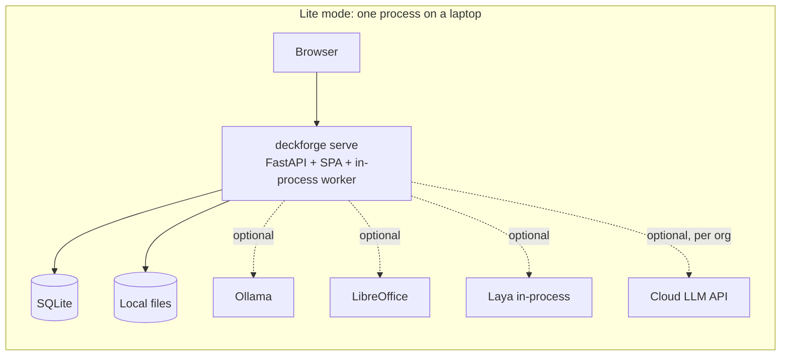
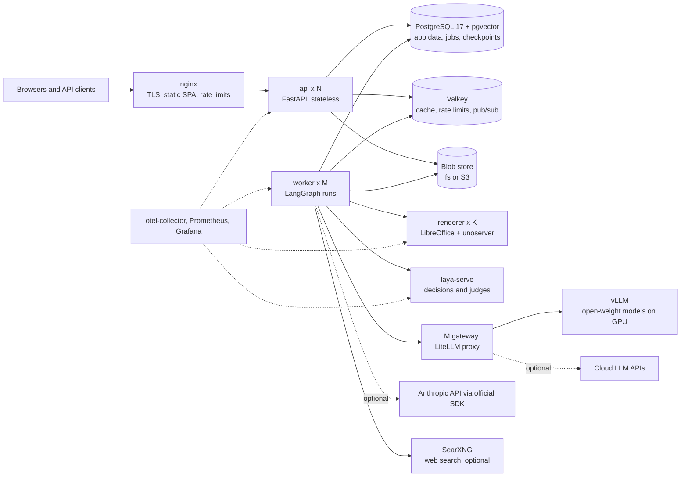
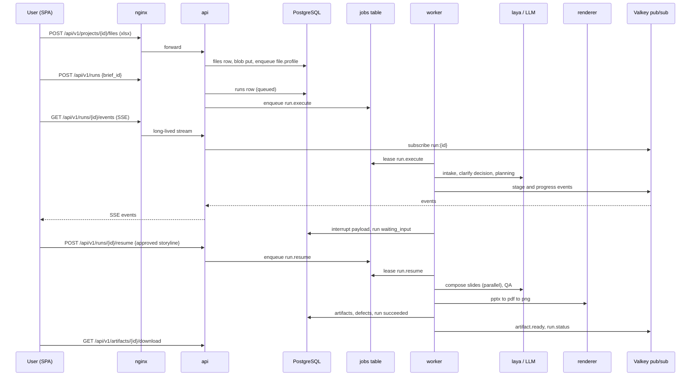

# 01. Architecture

## 1. What the system does

Input: a brief, optional data files (xlsx, csv), an optional customer template (pptx, potx), optional reference documents (pdf, docx).
Output: an editable PPTX deck in consulting style, a PDF export, slide previews, a QA report and a reasoning trace (plan report).

The system works in six steps, each with deterministic checks:

1. **Understand.** Parse the brief, profile the data, extract the design system, ask clarifying questions when the brief is incomplete.
2. **Reason.** Frame the problem, build an issue tree, choose analyses from the framework library, write a storyline and a slide plan. A human can approve or edit the storyline.
3. **Ground.** Compute every number from data (or editable dummy data, flagged), research external facts with citations when allowed.
4. **Compose.** For each slide, choose the exhibit, write the action title and commentary using fact tokens, pick icons and imagery.
5. **Render.** Compile native PPTX shapes and charts in the customer's template, render previews.
6. **Assure.** Run the evaluator cascade (deterministic, Laya, LLM, vision LLM), repair defects, report what remains.

## 2. Quality attributes and targets

| Attribute | Target | How it is met |
|---|---|---|
| On-prem | No customer data leaves the install unless an org admin enables a cloud model | Local LLMs by default, egress allow-list, cloud provider off per org (`07`) |
| Cross-platform | Lite mode installs and runs on macOS 13+, Windows 10/11, Ubuntu 22.04+ | Pure-Python core, bundled fonts, SQLite, optional LibreOffice (`14`) |
| Concurrency | Reference server node: 100 active web sessions, 20 concurrent generation runs | Stateless API replicas, PostgreSQL job queue, worker pool, renderer pool, batched GPU inference (`14`) |
| Deck latency | 15-slide deck: p50 at or under 5 min, p95 at or under 10 min on the reference node (target to validate in T-12.3) | Parallel slide composition, cached prefixes, Laya for fast decisions |
| Durability | A worker crash never loses a run. The run resumes from its last checkpoint | LangGraph checkpointer plus leased jobs (`06`) |
| Quality | Every deck passes lint, look-and-feel and storyline consistency. Residual defects are listed in the QA report | Evaluator cascade with repair loop (`09`) |
| Editability | Every chart and shape stays editable in PowerPoint. Numbers trace to data or to a flagged dummy | Native shapes and charts, fact tokens, dummy flags (`12`) |
| Tenancy | No data crosses orgs, including caches | `org_id` on every row and every cache key, tests for isolation (`15`) |

## 3. Deployment modes

| Mode | Who | Database | Queue | Cache and events | Blobs | LLM | Laya | Previews |
|---|---|---|---|---|---|---|---|---|
| Lite | One user, laptop | SQLite (`aiosqlite`) | In-process asyncio worker reading the `jobs` table | In-process memory plus SQLite cache table, in-process event bus | Local folder | Ollama or a cloud key | In-process `laya.Router` if the `laya` extra is installed, else off | `soffice` subprocess if installed, else off |
| Server | Many users | PostgreSQL 17 + pgvector | `jobs` table with leases, `LISTEN/NOTIFY` wake-up | Valkey | Local volume or S3-compatible | LiteLLM proxy in front of vLLM, Ollama or cloud | `laya-serve` HTTP service | `renderer` service with `unoserver` pool |

Both modes run the same graphs, nodes, prompts and renderer. Only adapters differ (section 5).

## 4. Processes and responsibilities

| Process | Image | Scales by | Responsibility | Must not |
|---|---|---|---|---|
| `nginx` | `nginx:stable` | 1 to 2 | TLS, static SPA, reverse proxy, coarse rate limits, SSE pass-through, upload size limit | Hold application logic |
| `api` | `deckforge` | CPU, request rate | Auth, validation, CRUD, enqueue jobs, SSE relay from Valkey, signed downloads | Call LLMs or render (except tiny sync helpers) |
| `worker` | `deckforge` | Queue depth | Execute LangGraph runs, template ingestion, evals. Call LLM gateway, Laya, renderer, tools | Serve HTTP |
| `renderer` | `deckforge-renderer` | Render queue, CPU | PPTX to PDF to PNG conversions, nothing else | Access the database |
| `laya` | `deckforge-laya` | GPU or CPU, decision rate | `laya-serve` with DeckForge checkpoints | Be reachable from outside the internal network |
| `litellm` | `litellm` | 1 to 2 | OpenAI-compatible gateway: virtual keys, budgets, rate limits, fallbacks, logging | Store customer documents |
| `vllm` | `vllm/vllm-openai` | GPUs | Serve open-weight chat and vision models with prefix caching | Run on the CPU node |
| `postgres` | `pgvector/pgvector:pg17` | Vertical, then read replica | App data, jobs, LangGraph checkpoints and store, vectors | |
| `valkey` | `valkey/valkey:8` | 1 (replica optional) | Cache, rate-limit buckets, event pub/sub, locks | Hold data that cannot be rebuilt |
| `searxng` | `searxng/searxng` | 1 | Metasearch for research (optional) | Be exposed publicly |

## 5. Ports and adapters

The domain code (`deckforge.core`, `deckforge.story`, `deckforge.viz`, `deckforge.render`, `deckforge.qa`) imports no infrastructure. Infrastructure is reached through ports (Python `Protocol` classes in `deckforge/ports.py`). Adapters live in their own packages and are wired in `deckforge/wiring.py` from settings.

| Port | Methods (async unless noted) | Lite adapter | Server adapter | Test fake |
|---|---|---|---|---|
| `BlobStore` | `put(key, data, content_type)`, `get(key)`, `exists(key)`, `delete(key)`, `url(key, ttl_s)` | `FsBlobStore` | `FsBlobStore` or `S3BlobStore` | `FakeBlobStore` (dict) |
| `JobQueue` | `enqueue(kind, payload, org_id, priority)`, `lease(worker_id, kinds)`, `heartbeat(job_id)`, `complete(job_id)`, `fail(job_id, error, retry)` | `SqlJobQueue` (SQLite, polling) | `SqlJobQueue` (PostgreSQL, SKIP LOCKED, NOTIFY) | `FakeJobQueue` |
| `EventBus` | `publish(channel, event)`, `subscribe(channel) -> AsyncIterator` | `MemoryEventBus` | `ValkeyEventBus` | `MemoryEventBus` |
| `Cache` | `get(key)`, `set(key, value, ttl_s)`, `lock(key, ttl_s)` | `SqliteCache` + memory LRU | `ValkeyCache` | `MemoryCache` |
| `VectorStore` | `upsert(namespace, items)`, `search(namespace, vector, k, filter)` | `NumpyVectorStore` (exact search) | `PgVectorStore` | `NumpyVectorStore` |
| `LLMProvider` | `chat_model(role) -> BaseChatModel` | `ModelRegistry` | `ModelRegistry` | `FakeLLM` |
| `DecisionEngine` | `decide(decision_id, state_text, ctx) -> Decision`, `decide_batch(...)` | `InprocLaya` or `NullLaya` | `HttpLaya` | `FakeLaya` |
| `PreviewRenderer` | `pptx_to_pdf(pptx_key) -> pdf_key`, `pdf_to_pngs(pdf_key, dpi) -> list[key]` | `SofficeRenderer` or `NullRenderer` | `HttpRenderer` (to `renderer` service) | `FakeRenderer` |
| `SearchProvider` | `search(query, k, recency_days) -> list[SearchHit]` | `NullSearch` or customer API | `SearxngSearch` | `FakeSearch` |
| `ImageProvider` | existing `deckforge.assets.resolver` sources | existing | existing | existing fakes |

Rule: a node or tool receives ports through the LangGraph runtime context (`06`, section 4), never by importing an adapter.

## 6. Request lifecycle

## 7. Data flow and trust boundaries

| Zone | Contents | Trust |
|---|---|---|
| User input | Brief text, clarification answers, plan edits | Authenticated but untrusted as instructions to tools |
| Uploaded files | xlsx, csv, pptx, potx, pdf, docx | Untrusted. Validated by magic bytes, size, zip-bomb limits, macro rejection (`15`) |
| Web content | Search results and fetched pages | Untrusted. SSRF guard on fetch, Laya guard and delimiters before any LLM sees it (`10`) |
| Model output | LLM text and JSON, Laya answers | Untrusted until validated against Pydantic schemas and deterministic checks |
| System | Prompts, framework library, design systems, code | Trusted |

## 8. Capacity model (estimates to validate)

Assumptions for a 15-slide board deck. These are planning estimates, not measurements. T-12.3 replaces them with measured numbers.

| Step | LLM calls | Input tokens | Output tokens | Laya calls | Wall time (est.) |
|---|---|---|---|---|---|
| Intake and clarify | 2 | 8k | 2k | 6 | 15 s |
| Planning (problem, issue tree, analyses, storyline) | 5 sequential | 45k | 10k | 30 | 90 to 150 s |
| Data and facts | 0 to 2 | 4k | 1k | 20 | 10 s |
| Compose 15 slides (parallel, 6 at a time) | 30 | 90k | 18k | 60 | 40 to 60 s |
| Render and preview | 0 | 0 | 0 | 0 | 15 to 30 s |
| QA cascade and one repair round | 8 to 15 | 30k | 5k | 150 | 40 to 60 s |
| Total | about 50 | about 180k | about 36k | about 270 | 3.5 to 5.5 min |

Reference server node (to be validated): one CPU host (32 vCPU, 128 GB RAM) for nginx, api, workers, renderer, PostgreSQL, Valkey. One GPU host (4 x 80 GB) for vLLM and Laya. At about 36k output tokens per deck and an aggregate decode throughput in the low thousands of tokens per second with batching, the GPU host supports roughly 20 concurrent runs before queueing. Workers: one run per worker slot, 24 slots (6 processes x 4 async slots). Scale-out rules are in `14`.

## 9. Key design rules

1. **Deterministic first.** If code can decide it (a number, a layout, a contrast check), code decides. LLMs write language and make judgements. Laya makes fast typed choices.
2. **Typed everywhere.** Every LLM output is a Pydantic model validated before use. Every Laya answer is a typed `Decision` with confidence.
3. **References, not payloads.** Graph state holds ids and blob keys for large objects (datasets, rendered decks, research pages). Checkpoints stay small.
4. **Every decision is logged** with its inputs, answer, confidence and later outcome. This is the training data for Laya and the audit trail for customers.
5. **Fail soft on quality, hard on truth.** A layout defect that cannot be repaired is reported and the deck still ships. A number that cannot be traced to data or a flagged dummy blocks the slide.
6. **One codebase, two modes.** No `if lite:` branches in domain code. Mode differences live in adapters and `wiring.py`.
