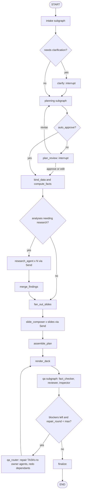
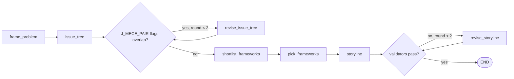
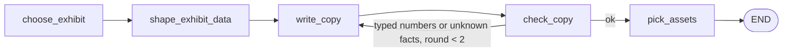

# 06. Orchestration with LangGraph and LangChain

Library versions: `langgraph==1.2.*`, `langchain==1.4.*`, `langchain-core==1.6.*`. The patterns below were verified against these versions on 2026-10-04 (state reducers, `context_schema` with `Runtime`, `interrupt` and `Command(resume=...)`, `Send` fan-out with fan-in, `astream(..., stream_mode=["updates", "custom"], subgraphs=True)` yielding `(namespace, mode, chunk)` tuples).

## 1. What each library is used for

| Library | Used for | Not used for |
|---|---|---|
| LangGraph | The deck pipeline as a durable state machine: nodes, conditional edges, parallel fan-out (`Send`), human-in-the-loop (`interrupt`), retries (`RetryPolicy`), node caching (`CachePolicy`), checkpoints, streaming, long-term memory (`Store`) | Business logic inside graph wiring code |
| LangChain core | `BaseChatModel` interface, `ChatPromptTemplate`, messages, `with_structured_output`, `StructuredTool`, embeddings interface | Legacy chains or `AgentExecutor` |
| LangChain `create_agent` + middleware | Only the two ReAct agents (`researcher`, and `supervisor` in revision mode), which need open-ended tool use (`20`, section 4). Middleware: our `LayaToolSelectorMiddleware`, `ToolRetryMiddleware`, `ToolCallLimitMiddleware`, `ModelCallLimitMiddleware`, `SummarizationMiddleware`, `ContextEditingMiddleware` | The main pipeline (it is a fixed graph, not an agent loop) |

### 1.1 How this document relates to the agent docs

This document defines the graph mechanics: state, nodes, edges, retries, interrupts, streaming and the job runner. The agent layer (`20`) and the agent protocol (`27`) sit on top of it:
- Each agent in `20` is a subgraph or a `create_agent` instance invoked from a node of `deck_graph`. The node names below map to agents as follows: `intake` = intake_analyst, `planning` = engagement_manager, `bind_data` and `compute_facts` = data_analyst, `research_agent` = researcher, `slide_composer` = viz_designer then copywriter then art_director, `qa` = fact_checker and reviewer.
- The graph itself is the orchestrator. It sends `TASK` envelopes and receives `RESULT`, `REJECT`, `NEED`, `ESCALATE` and `REPORT` (`27`, section 2). In-process this is a function call with the envelope as argument, so the protocol adds no network hop.
- The `repair` node of earlier drafts is replaced by the `qa_router` node (`27`, section 8.3), which routes each finding to the agent that owns the faulty artefact.

## 2. Graph inventory

| Graph | File | Entry | Purpose |
|---|---|---|---|
| `deck_graph` | `deckforge/graphs/deck.py` | `run.execute`, `run.resume` jobs | Full pipeline from brief to QA'd deck |
| `intake` (subgraph) | `deckforge/graphs/intake.py` | node in `deck_graph` | Normalise brief, attach data profiles and design system, guard check, clarification decision |
| `planning` (subgraph) | `deckforge/graphs/planning.py` | node in `deck_graph` | Problem, issue tree, analyses, storyline, slide plan |
| `research_agent` | `deckforge/graphs/research.py` | `Send` per analysis needing external data | `create_agent` with Laya tool selection |
| `slide_composer` (subgraph) | `deckforge/graphs/compose.py` | `Send` per slide | Exhibit choice, exhibit data, title and commentary, assets |
| `qa` (subgraph) | `deckforge/graphs/qa.py` | node in `deck_graph` | Evaluator cascade and visual inspector (`09` section 6, `25`), returns `QAVerdict` |
| `qa_router` | `deckforge/graphs/qa_router.py` | node in `deck_graph` | Owner and strategy per finding, repair `TASK`s to owner agents, redo of dependants (`27`, section 8) |
| `revision_graph` | `deckforge/graphs/revision.py` | `run.revise` job | W2: supervisor `RevisionPlan`, owner task, redo, render, incremental QA (`20`, W2) |
| `slide_regen_graph` | `deckforge/graphs/regen.py` | `slide.regenerate` job | Recompose one slide with a user instruction, re-render, re-QA |
| `template_ingest_graph` | `deckforge/graphs/template.py` | `template.ingest` job | PPTX/POTX to `DesignSystem` (deterministic plus one LLM naming step) |

## 3. State

`deckforge/graphs/state.py`:

```python
import operator
from typing import Annotated, TypedDict

from deckforge.core import Plan, Slide
from deckforge.core.brief import Brief, Clarification
from deckforge.core.dataset import DatasetRef
from deckforge.core.design import DesignSystem
from deckforge.core.facts import Fact
from deckforge.core.quality import Defect, QAReport
from deckforge.core.research import Citation, Finding
from deckforge.core.run import RunOptions


def merge_dict(left: dict | None, right: dict | None) -> dict:
    """Reducer: parallel branches add keys, later writes win per key."""
    return {**(left or {}), **(right or {})}


class DeckState(TypedDict, total=False):
    # identity and options (set at start, never changed)
    run_id: str
    org_id: str
    project_id: str
    options: RunOptions
    # inputs
    brief: Brief
    tables: list[DatasetRef]
    reference_keys: list[str]                       # blob keys of extracted reference text
    design_system: DesignSystem
    clarifications: list[Clarification]
    # planning (Plan.slides holds the slide plan: archetype, analysis, title intent)
    plan: Plan
    # grounding
    exhibit_data: Annotated[dict[str, dict], merge_dict]     # dataset key -> ExhibitData JSON
    facts: Annotated[dict[str, Fact], merge_dict]
    findings: Annotated[list[Finding], operator.add]
    citations: Annotated[dict[str, Citation], merge_dict]
    # composition
    slides: Annotated[dict[str, Slide], merge_dict]          # slide id -> composed Slide
    asset_keys: Annotated[dict[str, str], merge_dict]        # asset need id -> blob key
    # render and QA
    deck_version: int
    deck_key: str
    preview_keys: list[str]
    defects: list[Defect]
    qa: QAReport
    repair_round: int
    # bookkeeping
    decision_log_ids: Annotated[list[str], operator.add]
    warnings: Annotated[list[str], operator.add]
```

Subgraph state rules:
- `intake`, `planning`, `qa` and `qa_router` use `DeckState` directly (they run once, on the whole deck).
- `slide_composer` runs once per slide through `Send`. It is built as `StateGraph(ComposeState, context_schema=GraphContext, input_schema=ComposeInput, output_schema=ComposeOutput)`. `ComposeInput` holds the slide plan item, brief, design system, facts and the one dataset it needs. `ComposeOutput` declares only `slides`, `asset_keys`, `decision_log_ids` and `warnings` (with the same reducers as `DeckState`), so a branch never writes back facts or exhibit data it only read.
- `research_agent_node` is a plain async node that receives one analysis from `Send`, gets a compiled agent from `runtime.context` (cached per org model profile, because the model depends on the org) and returns only `findings`, `citations`, `decision_log_ids` and `warnings`.

Rules:
1. State must stay under 256 KB serialised. Tables, rendered decks, research pages and tool outputs are stored as blobs and referenced by key.
2. A node returns only the keys it changes.
3. Parallel branches write only to reducer keys (`exhibit_data`, `facts`, `findings`, `citations`, `slides`, `asset_keys`, `decision_log_ids`, `warnings`).
4. Pydantic models in state are allowed (LangGraph's serializer handles them). Never put open file handles, clients or ports in state.

## 4. Runtime context (ports for nodes)

```python
# deckforge/graphs/context.py
from dataclasses import dataclass

from deckforge.ports import BlobStore, Cache, DecisionEngine, EventBus, LLMProvider, PreviewRenderer, SearchProvider, VectorStore
from deckforge.tools.executor import ToolExecutor
from deckforge.db.repositories import Repositories


@dataclass(frozen=True)
class GraphContext:
    org_id: str
    run_id: str
    llm: LLMProvider
    decisions: DecisionEngine
    tools: ToolExecutor
    blobs: BlobStore
    cache: Cache
    vectors: VectorStore
    renderer: PreviewRenderer
    search: SearchProvider
    events: "RunEventSink"          # writes run_events then publishes to EventBus
    repos: Repositories
    agents: "AgentFactory"          # builds and caches the research agent per org model profile
```

Graphs are built with `StateGraph(DeckState, context_schema=GraphContext)`. Nodes take `(state, runtime: Runtime[GraphContext])` and use `runtime.context.llm` and so on. The worker passes `context=GraphContext(...)` to `astream`. Context is not checkpointed, so it is rebuilt on every resume.

## 5. `deck_graph` topology



### 5.1 Node catalogue

Types: D = deterministic code, L = LLM, Y = Laya decision, T = tool call, H = human interrupt.

| Node | Type | Reads | Writes | Retry | Cache | Timeout | Events |
|---|---|---|---|---|---|---|---|
| `intake.normalise_brief` | L (extractor) + D | brief | brief (deck_type, decision_asked, what_to_show filled) | 3 | no | 60 s | stage.started intake |
| `intake.attach_tables` | D | brief.data_file_ids | tables | 3 | yes (by file sha) | 30 s | |
| `intake.attach_design` | D | brief | design_system | 3 | no | 10 s | |
| `intake.guard_inputs` | Y (`D_GUARD_INJECTION`) | brief, reference text | warnings | 2 | yes | 10 s | |
| `intake.clarify_decision` | Y (`D_BRIEF_GAPS`) then L | brief, tables | clarifications (questions only) | 2 | no | 60 s | |
| `clarify` | H | clarifications | clarifications (answers), brief | none | no | none | question.asked |
| `planning.frame_problem` | L (planner) | brief, tables summaries | plan.problem | 3 | no | 180 s | node.progress |
| `planning.issue_tree` | L (planner) + Y (`J_MECE_PAIR`) | plan.problem | plan.issue_tree | 3 | no | 180 s | |
| `planning.select_analyses` | D (shortlist) + Y (`D_FRAMEWORK_PICK`) + L (planner) | issue tree, tables | plan.analyses | 3 | no | 240 s | |
| `planning.storyline` | L (planner) + D (validators) | analyses | plan (governing thought, SCR, sections, slides as plan items) | 3 | no | 240 s | plan.ready |
| `plan_review` | H | plan | plan (edited) or revise instruction | none | no | none | question.asked |
| `bind_data` | D + Y (`D_COLUMN_ROLE`) | plan.analyses, tables | exhibit_data (data or dummy), warnings | 2 | yes | 120 s | |
| `compute_facts` | D (calc recipes) | exhibit_data, tables | facts | 2 | yes | 60 s | |
| `research_agent` | L + T + Y | one analysis | findings, citations | 2 | tool-level | 300 s | node.progress |
| `merge_findings` | D | findings | exhibit_data, facts (source=research) | 1 | no | 30 s | |
| `fan_out_slides` | D | plan.slides | `list[Send]` | n/a | n/a | n/a | stage.started compose |
| `slide_composer` | D + Y + L (writer) + T | one slide plan item, facts, exhibit_data | slides[id], asset_keys | 3 | no | 180 s | slide.composed |
| `assemble_plan` | D | plan, slides | plan.slides (composed, ordered) | 1 | no | 10 s | |
| `render_deck` | D + T (renderer) | plan, exhibit_data, facts, design_system | deck_version, deck_key, preview_keys | 2 | no | 180 s | slide.rendered, artifact.ready |
| `qa.*` | D + Y + L + VLM | deck, plan | defects, qa | 2 | per judge | 240 s | qa.defect |
| `qa_router` | D + Y, then owner agents (L) | defects, artefact provenance | new artefact versions, repair_round, agent_messages | 2 | no | 180 s | qa.repair |
| `finalize` | D | everything | artifacts, run status | 3 | no | 60 s | run.status |

### 5.2 Edges in code

```python
# deckforge/graphs/deck.py
from langgraph.graph import END, START, StateGraph
from langgraph.types import CachePolicy, RetryPolicy, Send

from deckforge.graphs import nodes as n
from deckforge.graphs.context import GraphContext
from deckforge.graphs.state import DeckState
from deckforge.graphs.intake import build_intake
from deckforge.graphs.planning import build_planning
from deckforge.graphs.compose import build_slide_composer
from deckforge.graphs.qa import build_qa
from deckforge.graphs.research import build_research_agent

GRAPH_VERSION = "deck-1"          # bump when node names, state keys or edges change (section 9)

LLM_RETRY = RetryPolicy(max_attempts=3, initial_interval=2.0, backoff_factor=2.0, max_interval=30.0,
                        retry_on=n.is_transient)        # ProviderError(retryable=True), timeouts, 429, 5xx
IO_RETRY = RetryPolicy(max_attempts=3, initial_interval=0.5)


def fan_out_slides(state: DeckState) -> list[Send]:
    return [Send("slide_composer", n.compose_input(state, item)) for item in state["plan"].slides]


def fan_out_research(state: DeckState) -> list[Send] | str:
    todo = [a for a in state["plan"].analyses if a.data_status == "research"]
    if not todo or not state["options"].research_enabled:
        return "fan_out_slides"
    return [Send("research_agent", n.research_input(state, a)) for a in todo]


def build_deck_graph() -> StateGraph:
    g = StateGraph(DeckState, context_schema=GraphContext)
    g.add_node("intake", build_intake().compile())
    g.add_node("clarify", n.clarify)
    g.add_node("planning", build_planning().compile())
    g.add_node("plan_review", n.plan_review)
    g.add_node("bind_data", n.bind_data, retry_policy=IO_RETRY, cache_policy=CachePolicy(key_func=n.bind_key, ttl=86400))
    g.add_node("compute_facts", n.compute_facts, retry_policy=IO_RETRY)
    g.add_node("research_agent", n.research_agent_node, retry_policy=LLM_RETRY)   # wraps the per-org agent (08, section 6)
    g.add_node("merge_findings", n.merge_findings)
    g.add_node("fan_out_slides", n.noop)
    g.add_node("slide_composer", build_slide_composer().compile(), retry_policy=LLM_RETRY)
    g.add_node("assemble_plan", n.assemble_plan)
    g.add_node("render_deck", n.render_deck, retry_policy=IO_RETRY)
    g.add_node("qa", build_qa().compile())
    g.add_node("qa_router", n.qa_router, retry_policy=LLM_RETRY)      # 27, section 8.3
    g.add_node("finalize", n.finalize, retry_policy=IO_RETRY)

    g.add_edge(START, "intake")
    g.add_conditional_edges("intake", n.route_after_intake, ["clarify", "planning"])
    g.add_edge("clarify", "planning")
    g.add_conditional_edges("planning", n.route_after_planning, ["plan_review", "bind_data"])
    g.add_conditional_edges("plan_review", n.route_after_review, ["planning", "bind_data"])
    g.add_edge("bind_data", "compute_facts")
    g.add_conditional_edges("compute_facts", fan_out_research, ["research_agent", "fan_out_slides"])
    g.add_edge("research_agent", "merge_findings")
    g.add_edge("merge_findings", "fan_out_slides")
    g.add_conditional_edges("fan_out_slides", fan_out_slides, ["slide_composer"])
    g.add_edge("slide_composer", "assemble_plan")
    g.add_edge("assemble_plan", "render_deck")
    g.add_edge("render_deck", "qa")
    g.add_conditional_edges("qa", n.route_after_qa, ["qa_router", "finalize"])
    g.add_edge("qa_router", "render_deck")
    g.add_edge("finalize", END)
    return g
```

Route functions are pure and unit-tested:

```python
def route_after_qa(state: DeckState) -> str:
    blockers = [d for d in state["defects"] if d.severity == "blocker" and d.status == "open"]
    if blockers and state.get("repair_round", 0) < state["options"].max_repair_rounds:
        return "qa_router"            # was "repair". Majors also route here when D_REPAIR_STOP says continue (27, section 8.4)
    return "finalize"
```

### 5.3 Interrupt nodes

```python
from langgraph.types import interrupt

async def plan_review(state: DeckState, runtime: Runtime[GraphContext]) -> dict:
    # No side effects before interrupt(): on resume the node runs again from the top.
    payload = {"kind": "plan_review", "plan": state["plan"].model_dump(mode="json")}
    answer = interrupt(payload)                     # worker stores payload, run -> waiting_input
    match answer["action"]:
        case "approve":
            return {}
        case "edit":
            return {"plan": validate_edited_plan(state["plan"], answer["plan"])}   # raises PlanInvalid
        case "revise":
            return {"warnings": [], "brief": with_revision_note(state["brief"], answer["instruction"])}
```

`route_after_review` returns `"planning"` when the last answer was `revise` (stored as a flag in state), else `"bind_data"`.

Rules for interrupt nodes:
1. `interrupt()` is the first statement with an effect. Everything before it must be pure.
2. The payload must be JSON-serialisable and match `05` section 3.5.
3. Never call `interrupt()` inside a `Send` branch (parallel interrupts complicate resume). Only `clarify`, `plan_review` and optional `final_review` interrupt.

### 5.4 Subgraph details

**intake** (`START -> normalise_brief -> attach_tables -> attach_design -> guard_inputs -> clarify_decision -> END`). `clarify_decision` asks Laya `D_BRIEF_GAPS` (several typed questions in one forward pass: audience clear, decision clear, data sufficient for what_to_show, time horizon stated). If any gap probability is above its threshold (or Laya abstains on a gap), the `extractor` LLM writes at most three clarifying questions with `why` text. If `options.ask_clarifications` is false, gaps become assumptions recorded in `warnings` and the plan report.

**planning**:



- `shortlist_frameworks` (D): for each leaf issue, embedding search in `kb_items` namespace `frameworks` (top 20).
- `pick_frameworks` (Y + L): Laya `D_FRAMEWORK_PICK` over the 20 (choice) gives a top 3 by probability. The planner LLM picks one per issue with a reason and the dataset binding (`data_status`). If Laya abstains, the LLM sees all 20 cards.
- `storyline` (L): governing thought, situation, complication, resolution, sections, slide plan. Validators (D): slide count within brief bounds, exec summary present after agenda, every analysis used at least once, every section non-empty, decision slide last for `board` and `executive` audiences, no two adjacent slides with the same exhibit type unless the plan marks them as a pair.

**slide_composer** (input: one slide plan item, facts, exhibit data for its dataset, design system):



- `choose_exhibit` (D + Y): `select.choose(message_type, profile_of(data), audience)`. If the top two scores differ by less than 0.05, Laya `D_EXHIBIT_TIEBREAK` decides. Archetypes `cover`, `agenda`, `exec_summary`, `decisions` skip this.
- `shape_exhibit_data` (D, L only when the mapping is ambiguous): map the analysis dataset into the exhibit's `ExhibitData` model (`04`, 2.3). Validation failure retries once with the error text, then falls back to the next candidate exhibit.
- `write_copy` (L writer): action title, exhibit title and unit, commentary points with markers, sticker, source line. Output model `SlideCopy`. Must use `{fact}` tokens for every number.
- `check_copy` (D + Y): `resolve()` must succeed, `untracked_numbers()` must be empty except allowed brief numbers, title length at or under 2 lines at the design system title size (metrics), Laya `J_ACTION_TITLE` and `J_TITLE_SUPPORTED` above threshold, else rewrite with the judge evidence.
- `pick_assets` (T): icon search (embedding shortlist over the Lucide index, then Laya `D_ICON_PICK` when more than one fits), band or panel imagery through the existing asset resolver.

**qa**: see `09` section 6 and `25`. Output: `defects`, `qa`.

**qa_router**: see `27` section 8.3. Output: new artefact versions from owner agents, `repair_round`.

**research_agent**: see `08` section 6.

## 6. Checkpointing and durability

| Mode | Checkpointer | Store | Node cache |
|---|---|---|---|
| Server | `AsyncPostgresSaver` (schema `lg`) | `AsyncPostgresStore` (schema `lg`) | `RedisCache` from `langgraph.cache.redis` (Valkey) |
| Lite | `AsyncSqliteSaver` (`checkpoints.db`) | `InMemoryStore` persisted to SQLite by our adapter (or `AsyncSqliteStore` if available in the pinned version) | `SqliteCache` from `langgraph.cache.sqlite` |

- `thread_id = run_id`. Subgraph checkpoints are namespaced automatically.
- Stream with `durability="sync"` so a checkpoint is written before the next step starts. A killed worker loses at most the in-flight node.
- Nodes must be idempotent: writing a blob uses a deterministic key (`.../v{version}/...`), DB writes are upserts, events carry the node id and dedupe on `(run_id, node, attempt)`.
- Checkpoint cleanup: a nightly `maintenance.prune_checkpoints` job deletes checkpoints of runs finished more than 7 days ago (the deck versions keep the results).

## 7. Worker loop

```python
# deckforge/jobs/worker.py (shape, not complete code)
async def run_worker(settings: Settings) -> None:
    ports = await wiring.build_ports(settings)
    sem = asyncio.Semaphore(settings.worker_slots)
    async with ports.queue.listener() as wake:                 # LISTEN jobs_ready (server) or 1 s ticks (lite)
        while not stopping.is_set():
            await sem.acquire()
            job = await ports.queue.lease(settings.worker_id, settings.worker_kinds)
            if job is None:
                sem.release()
                await wake.wait(timeout=2.0)
                continue
            asyncio.create_task(_run_job(job, ports, sem))


async def _run_job(job: Job, ports: Ports, sem: asyncio.Semaphore) -> None:
    try:
        async with heartbeat(ports.queue, job.id, every_s=20):
            await HANDLERS[job.kind](job, ports)               # e.g. execute_run, resume_run, ingest_template
        await ports.queue.complete(job.id)
    except NonRetryable as e:
        await ports.queue.fail(job.id, str(e), retry=False)
    except Exception as e:                                     # noqa: BLE001, logged with traceback
        await ports.queue.fail(job.id, repr(e), retry=True)
    finally:
        sem.release()
```

`execute_run` and `resume_run`:

```python
async def execute_run(job: Job, ports: Ports) -> None:
    run = await ports.repos.runs.get(job.payload["run_id"])
    graph = compiled_deck_graph(ports)                         # built once per process, cached
    config = {"configurable": {"thread_id": run.id}, "max_concurrency": settings.run_max_concurrency,
              "recursion_limit": 250}
    ctx = make_context(ports, run)
    snapshot = await graph.aget_state(config)
    if job.kind == "run.resume":
        inp = Command(resume=run.resume_payload)
    elif snapshot.values:                                      # re-leased after a crash: continue
        inp = None
    else:
        inp = await initial_state(ports, run)
    await ports.repos.runs.set_status(run.id, "running")
    async for ns, mode, chunk in graph.astream(inp, config, context=ctx, durability="sync",
                                               stream_mode=["updates", "custom"], subgraphs=True):
        if await ports.repos.runs.cancel_requested(run.id):
            raise RunCancelled(run.id)
        if mode == "custom":
            await ctx.events.progress(chunk)                   # node.progress events from get_stream_writer()
        elif mode == "updates" and "__interrupt__" in chunk:
            payload = chunk["__interrupt__"][0].value
            await ports.repos.runs.wait_for_input(run.id, payload)   # status waiting_input, pending_input
            await ctx.events.emit("question.asked", payload)
            return                                             # job completes, worker slot freed
        elif mode == "updates":
            await ctx.events.node_updates(ns, chunk)           # stage events, slide.composed, etc.
    await ports.repos.runs.set_status(run.id, "succeeded")
```

Cancellation: `RunCancelled` is caught by the handler, which marks the run `cancelled` and completes the job without retry. Failure: after the last job attempt the run is marked `failed` with `error_code` from the exception type.

Concurrency limits:
- Per worker process: `DF_WORKER_SLOTS` concurrent jobs.
- Per run: `max_concurrency` in the config limits parallel `Send` branches (slides, research).
- Per org: queue admission (lease query skips orgs at `DF_ORG_MAX_ACTIVE_RUNS`).
- Per model pool: `ModelPool` holds a cluster-wide token budget semaphore in Valkey (Lua) per pool and priority class, with adaptive concurrency from vLLM queue metrics (`22`, section 6). There is no external gateway.

## 8. Queue SQL (server)

```sql
-- lease one job
WITH candidate AS (
  SELECT j.id FROM app.jobs j
  WHERE j.status = 'queued' AND j.run_after <= now() AND j.kind = ANY(:kinds)
    AND (j.kind NOT IN ('run.execute','run.resume')
         OR (SELECT count(*) FROM app.jobs a
             WHERE a.org_id = j.org_id AND a.status = 'leased' AND a.kind IN ('run.execute','run.resume')) < :org_cap)
  ORDER BY j.priority, j.run_after
  FOR UPDATE SKIP LOCKED
  LIMIT 1)
UPDATE app.jobs SET status = 'leased', leased_by = :worker, lease_expires_at = now() + interval '60 seconds',
       attempts = attempts + 1, updated_at = now()
FROM candidate WHERE app.jobs.id = candidate.id
RETURNING app.jobs.*;

-- heartbeat
UPDATE app.jobs SET lease_expires_at = now() + interval '60 seconds', updated_at = now()
WHERE id = :id AND leased_by = :worker AND status = 'leased';

-- reaper (every 30 s, one worker wins via pg_try_advisory_lock(4242))
UPDATE app.jobs SET status = CASE WHEN attempts >= max_attempts THEN 'dead' ELSE 'queued' END,
       run_after = now() + (interval '10 seconds' * power(2, attempts)), leased_by = NULL, updated_at = now()
WHERE status = 'leased' AND lease_expires_at < now();

-- wake-up: after inserting a job, in the same transaction
NOTIFY jobs_ready;
```

Lite mode uses the same table in SQLite with a process-level `asyncio.Lock` instead of `SKIP LOCKED` (one process) and polling every second.

Job kinds: `run.execute`, `run.resume`, `slide.regenerate`, `file.profile`, `template.ingest`, `reference.extract`, `webhook.deliver`, `project.purge`, `org.purge`, `eval.run`, `laya.train` (P11, GPU worker only), `maintenance.prune_checkpoints`, `maintenance.redact_decision_log`.

## 9. Versioning graphs

- `GRAPH_VERSION` is stored on each run. A worker only resumes runs with a version it supports (`SUPPORTED_GRAPH_VERSIONS` in `graphs/__init__.py`).
- Adding a node at the end or a new optional state key keeps the version. Renaming a node, removing a state key or changing edges bumps it.
- During a rolling upgrade, old workers keep running until queues drain (`DF_WORKER_KINDS` can pin old workers to `run.resume` of old versions).

## 10. Streaming progress from nodes

```python
from langgraph.config import get_stream_writer

async def slide_progress(done: int, total: int, label: str) -> None:
    get_stream_writer()({"node": "slide_composer", "done": done, "total": total, "label": label})
```

The worker maps custom chunks to `node.progress` events. Node updates map to events by a table in `deckforge/graphs/events_map.py` (for example an update from `slide_composer` with `slides` becomes `slide.composed`).

## 11. Testing graphs

- Every node is a plain async function tested with a fake `Runtime` (`tests/unit/graphs/conftest.py` builds `GraphContext` from fakes).
- Graph tests compile with `InMemorySaver` and run the example brief end to end with `FakeLLM` (canned responses keyed by prompt id) and `FakeLaya` (scripted answers). Assertions: final state has a QA report, events in order, interrupt and resume work, a simulated crash (exception injected once in `render_deck`) resumes and finishes.
