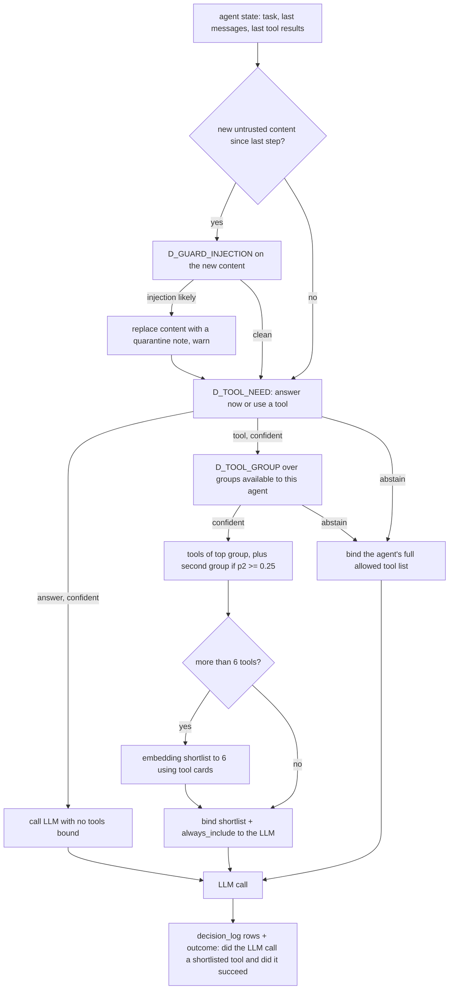

# 08. Tools and tool management

## 1. Two ways tools are called

| Style | Where | Who decides which tool | Example |
|---|---|---|---|
| Direct | Fixed graph nodes (most of the pipeline) | The graph (code) | `render_deck` calls `render.compile_pptx` then `render.preview` |
| Agentic | Research sub-agent, slide regeneration with free-form instructions | Laya shortlists, the LLM chooses among the shortlist | "Find the 2025 Indian auto components market size with a source" |

Both go through one `ToolExecutor`, so validation, timeouts, caching, permissions and logging are identical.

## 2. Tool contract

```python
# deckforge/tools/spec.py
class SideEffect(StrEnum):
    none = "none"          # pure computation
    read = "read"          # reads internal data or blobs
    external = "external"  # network calls outside the install
    write = "write"        # creates or changes stored data

class ToolSpec(BaseModel):
    name: str                       # snake_case, unique, e.g. "web_search"
    version: int                    # bump when input/output schema or behaviour changes
    group: ToolGroup                # see section 3
    description: str                # at most 300 characters, written for an LLM: what, when, when not
    input_model: type[BaseModel]
    output_model: type[BaseModel]
    side_effect: SideEffect
    timeout_s: float = 30.0
    max_retries: int = 2            # transient failures only
    idempotent: bool = True
    cache_ttl_s: int = 0            # 0 = no cache. Only for side_effect in (none, read, external)
    roles: set[str] = {"editor", "admin", "owner"}   # who may trigger it (through a run)
    requires: set[str] = set()      # features: "research", "network", "renderer", "laya"
    max_result_chars: int = 8000    # larger results go to a blob, the LLM gets a summary and a handle
```

Registration:

```python
# deckforge/tools/registry.py
REGISTRY: dict[str, RegisteredTool] = {}

def tool(spec: ToolSpec):
    def wrap(fn: Callable[[BaseModel, ToolContext], Awaitable[BaseModel]]):
        REGISTRY[spec.name] = RegisteredTool(spec=spec, fn=fn)
        return fn
    return wrap

def as_langchain_tool(name: str, ctx: ToolContext) -> StructuredTool:
    """Wrap a registered tool as a LangChain StructuredTool bound to the executor (for agents)."""
```

`ToolContext` carries `org_id`, `run_id`, `node`, ports (blobs, cache, search, renderer), and the principal's role.

## 3. Tool groups and catalogue

Groups are kept at 12 or fewer so the Laya group-routing question stays well inside its option budget.

| Group | Tools (name: purpose) | Side effect |
|---|---|---|
| `data` | `profile_table`: column types and stats. `query_table`: filter, group, aggregate on a stored table with a typed query (no code). `pivot_table`. `make_dummy_series`: plausible editable dummy data with a DUMMY flag | read |
| `calc` | `growth_rates` (CAGR, YoY). `bridge_decompose` (price-volume-mix, margin bridge). `share_of_total`. `benchmark_gap`. `value_at_stake` | none |
| `knowledge` | `framework_lookup` (framework cards by id or query). `exemplar_search` (corpus slide descriptions for few-shot). `org_terms` (org terminology and banned phrases) | read |
| `viz` | `select_exhibit` (wraps `viz.select.choose`). `fit_text` (does a string fit a box at a size). `validate_exhibit_data` | none |
| `assets` | `icon_search` (Lucide index). `flag_lookup`. `map_lookup` (Natural Earth country shapes). `image_search` (stock adapters). `generate_image` (T2I, GPU only). `illustration` (procedural isometric scenes) | read or external |
| `research` | `web_search`. `fetch_url` (SSRF-guarded). `extract_facts` (LLM extraction with quotes). `cite` (create a Citation) | external |
| `documents` | `reference_search` (search uploaded reference documents). `read_reference_section` | read |
| `render` | `compile_pptx`. `preview` (PPTX to PNGs). `lint_deck` | write, read |
| `qa` | `lookfeel_check`. `consistency_check`. `run_judges` | read |
| `storage` | `save_artifact` | write |

Each tool lives in `deckforge/tools/impl/<group>.py`. Every tool has a unit test with a fake context and a schema round-trip test.

### 3.1 Typed table queries instead of code execution

No tool executes model-written code in v1. `query_table` takes:

```python
class TableQuery(BaseModel):
    table_id: str
    filters: list[Filter] = []           # column, op in (eq, ne, lt, le, gt, ge, in, between), value
    group_by: list[str] = []
    measures: list[Measure] = []         # column, agg in (sum, mean, min, max, count, median, first, last)
    sort: list[Sort] = []
    limit: int = Field(default=100, le=1000)
```

The executor validates column names against the stored profile and runs it with pandas. This covers the calculations the frameworks need without a sandbox.

## 4. Executor

```python
# deckforge/tools/executor.py
class ToolExecutor:
    async def call(self, name: str, args: dict | BaseModel, ctx: ToolContext) -> ToolResult: ...
    async def call_many(self, calls: list[tuple[str, dict]], ctx: ToolContext) -> list[ToolResult]: ...  # gather
```

`call()` steps, in order:

1. Look up the tool. Unknown name raises `ToolError("unknown_tool")` (returned to an agent as an error result, not raised).
2. Feature check (`requires`) against settings and org settings. Missing feature returns `ToolResult(status="unavailable")`.
3. Permission check (`roles`).
4. Validate input with `input_model`. Errors return `status="invalid_args"` with the Pydantic error text, so an agent can correct itself.
5. Cache lookup when `cache_ttl_s > 0`: key `tool:{name}:v{version}:{org_scope}:{sha256(canonical_json(args))}`. `org_scope` is `shared` only for tools marked shared-safe (`framework_lookup`, `icon_search`, `flag_lookup`, `map_lookup`), else the org id.
6. Circuit breaker for `external` tools: per tool per process, opens after 5 consecutive failures for 60 s.
7. Execute with `asyncio.timeout(timeout_s)` and tenacity retries (`max_retries`, exponential backoff, retry only on `TransientToolError`, `httpx.TransportError`, timeouts).
8. Validate output with `output_model`.
9. If the serialised result is longer than `max_result_chars`, store it as a blob (`.../tools/{tool_call_id}.json`) and return a summary plus `handle`.
10. Write `tool_calls` (status, latency, cache hit, args hash, blob key). Emit metrics.

`ToolResult`:

```python
class ToolResult(BaseModel):
    tool: str
    status: Literal["ok", "invalid_args", "unavailable", "error", "timeout"]
    data: dict | None
    summary: str | None = None      # always set when data is offloaded
    handle: str | None = None       # blob key for offloaded data
    error: str | None = None
```

## 5. Laya-based tool selection

Binding every tool to an LLM bloats the context and lowers tool-choice accuracy. Laya narrows the choice in tens of milliseconds, with a calibrated confidence that tells us when to trust it.

### 5.1 The pipeline

For each model call inside an agent:



### 5.2 Middleware implementation

`deckforge/tools/selector.py` implements a LangChain 1.4 `AgentMiddleware` modelled on the library's `LLMToolSelectorMiddleware`, but asking Laya instead of an LLM:

```python
from langchain.agents.middleware import AgentMiddleware, ModelRequest

class LayaToolSelectorMiddleware(AgentMiddleware):
    def __init__(self, engine: DecisionEngine, groups: dict[str, list[str]], always_include: list[str],
                 cards: ToolCardIndex, max_tools: int = 6):
        ...

    async def awrap_model_call(self, request: ModelRequest, handler):
        state_text = build_tool_state(request.messages, request.state)   # at most 380 tokens, see 10 section 5
        need = await self.engine.decide("D_TOOL_NEED", state_text, ctx_from(request))
        if not need.abstained and need.answer == "answer":
            return await handler(request.override(tools=[]))
        if need.abstained:
            return await handler(request)                                # full allowed list
        group = await self.engine.decide("D_TOOL_GROUP", state_text, ctx_from(request),
                                         options=self._group_options(request.tools))
        if group.abstained:
            return await handler(request)
        names = self._tools_for(group)                                   # top group, maybe second group
        if len(names) > self.max_tools:
            names = await self.cards.shortlist(state_text, names, k=self.max_tools)
        names = list(dict.fromkeys(names + self.always_include))
        selected = [t for t in request.tools if t.name in names]
        return await handler(request.override(tools=selected))
```

`wrap_model_call` (sync) delegates to the async version through the event loop helper. The middleware writes `decision_log` rows through the engine (every `decide` call logs).

### 5.3 Option design for Laya questions about tools

Rules taken from Laya's documented limits, applied to every tool question:

| Rule | Why |
|---|---|
| Choice keys are neutral group names (`data`, `calc`, `research`), never `yes`/`no` or `true`/`false` | Laya can follow boolean-word labels instead of the descriptions |
| `D_TOOL_NEED` is a 2-option `choice` with keys `answer` and `tool` and full descriptions, not a `noul` | Avoids the `noul` label-following issue on the English checkpoint |
| At most 12 options per question, each description at most 20 words | Stays within the option token budget (`head_max_len`), so options are not trimmed |
| For questions with 6 or fewer options, ask the same question under every rotation of `option_order` in one forward pass and average | Documented position bias. Rotation averaging cut order-dependent answers in Laya's own measurement |
| State text at most 380 tokens, built deterministically | Leaves room within the 512-token English checkpoint |
| Every threshold is fitted per decision on held-out data (`09`, section 5) | Shipped checkpoints are over-confident until calibrated |

### 5.4 Tool cards

`kb_items` namespace `tool_cards`: one card per tool (name, group, description, three example tasks). Embedded with the `embed` role. Used for the embedding shortlist within a group and as Laya option descriptions for groups (group descriptions are generated from member cards and reviewed by hand once).

### 5.5 Outcome labelling (feeds training)

After each agent step, `ToolOutcomeLabeler` writes `outcome_label` on the decision rows:
- `D_TOOL_NEED`: label `tool` if the LLM (given the full list in abstain cases) called a tool, else `answer`.
- `D_TOOL_GROUP`: the group of the tool the LLM actually called and that returned `ok`. If the call failed or the LLM called nothing useful, the label is the group of the next successful call within two steps, else no label.
These labels train the Laya head in P11. In shadow mode (`09`, section 4) the LLM always sees the full list, so labels are unbiased by Laya's own choices.

## 6. Research agent

```python
# deckforge/graphs/research.py
def build_research_agent(registry: ModelRegistry, org: OrgSettings, engine: DecisionEngine,
                         tool_ctx: ToolContext, cards: ToolCardIndex) -> CompiledStateGraph:
    """Built lazily and cached per (org model profile) by GraphContext.agents. Not compiled at import time."""
    tools = [as_langchain_tool(n, tool_ctx) for n in RESEARCH_AGENT_TOOLS]   # web_search, fetch_url, extract_facts,
                                                                             # cite, reference_search, read_reference_section,
                                                                             # query_table, growth_rates, framework_lookup
    return create_agent(
        model=registry.chat_model("extractor", org=org),
        tools=tools,
        system_prompt=load_prompt("research.agent").system_text,
        response_format=ResearchOut,                                    # findings with citation ids
        middleware=[
            LayaToolSelectorMiddleware(engine, groups=RESEARCH_GROUPS, always_include=["cite"], cards=cards),
            ToolRetryMiddleware(max_retries=2),
            ToolCallLimitMiddleware(run_limit=12),
            ToolCallLimitMiddleware(tool_name="fetch_url", run_limit=6),
            ModelCallLimitMiddleware(run_limit=10, exit_behavior="end"),
            ContextEditingMiddleware(),                                 # clears old tool results first
            SummarizationMiddleware(model=registry.chat_model("extractor", org=org), trigger=("tokens", 24000),
                                    keep=("messages", 12)),
        ],
        name="research_agent",
    )
```

Research rules:
1. Every `Finding` must reference at least one `Citation` with an exact quote found in the fetched page text (checked by string search, case- and whitespace-insensitive).
2. Fetched pages pass the SSRF guard (`15`) and `D_GUARD_INJECTION` before their text reaches the model.
3. A finding older than `options.research.max_age_days` (default 730) is flagged in the plan report.
4. If research returns nothing usable, the analysis falls back to dummy data and the slide gets an `ILLUSTRATIVE` sticker.
5. The agent's input is one analysis (question, framework, data needed). Its output is `ResearchOut(findings, citations, gaps)`.

## 7. MCP (P7, optional)

| Direction | How | Use |
|---|---|---|
| DeckForge as MCP server | `deckforge/tools/mcp_server.py` with the `mcp` SDK (FastMCP). Exposes `create_run`, `get_run`, `list_decks`, `download_deck`, and read-only tools (`framework_lookup`, `icon_search`). Auth with an org API key | Customers drive DeckForge from their own agents |
| DeckForge as MCP client | `langchain-mcp-adapters` loads tools from customer MCP servers configured per org (URL and credentials in `provider_credentials`). They join the `documents` or `data` group with `side_effect=external` | Pull data from customer systems |
| Laya MCP | Not used. DeckForge calls `laya-serve` over HTTP | |

External MCP tools get the same executor treatment (validation, timeouts, logging) through a wrapper `McpToolAdapter`.

## 8. Adding a new tool (checklist for the implementing agent)

1. Define `XInput`, `XOutput` models in `deckforge/tools/impl/<group>.py`.
2. Write the `ToolSpec` with an LLM-facing description (what it does, when to use it, when not to).
3. Implement `async def x(args: XInput, ctx: ToolContext) -> XOutput` without side effects outside its declared class.
4. Register with `@tool(spec)`.
5. Add a tool card (three example tasks) to `deckforge/tools/cards.yaml`.
6. Tests: happy path, invalid args, timeout path (with a fake slow dependency), cache key stability.
7. If the tool joins an agent, add it to the agent's tool list and regenerate the group descriptions.
