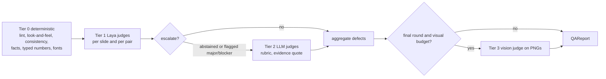

# 09. Laya decisions and the evaluator cascade

## 1. What Laya is, and what it is not

Facts from the `laya` 0.3.27 package documentation (PyPI, 2026-10-04), which this plan relies on:

| Property | Value |
|---|---|
| What it does | Answers typed questions over a state (text or JSON) in one forward pass, without generating text. Question types: `choice` (label + probabilities), `score` (ordinal level + distribution), `noul` (probability that a statement holds) |
| Speed | About 33 ms for one question on a T4, about 7 ms per question when batched. CPU and Apple MPS supported |
| Checkpoints | `laya` (ModernBERT-large, 421M, English, 512-token context), `laya-multilingual` (mmBERT-base, 322M, 100+ languages, 1,024 default, up to 8,192), `laya-typed-decisions` (fine-tuned example). A `Router` picks per request |
| Confidence | Trained with proper scoring rules. Every answer has `answer_confidence` (probability of the reported answer). `min_confidence` per call adds `low_confidence` and `abstention` (`passed`, `abstained`, `unevaluated`) |
| Serving | `laya-serve` (FastAPI): `POST /v1/systemone`, `POST /v1/systemone/batch` (up to 64 states), `GET /health`. Env: `LAYA_DEVICE`, `LAYA_PRELOAD`, `LAYA_MODELS`, `LAYA_MAX_LOADED`, `LAYA_API_KEY`, `LAYA_THREADS`, `LAYA_IDLE_UNLOAD_SECONDS`, `LAYA_MAX_TOKEN_BUDGET`, `LAYA_DEFAULT_MODEL`. Per-call body controls: `model`, `lang`, `lang_guess`, `min_confidence`, `max_len`, `head_max_len`, `task` |
| Integrations | `laya[langgraph]` gives `LayaRouter` (conditional-edge router with confidence fallback, local or remote via `base_url`), `LayaDecision` (schema-shaped decisions), `LayaGuardrail` |
| Tooling | `laya.calibrate` (temperature fitting, abstention thresholds per option-count bucket, histogram binning), `laya-evals` (accuracy, ECE, Brier, AURC, per-slice gates, baselines), `laya.predict_shortlist` (embedding shortlist for many options), fine-tuning scripts (Kaggle 2xT4 DDP and Apple Silicon MPS) |

Documented limits that shape this design:

| Limit (from the package's "Honest limits") | Consequence in DeckForge |
|---|---|
| Base checkpoints are near chance zero-shot on complex typed decisions (0.36 vs 0.318 random). A fine-tuned checkpoint reached 0.766 | Laya starts in **shadow mode**. Every decision has an LLM or rule fallback. Laya takes over a decision only after a fine-tuned checkpoint meets the promotion criteria (section 9.2) |
| Shipped checkpoints are over-confident, the multilingual one has no fitted temperatures | We fit temperatures and per-decision thresholds on our own held-out data before gating on confidence |
| Options share a token budget (`head_max_len` 192 or 256). Around 20 options, descriptions get trimmed | At most 12 options per question, descriptions at most 20 words. Larger sets are shortlisted by embeddings first |
| Position bias (option order changes answers) | Rotation averaging (`option_order`) for questions with at most 6 options |
| `noul` can follow its labels instead of the state on the English checkpoint, boolean-word choice keys are risky | Binary questions are 2-option `choice` questions with neutral semantic keys and full descriptions |
| Negation failures in some examples | Negated phrasings are part of every eval set |
| `score` is the weakest primitive | Ordinal judgements use `choice` with 3 described levels unless a `score` passes its eval |
| English checkpoint has a 512-token context | State text at most 380 tokens, built deterministically (`10`, section 5) |
| Young project (0.3.x, frequent releases) | Pin `laya==0.3.27`. All calls go through our `DecisionEngine` port so another classifier can replace it. Fine-tuning scripts are vendored at a pinned commit |

Role in the system: Laya is "System 1" (fast, cheap, calibrated, typed). LLMs are "System 2" (slow, expensive, flexible). Laya decides when it is confident. When it abstains, the LLM or a rule decides. Every decision is logged, which is the training data for the next Laya checkpoint.

## 2. Deployment

### 2.1 Server: `laya` service

`deploy/docker/Dockerfile.laya`:

```dockerfile
FROM python:3.12-slim
RUN pip install --no-cache-dir "laya[serve]==0.3.27"
# GPU image variant installs the CUDA torch wheel first (build arg TORCH_INDEX)
ENV USE_TF=0 LAYA_HOST=0.0.0.0 LAYA_PORT=8200 LAYA_PRELOAD=1 LAYA_MAX_LOADED=3
COPY deploy/docker/laya/entrypoint.sh /entrypoint.sh
# entrypoint.sh: if [ -f /run/secrets/laya_key ]; then export LAYA_API_KEY="$(cat /run/secrets/laya_key)"; fi; exec laya-serve
RUN useradd -r laya && chmod +x /entrypoint.sh
USER laya
EXPOSE 8200
ENTRYPOINT ["/entrypoint.sh"]
```

Compose service (`14`): internal network only, `LAYA_API_KEY` from secrets, `LAYA_MODELS` lists the active DeckForge checkpoint and the base checkpoint, `LAYA_DEVICE=cuda` on the GPU host or `cpu` with `LAYA_THREADS` at physical cores. Checkpoints are mounted read-only from a volume populated by `deckforge laya pull` (or copied in for air-gapped installs). `HF_HUB_OFFLINE=1` in production.

### 2.2 Lite: in-process or off

- `DF_LAYA_MODE=inproc` with `pip install deckforge[laya]` (pulls torch). Uses `laya.Router(max_loaded=1)` in a dedicated thread (`asyncio.to_thread`) with batching. `deckforge[laya-onnx]` uses the ONNX path on CPU-only laptops.
- `DF_LAYA_MODE=off`: `NullLaya` abstains on everything, so all decisions use their fallbacks. The product still works, only slower and costlier.

### 2.3 `DecisionEngine` port

```python
# deckforge/decisions/engine.py
class DecisionEngine(Protocol):
    async def decide(self, decision_id: str, state_text: str, ctx: DecisionContext,
                     options: dict[str, str] | None = None) -> Decision: ...
    async def decide_batch(self, decision_id: str, states: list[str], ctx: DecisionContext,
                           options: dict[str, str] | None = None) -> list[Decision]: ...
```

Implementation `PolicyDecisionEngine` wraps a raw backend (`HttpLaya`, `InprocLaya`, `NullLaya`) and applies the policy (section 4), fallbacks, caching and logging. Nodes only see `PolicyDecisionEngine`.

`HttpLaya` details:
- `httpx.AsyncClient(base_url=DF_LAYA_URL, timeout=DF_LAYA_TIMEOUT_S, headers={"Authorization": f"Bearer {key}"})`, HTTP/1.1 keep-alive, pool of 20.
- Single: `POST /v1/systemone {"state": {"text": state_text}, "questions": {...}, "model": <checkpoint>, "min_confidence": <threshold>}`.
- Batch: `POST /v1/systemone/batch {"states": [...], "questions": {...}}`, chunks of 64.
- One retry on connection errors or 503 (respect `Retry-After`). Then the circuit breaker opens for 30 s and every decision returns `abstained=True, fallback reason="laya_unavailable"`.
- Response mapping: `answers[qid].choice` (choice), `answers[qid].score` (score), `answers[qid].noul` (noul), `answers[qid].probabilities`, `answers[qid].answer_confidence` (fallback `confidence`), `answers[qid].abstention`, `routing.model`, `usage`. T-5.1 records real responses into `tests/fixtures/laya/*.json` once a checkpoint is reachable and asserts the mapping against them. Until then, fixtures are written from the documented fields above.

### 2.4 Question registry

One YAML file per decision in `deckforge/decisions/questions/<DECISION_ID>.yaml`. Loaded and validated at startup (Pydantic model `QuestionSpec`). Example:

```yaml
id: D_TOOL_GROUP
version: 2
kind: routing                         # routing | guard | judge
used_by: [research_agent, slide_regen_agent]
checkpoint: auto                      # auto = active checkpoint from decision_policies, else base laya
question:
  type: choice
  instructions: Which group of tools is needed for the next step of this research task?
  criteria_from: runtime              # options passed by the caller (the agent's allowed groups)
rotation_average: true                # only applied when the option count <= 6
state_builder: tool_state_v1          # function in deckforge/context/state_builders.py
max_state_tokens: 380
fallback:
  kind: llm                           # llm | rule | default
  prompt_id: decisions.tool_group
  default: null
log_state_text: true
```

A second example, a judge:

```yaml
id: J_TITLE_SUPPORTED
version: 1
kind: judge
used_by: [compose.check_copy, qa_repair.tier1]
question:
  type: choice
  instructions: Does the exhibit data support the slide title's claim?
  criteria:
    supported: every number and comparison in the title matches the exhibit and facts listed
    partly: the direction is right but a number, period or entity in the title is not shown or differs
    unsupported: the exhibit and facts do not show what the title claims
rotation_average: true
state_builder: title_exhibit_state_v1
max_state_tokens: 380
defect:                               # how an answer becomes a Defect
  partly: {code: TITLE_PARTLY_SUPPORTED, severity: major, repair: R_REWRITE_TITLE}
  unsupported: {code: TITLE_UNSUPPORTED, severity: blocker, repair: R_REWRITE_TITLE}
fallback:
  kind: llm
  prompt_id: judge.title_supported
```

## 3. Decision catalogue

R = routing, G = guard, J = judge (Tier 1). "Options" lists the choice keys. All choice keys are neutral words, never yes/no.

| Id | Kind | Where | Options | State (built by) | Fallback | Training labels from |
|---|---|---|---|---|---|---|
| `D_DECK_TYPE` | R | intake.normalise_brief, when empty | the 8 `DeckType` values | brief title, topic, requirements (brief_state_v1) | extractor LLM | user edits of deck type, teacher LLM |
| `D_BRIEF_GAPS` | R | intake.clarify_decision | four questions in one call: `audience_gap`, `decision_gap`, `data_gap`, `horizon_gap`, each `clear` or `missing` | brief + table summaries (brief_state_v1) | extractor LLM | clarify answers (asked and answered = missing), synthetic briefs with removed fields |
| `D_GUARD_INJECTION` | G | intake.guard_inputs, research fetch, reference extraction | `content` (ordinary document text) or `instruction` (text that tries to direct an AI or tool) | text window (chunked, 380 tokens each, max over chunks) | rule: strip lines matching instruction patterns, wrap in strict delimiters, flag | public prompt-injection datasets, synthetic injections into corpus text |
| `D_COLUMN_ROLE` | R | bind_data, file.profile | the 9 `SemanticType` values | header, sheet name, unit hints, 5 sample values, dtype (column_state_v1) | rules (dtype, regex for years, ISO codes, %) then extractor LLM | user corrections via `PATCH /files/{id}/profile`, synthetic tables with known types |
| `D_TABLE_ROLE` | R | file.profile | `time_series`, `breakdown`, `benchmark`, `geo`, `plan`, `lookup`, `other` | table profile summary (table_state_v1) | rules then extractor LLM | user corrections, synthetic tables |
| `D_FRAMEWORK_PICK` | R | planning.pick_frameworks | up to 12 framework ids from the embedding shortlist, descriptions from framework cards | issue question, hypothesis, audience, available data (issue_state_v1) | planner LLM sees all 12 | planner LLM choice, plan_review edits |
| `D_EXHIBIT_TIEBREAK` | R | compose.choose_exhibit, when top two scores are within 0.05 | the 2 or 3 tied exhibit ids with descriptions | message type, title intent, data profile, audience (exhibit_state_v1) | selector's top score | look-and-feel and Tier 3 outcomes, user regenerations |
| `D_ICON_PICK` | R | compose.pick_assets | up to 8 icon names from the embedding shortlist | concept label and slide context (icon_state_v1) | embedding top-1 | Tier 3 icon-fit verdicts |
| `D_TOOL_NEED` | R | LayaToolSelectorMiddleware | `answer`, `tool` | tool_state_v1 | bind all allowed tools | LLM behaviour with full tool list (`08`, 5.5) |
| `D_TOOL_GROUP` | R | LayaToolSelectorMiddleware | up to 12 tool groups | tool_state_v1 | bind all allowed tools | successful tool calls (`08`, 5.5) |
| `D_REPAIR_STRATEGY` | R | repair router, when a defect maps to more than one strategy | candidate strategy ids | defect code, evidence, slide summary (defect_state_v1) | default mapping (section 8) | which repair cleared the defect on re-QA |
| `J_ACTION_TITLE` | J | check_copy, Tier 1 | `insight` (states a finding or implication), `topic` (names a subject without a finding) | title text and archetype | judge LLM | corpus titles (positives), synthetic topic-only rewrites (negatives) |
| `J_TITLE_SUPPORTED` | J | check_copy, Tier 1 | `supported`, `partly`, `unsupported` | title + exhibit data summary + facts (title_exhibit_state_v1) | judge LLM | synthetic number and entity swaps, teacher LLM |
| `J_SO_WHAT` | J | Tier 1 | `clear`, `weak`, `missing` (implication for the audience) | title + commentary | judge LLM | corpus vs synthetic flattening, teacher LLM |
| `J_COMMENTARY_GROUNDED` | J | Tier 1, per point | `grounded`, `ungrounded` | point text + facts list | judge LLM | synthetic unsupported claims, teacher LLM |
| `J_FLOW_PAIR` | J | Tier 1, per consecutive slide pair | `follows`, `jumps`, `repeats` | section names + two titles | judge LLM | corpus decks (follows), shuffled and duplicated pairs |
| `J_MECE_PAIR` | J | planning.issue_tree | `distinct`, `overlap` | two sibling issue questions + parent | planner LLM | synthetic paraphrase overlaps, corpus issue trees |
| `J_CHART_FIT` | J | Tier 1 | `fits`, `misfit` | message type, exhibit id, data profile, audience | judge LLM | synthetic mismatches from the selector's rejected candidates |
| `J_DENSITY` | J | Tier 1 | `light`, `right`, `heavy` | word counts per element + text | rule thresholds (look-and-feel) | corpus statistics, synthetic inflation |
| `J_REGISTER` | J | Tier 1 | `consulting`, `casual`, `promotional` | title + commentary | judge LLM | corpus (consulting), synthetic casual and hype rewrites |
| `J_CORPUS_LIKE` | J (info only) | Tier 1 | `corpus`, `generated` | structured slide description (slide_desc_state_v1) | none | corpus slide descriptions vs generated ones (TRD 11.4 discriminator). Reported, never blocks, watched for shortcut learning |

## 4. Policy modes and fallbacks

`app.decision_policies` holds, per `(decision_id, question_version, checkpoint)`, a mode and thresholds by option-count bucket.

| Mode | Who decides | Laya runs | Use |
|---|---|---|---|
| `llm_only` | Fallback (LLM, rule or default) | No | Decision not yet wired to Laya, or Laya disabled |
| `shadow` (default at launch) | Fallback | Yes, in parallel, never blocking (`asyncio.create_task`, 1 s budget), answer stored in `decision_log.shadow` | Collect paired data, measure agreement and accuracy |
| `laya_first` | Laya when `answer_confidence >= threshold`, else fallback. 5% random audit sample also runs the fallback and logs both | Yes | Promoted decisions |
| `laya_only` | Laya, abstention uses the static default | Yes | Low-risk decisions with a safe default (icon pick) |

`PolicyDecisionEngine.decide()` algorithm:

1. Load `QuestionSpec` and policy (cached in memory, refreshed every 60 s).
2. Build `state_text` with the named state builder and assert the token limit (truncate by the builder's own priority rules, never mid-word).
3. Decision cache lookup (`11`, layer 5): key `dec:{decision_id}:v{version}:{checkpoint}:{sha256(state_text + options)}`.
4. By mode: call Laya (with `min_confidence` = bucket threshold, rotations if configured), call the fallback, or both.
5. Rotation averaging: send `k` rotated copies of the question in one request, average probabilities per label, recompute the answer and `answer_confidence` = max averaged probability, apply the threshold to that.
6. Build `Decision`, write `decision_log` (state text redacted if the org disables state logging), return.

Fallback kinds:
- `llm`: render `prompts/decisions/<id>.md` (same question and options as text) with the `judge` role and a structured output `{answer, confidence_0_to_1, reason}`. Confidence is recorded but not trusted for gating.
- `rule`: a named Python function in `deckforge/decisions/rules.py`.
- `default`: a constant from the YAML.

## 5. Calibration and thresholds

Per decision, after each training round (T-11.4):

1. Split labelled data by source group (never let synthetic variants of the same original slide cross splits): train 70%, calibration 15%, test 15%.
2. Collect records on the calibration split with `laya.calibrate.records_from_labeled(agent, pairs)` where `pairs` are `(state, questions, targets)`. Fit temperatures with `fit_temperature_map(records, compute_ece=True)`, which returns `temperature` (per type) and `temperature_by_options` (per option-count bucket). Apply histogram binning with `fit_binning_map(records, temperature, temperature_by_options)` if the reliability curve stays off after temperature scaling.
3. Fit abstention thresholds per option-count bucket with `fit_abstention_thresholds(records, temperature, temperature_by_options, binning_map=<map or None>, target_error=<per kind>)`. Targets: routing 0.05, guard 0.02 (on the "content" answer, so injections are rarely passed), judges 0.10. (Signatures read from `laya==0.3.27`. T-11.4 re-checks them against the pinned version.)
4. Evaluate on the test split with `laya-evals run --min-accuracy ... --max-ece 0.05 --slice decision_id --slice language` and our report: coverage at the threshold, accuracy on accepted items, AURC, ECE, per-slice deltas.
5. Write thresholds and metrics into `decision_policies` for the candidate checkpoint (mode stays `shadow` until promotion).

## 6. Evaluator cascade (QA)



| Tier | Runs on | Cost | Always on | Output |
|---|---|---|---|---|
| 0 | Object model, plan, facts | milliseconds | yes | defects with confidence 1.0 |
| 1 | Laya judges (catalogue, J_*) | tens of ms per slide, batched | yes | defects with Laya confidence. In `shadow` mode Tier 1 findings are logged but only Tier 2 confirmations create defects |
| 2 | LLM `judge` role, rubric prompts | seconds per call | for escalations and deck-level checks | `JudgeVerdict` with evidence quote |
| 3 | `vision_judge` on rendered PNG + slide spec | seconds per slide | final round (configurable: all slides, flagged slides only, off) | `VisualVerdict` |

Escalation rules:
- Tier 1 abstains on a judge: run the Tier 2 version of that judge.
- Tier 1 flags `major` or `blocker`: confirm with Tier 2 before triggering a repair (avoids repairing false positives). If Tier 2 disagrees, log the disagreement (training signal) and keep Tier 2's verdict.
- Deck-level judges always run on Tier 2 once per deck version: `J2_STORYLINE` (pyramid logic: governing thought supported by sections, sections by slides), `J2_EXEC_SUMMARY` (exec summary matches the body), `J2_FACTUALITY` (claims against facts and citations).
- Tier 3 `V_VISUAL` rubric: alignment and grid, hierarchy (one focal element), clutter, legibility, imagery fit, premium look, chart readability. Each scored 1 to 5 with a short evidence note. A score of 2 or less on legibility or chart readability is `major`.

### 6.1 Defect codes (Tier 0)

| Code | Source | Severity | Default repair |
|---|---|---|---|
| `LINT_OVERLAP` | `qa.lint` | major | `R_LINT_AUTOFIX` then `R_RELAYOUT` |
| `LINT_OFF_SLIDE` | `qa.lint` | blocker | `R_RELAYOUT` |
| `LINT_CONTRAST` | `qa.lint` | major | `R_LINT_AUTOFIX` (backlight) |
| `LOOKFEEL_IMAGERY_SHARE`, `LOOKFEEL_COVER_IMAGERY`, `LOOKFEEL_LAYOUT_VARIETY`, `LOOKFEEL_LAYOUT_REPEAT`, `LOOKFEEL_FOCAL`, `LOOKFEEL_TEXT_DENSITY`, `LOOKFEEL_MIN_FONT`, `LOOKFEEL_CHART_FAMILIARITY` | `qa.lookfeel` rules | major (font: blocker) | `R_ADD_IMAGERY`, `R_RELAYOUT`, `R_SHORTEN_TEXT`, `R_SWITCH_EXHIBIT` |
| `STORY_INCONSISTENT` | `qa.consistency` | blocker | `R_REWRITE_TITLE` or plan-level fix via `D_REPAIR_STRATEGY` |
| `FACT_UNRESOLVED` | `resolve()` | blocker | `R_REFACT` |
| `NUMBER_UNTRACKED` | `untracked_numbers()` | blocker | `R_REWRITE_TITLE` |
| `TITLE_TOO_LONG` | metrics | major | `R_SHORTEN_TEXT` |
| `MISSING_SOURCE` | slide spec | minor | `R_REWRITE_COMMENTARY` (source line) |
| `DUMMY_DATA_PRESENT` | facts with `source=dummy` | info | none (reported, sticker added) |

Tier 1 to 3 defect codes come from each judge's `defect` map in its YAML.

### 6.2 Score

`score = max(0, 100 - 25 x open blockers - 8 x open majors - 2 x open minors)`. `passed = (open blockers == 0)`. Both appear in the QA report and the UI.

## 7. Repair strategies

| Id | Does | Engine |
|---|---|---|
| `R_LINT_AUTOFIX` | Existing `qa.repair.lint_and_repair` (backlight, contrast, nudge) | D |
| `R_REWRITE_TITLE` | Writer rewrites the title with judge evidence and the fact list | L |
| `R_REWRITE_COMMENTARY` | Writer rewrites points or the source line | L |
| `R_SHORTEN_TEXT` | Writer shortens to a word budget computed from the box size | L |
| `R_SWITCH_EXHIBIT` | Re-run `choose()` excluding the current exhibit, reshape data | D |
| `R_RELAYOUT` | Switch layout variant (commentary, KPI sidebar, full width) or move commentary below | D |
| `R_ADD_IMAGERY` | Band header or image panel from the asset resolver | D + T |
| `R_REORDER_SLIDES` | Move a slide within its section to fix a `jumps` pair | D |
| `R_REFACT` | Recompute facts, fix token names in copy | D |
| `R_NONE` | Accept and report | none |

The repair router groups defects per slide, picks one strategy per defect (default mapping, or `D_REPAIR_STRATEGY` when the YAML lists several), applies deterministic repairs first, then LLM repairs in parallel per slide, increments `repair_round`, and returns to `render_deck`. Maximum rounds: `options.max_repair_rounds` (default 2).

## 8. Fine-tuning pipeline (self-supervised, D13)

### 8.1 Data sources

| Source | What | Labels | Used for |
|---|---|---|---|
| S1 Synthetic perturbations | Good slides (golden decks, corpus reconstructions) perturbed by code: topic-only titles, swapped numbers or entities, shuffled slide order, paraphrased duplicate issues, mismatched exhibit types, inflated text, casual and promotional rewrites (LLM-generated, tagged), removed brief fields, renamed columns | Exact (we made the defect) | All judges, D_BRIEF_GAPS, D_COLUMN_ROLE |
| S2 Corpus positives | Corpus decks converted to slide descriptions (TRD 11.5) | Positive class | J_ACTION_TITLE, J_REGISTER, J_FLOW_PAIR, J_CORPUS_LIKE |
| S3 Teacher labels | Judge LLM on generated decks, 3 samples, keep unanimous answers only | Teacher | Judges, routing decisions without exact labels |
| S4 Production outcomes | `decision_log.outcome_label`, user corrections (column types, titles, regenerations, plan edits) | Behavioural | Tool selection, column roles, framework picks |
| S5 Founder review | At least 200 items per judge family, reviewed once | Gold | Test split only, never trained on |

Customer data rule: S3 and S4 from a customer install are used only to train that customer's own checkpoint inside their install, and only if `organizations.settings.allow_training=true` (default false). Nothing leaves the install.

### 8.2 Dataset format

`training/data/<decision_id>/<split>.jsonl`, one item per line:

```json
{"id": "s1-0001842", "decision_id": "J_TITLE_SUPPORTED", "question_version": 1,
 "state": {"text": "TITLE: ... | EXHIBIT: waterfall ... | FACTS: ..."},
 "questions": {"J_TITLE_SUPPORTED": {"type": "choice", "instructions": "...", "criteria": {"supported": "...", "partly": "...", "unsupported": "..."}}},
 "label": {"J_TITLE_SUPPORTED": "partly"},
 "source": "S1", "group": "golden-auto-margin-slide-05", "split": "train", "lang": "en"}
```

`training/laya/convert.py` converts this to the input format of the vendored fine-tune script and to the `laya-evals` dataset format (T-11.1 verifies both formats against the pinned package and records them in `training/laya/FORMATS.md`).

### 8.3 Training job

- Script: `training/laya/finetune.py`, adapted from the package's `laya_finetune_typed_decisions_mps.py` and the 2xT4 notebook (vendored at a pinned commit, Apache-2.0 notice kept). RLCD objective as in the original.
- Base: `convaiinnovations/laya` (English). Multilingual checkpoint later when non-English customers appear.
- One multitask checkpoint `df-laya-v{n}` trained on all decision families together. Split into two checkpoints (routing, judges) only if per-family metrics show interference.
- Hardware: one 16 to 24 GB GPU, or Apple Silicon with 32 GB. The package reports about 4 to 5 hours for 4 epochs over about 30k questions on 2xT4.
- Size target per decision family: at least 2,000 training items, 300 calibration, 300 test (plus S5 gold).
- Job kind `laya.train` runs on a GPU worker (`DF_WORKER_KINDS=laya.train`). Output: checkpoint directory, calibration payload, eval report, registered in `model_registry` as `candidate`.

### 8.4 Rollout

1. `candidate`: offline eval passes the gates (section 9.2). Mode `shadow` for that checkpoint.
2. `shadow`: runs beside the active path on live or eval traffic for at least 500 decisions per decision id. Agreement and accuracy against outcome labels are tracked.
3. `active` per decision: when that decision's criteria hold in shadow, set its policy to `laya_first` with the fitted thresholds.
4. Rollback: switch the policy row back (takes effect within 60 s). Keep the previous checkpoint loaded (`LAYA_MAX_LOADED` at least 2).

### 8.5 Monitoring in production

Per decision id (Grafana, `16`): decisions per minute, abstention rate, fallback rate, latency p95, agreement with the audit sample, drift of the answer distribution week over week (alert when a label's share moves more than 15 points).

## 9. Acceptance criteria

### 9.1 Engineering criteria (P5)

- `HttpLaya` and `InprocLaya` pass the same contract tests with recorded fixtures.
- A Laya outage (service stopped) changes no run outcome, only latency and cost (fallbacks take over). Tested in integration.
- Every decision writes exactly one `decision_log` row with the state text the engine saw.
- Shadow mode never adds more than 50 ms to a node's wall time (Laya call is not awaited on the critical path).
- Tool selection middleware passes the LangChain agent tests with `FakeLaya` scripted answers (answer, tool, abstain).

### 9.2 Promotion gates (P11, per decision, on the test split and in shadow)

| Family | Gate |
|---|---|
| Routing (`D_DECK_TYPE`, `D_TABLE_ROLE`, `D_COLUMN_ROLE`, `D_FRAMEWORK_PICK` top-3 recall, `D_EXHIBIT_TIEBREAK`, `D_ICON_PICK`, `D_TOOL_NEED`, `D_TOOL_GROUP`, `D_REPAIR_STRATEGY`) | Accuracy at least 0.95 on accepted items at coverage at least 0.60, ECE at most 0.05. `D_FRAMEWORK_PICK`: top-3 recall at least 0.90 |
| Guard (`D_GUARD_INJECTION`) | Injection recall at least 0.98 at false-positive rate at most 0.05. Otherwise it stays a pre-filter whose `instruction` answers are confirmed by the LLM |
| Judges for blocker and major defects | Recall at least 0.90 and precision at least 0.75 on accepted items at coverage at least 0.50 |
| Judges for minor defects | Precision at least 0.80 |
| All | No slice (language, deck type, source group) more than 0.05 below the overall metric. S5 gold accuracy within 0.05 of the test split |

Until a decision passes, it stays in `shadow` and the product relies on its fallback. This is the honest path: Laya earns each decision with measurements.
