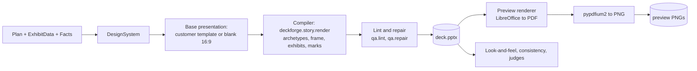

# 12. Render engine and assets

## 1. Pipeline



The compiler is the existing code. This plan changes four things around it: it reads a `DesignSystem` instead of module globals, it can start from a customer template, its text metrics come from bundled fonts on every OS, and exhibits read validated `ExhibitData` models.

## 2. Compiler changes

| Change | Where | Ticket |
|---|---|---|
| `viz.style.use()` accepts a `DesignSystem`. `Family.from_design_system(ds)` builds the token set. Families MERIDIAN and VERDANT become built-in `DesignSystem` rows | `deckforge/viz/style.py`, `deckforge/core/design.py` | T-8.3 |
| Frame zones read from `DesignSystem.zones` instead of constants (constants stay as defaults) | `deckforge/viz/frame.py` | T-8.3 |
| `Deck(template_path=...)` opens the customer template, removes its sample slides, and maps archetypes to template layouts through `layout_map`. Our shapes are placed in the content zone derived from the layout's placeholders. Title text goes into the layout's title placeholder when one exists, so the master's styling and footer apply | `deckforge/render/canvas.py` | T-8.4 |
| Metrics from bundled fonts (section 4) | `deckforge/render/metrics.py` | T-0.3 |
| Exhibit adapters take `ExhibitData` models (`04`, 2.3) | `deckforge/story/render.py` | T-4.2 |
| Each exhibit is wrapped in one group shape named `ex_<slide>_<exhibit>`, and the group's alt text (`descr`) stores `{"deckforge": 1, "exhibit": "...", "data": {...}}`. This lets DeckForge reopen a deck and edit or regenerate a slide, and keeps data with the chart for the user | `deckforge/render/canvas.py`, exhibits | T-6.5 |
| Native chart mode: for `columns`, `line`, `stacked_columns`, `bar`, `scatter` and the waterfall (stacked-column technique), `render_native()` writes a PowerPoint chart with an embedded workbook (existing `render/charts.py`). Org setting `prefer_native_charts` (default false). Designer exhibits remain the default because they look better | `deckforge/render/charts.py`, exhibits | T-6.6 |
| `renderer_version` constant (semver) stored on every deck version | `deckforge/render/__init__.py` | T-6.1 |

## 3. Template ingestion (customer pptx or potx to `DesignSystem`)

Job `template.ingest` runs `template_ingest_graph` (`06`). Steps:

1. **Validate** the upload (`15`, section 4). Reject macro-enabled files.
2. **Read theme**: open with python-pptx, read the slide master's theme part (`ppt/theme/theme1.xml`): `a:clrScheme` (`dk1`, `lt1`, `dk2`, `lt2`, `accent1` to `accent6`, `hlink`) and `a:fontScheme` (major and minor Latin fonts). Slide size from `presentation.slide_width/height`.
3. **Read layouts**: for each slide layout, name and placeholders (type, idx, position, size). Identify title-only, title-and-content, section header, blank, two-content layouts by placeholder pattern.
4. **Derive zones**: from the title-and-content layout, title placeholder box gives `title_y` and title width. Body placeholder box gives `content_y`, `content_y1`, `x0`, `x1`. Footer placeholders give `footer_y`.
5. **Map colours to roles**: `ink` = darkest of dk1/dk2 with contrast at least 7:1 on white. `accent` = accent1 unless its contrast on white is below 3:1, then the first accent that passes. `accent_dark` and `accent_light` derived in OKLab (lightness -0.15 and +0.35). `negative` = the closest accent to red hue if one exists with contrast at least 4.5:1, else `#C0391B`. `heat` ramp: 5 steps from `accent_light` to `accent_dark` in OKLab, then each step's text colour chosen by contrast (the heat-table rule). `waves` from accent1, accent2, accent3 adjusted for ordinal lightness.
6. **Validate the palette**: run the dataviz palette checks (lightness band, CVD separation for categorical sets, contrast). Failures are adjusted automatically and listed as warnings.
7. **Fonts**: title font = major Latin, body font = minor Latin. If not in the bundled set, map to the nearest metric-compatible bundled font for metrics, and record a warning that previews substitute it (the PPTX still names the customer font, so it renders correctly on the customer's machines).
8. **Logo**: find picture shapes on the master or title layout. Largest picture in a corner is the logo candidate. Position recorded.
9. **Name** (one `extractor` LLM call): suggest a display name and a layout map confirmation from layout names. Optional, falls back to the file name.
10. **Preview**: render a fixed 6-slide sample deck (cover, agenda, exhibit with commentary, KPI sidebar, matrix, decisions) with the new design system, store PNGs, status `ready`.
11. The user reviews in the UI and can edit colours, fonts and the layout map (each save creates a new version).

## 4. Fonts on every OS

`deckforge/fonts/` ships these files (OFL or Apache, licence files included):

| Bundled family | Metric-compatible with | Role |
|---|---|---|
| Liberation Sans (Regular, Bold, Italic, Bold Italic) | Arial | default body and charts |
| Gelasio (Regular, Bold) | Georgia | MERIDIAN titles |
| Carlito (Regular, Bold) | Calibri | common corporate templates |
| Caladea (Regular, Bold) | Cambria | common corporate templates |
| Liberation Serif | Times New Roman | fallback |

`deckforge/fonts/fonts.json` maps a font name and weight to a file, plus aliases (`"Arial": "Liberation Sans"`, `"Georgia": "Gelasio"`, `"Calibri": "Carlito"`, `"Cambria": "Caladea"`). `metrics.font_file(name, bold)` resolves through this index only. No `fc-match`, no system font lookup. Result: identical line breaks and fit decisions on macOS, Windows, Linux and in containers.

The renderer image installs the same files into `/usr/share/fonts/truetype/deckforge/` and adds fontconfig aliases (`deploy/docker/renderer/fonts.conf`) so LibreOffice previews match the metrics.

## 5. Preview renderer

### 5.1 Server: `renderer` service

A small FastAPI app in `deckforge/renderer_service/app.py`, packaged in `deploy/docker/Dockerfile.renderer` (Debian slim, `libreoffice-impress`, `python3`, `unoserver==3.7`, bundled fonts). It has no database or blob access.

| Endpoint | Body | Response |
|---|---|---|
| `POST /v1/convert` | multipart `file` (pptx), query `to=pdf` | `application/pdf` bytes |
| `GET /health` | | `{instances: N, busy: k}` |

Internals:
- At startup, launch `N = DF_RENDERER_INSTANCES` (default: CPU cores / 2) `unoserver` processes on ports 2003 + i, each with its own profile dir (`--user-installation file:///tmp/lo-<i>`).
- A pool hands each request to a free instance (`asyncio.Queue` of instance ids). Conversion uses the unoserver client (`UnoClient(port=...).convert(indata=bytes, convert_to="pdf")`, verify the exact call against unoserver 3.7 in T-6.3).
- Timeout 90 s per conversion. On timeout or crash, kill and restart that instance, return 503 so the worker retries.
- Requests limited to 100 MB and 1 conversion per instance at a time.

The worker's `HttpRenderer` posts the PPTX, receives the PDF, stores it, then rasterises locally (section 5.3).

### 5.2 Lite: `SofficeRenderer`

```text
<soffice> --headless --norestore --nolockcheck -env:UserInstallation=file:///<tmp>/lo-profile-<pid>
          --convert-to pdf --outdir <tmp_out> <tmp_in>/deck.pptx
```

- `asyncio.create_subprocess_exec` with a 120 s timeout. Profile dir per process avoids the LibreOffice lock problem. A process-wide semaphore of 1 (LibreOffice is heavy on laptops).
- `DF_SOFFICE_PATH` or auto-detection (`02`, section 6). Missing LibreOffice: `NullRenderer`, the UI shows "Install LibreOffice to see previews". QA Tier 3 is skipped and reported.

### 5.3 Rasterisation

```python
import pypdfium2 as pdfium

def pdf_to_pngs(pdf_bytes: bytes, dpi: int = 110) -> list[bytes]:
    pdf = pdfium.PdfDocument(pdf_bytes)
    out = []
    for i in range(len(pdf)):
        img = pdf[i].render(scale=dpi / 72).to_pil()
        buf = io.BytesIO(); img.save(buf, format="PNG", optimize=True); out.append(buf.getvalue())
    return out
```

Previews at 110 dpi (about 1467 x 825 px for 13.33 x 7.5 in) for the UI. Tier 3 judges use 144 dpi. Thumbnails (320 px wide) generated with Pillow.

## 6. Assets

The asset pipeline exists (`deckforge/assets/`, TRD 7.9). Integration work:

| Item | Change |
|---|---|
| Resolver as tools | `icon_search`, `flag_lookup`, `map_lookup`, `image_search`, `generate_image`, `illustration` wrap the existing sources (`08`, section 3) |
| Shared cache | `assets/` in the blob store replaces the local cache folder. Every asset has a sidecar JSON: source, URL, licence, author, prompt (for generated images), sha256 |
| Network | Stock (Pexels, Unsplash, Openverse) and Hugging Face downloads need the hosts on the egress allow-list. In air-gapped installs only bundled icons, flags, maps, procedural art and the isometric illustrator are used |
| Icon index | Lucide icon names with short descriptions embedded into `kb_items` namespace `icons` for semantic search. Bundled offline copy of the Lucide SVGs in `deckforge/assets/bundled/lucide/` (ISC licence) so icons work without GitHub access |
| Maps | Natural Earth 50m countries GeoJSON bundled (public domain) for the same reason |
| Image generation | Optional `t2i` service (existing `t2i_server.py`) on the GPU host. Disabled by default |
| Licence report | Each deck version gets an asset licence list in the plan report |

## 7. Determinism and golden tests

- Rendering must be deterministic for the same inputs: no random seeds without a seed derived from the slide id, sorted dict iteration, fixed shape naming.
- Golden decks (`17`): the example brief and five more briefs rendered in both families. Tests compare normalised slide XML (shape names, positions rounded to 0.01 in, text, colours) and, on Linux CI only, PNG similarity against stored references (mean absolute pixel difference at most 2.0 out of 255, and no 32 x 32 tile above 12.0, computed with numpy).
- Any intended visual change updates the references in the same PR with a before and after sheet attached.
