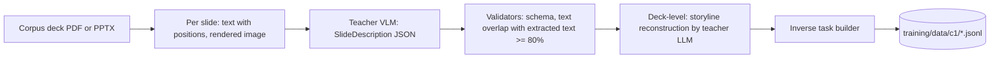

# 19. DeckForge-LM: the onboard open model and how it is trained

## 1. Decision

| # | Decision |
|---|---|
| D16 | The onboard LLM is an open-weight model with a permissive licence, fine-tuned by us for DeckForge work. It is called **DeckForge-LM** (`df-lm`). No closed-model API (Anthropic, OpenAI, Google or similar) is used at runtime, and no output of a closed-model API is used as training data. Closed-API terms prohibit using outputs to build competing models, and D2 keeps customer data on-prem |
| D17 | One base model family with a size ladder (same tokenizer), so we can train once on the large size and distil to the small ones |
| D18 | Teachers for data generation are also open-weight models with licences that allow training on their outputs, run on our own GPUs |

Laya (doc `09`) stays the fast decision layer. DeckForge-LM does the language work: planning, writing, critique, tool use and repairs.

## 2. Model family and sizes

Reference family: **Qwen3 dense** (Apache-2.0). It has a size ladder with one tokenizer, strong JSON and tool-calling behaviour, and support in every tool we need (TRL, PEFT, vLLM multi-LoRA, llama.cpp GGUF, Ollama). The family is confirmed or replaced by the bake-off in T-13.1. Candidates in the bake-off: Qwen3 dense (Apache-2.0), gpt-oss (Apache-2.0, MoE), Mistral Small (Apache-2.0). A newer release of one of these families replaces the reference only by winning the bake-off.

| DeckForge model | Base | Params | Where it runs | Serving format |
|---|---|---|---|---|
| `df-lm-32b` | Qwen3-32B | about 32.8B | GPU server (reference: 4 x 80 GB) | FP8 weights, FP8 KV cache, vLLM, multi-LoRA |
| `df-lm-14b` | Qwen3-14B | about 14.8B | single-GPU server or workstation (24 to 48 GB) | FP8 or AWQ 4-bit, vLLM |
| `df-lm-8b` | Qwen3-8B | about 8.2B | laptops (16 GB RAM and up) | GGUF Q4_K_M to Q8_0, Ollama or llama.cpp |
| `df-vlm` | an Apache-2.0 vision-language model chosen in T-13.1 (Qwen VL family candidate, about 7B to 8B) | about 8B | GPU server, optional on laptops with 32 GB+ | FP8 (server), GGUF (laptop) |
| `df-laya` | `convaiinnovations/laya` | 421M | everywhere | `laya-serve` or ONNX int8 |

Why dense first: LoRA training, multi-LoRA serving and quantisation are simpler and better supported on dense models. An MoE base is adopted only if it wins the bake-off on quality per GPU-hour.

Bake-off criteria (T-13.1): licence (must allow commercial use and fine-tuning), JSON-schema validity rate, tool-call accuracy on our tool benchmark, first-try pass rate of the storyline validators, Tier 1 and Tier 2 judge scores on 30 golden briefs, Indian English business register (judge), latency and memory per token, LoRA support in vLLM and llama.cpp, availability of 8B-class and 32B-class sizes with one tokenizer.

## 3. What DeckForge-LM must learn

| Capability | Used by agent (`20`) | How we know it is learned |
|---|---|---|
| Problem framing (key question, decision maker, criteria) | Engagement Manager | Judge score, plan review edit rate |
| MECE issue trees with testable hypotheses | Engagement Manager | `J_MECE_PAIR` overlap rate, validator pass |
| Framework choice from the library | Engagement Manager | Top-3 agreement with corpus-inverted choices |
| Pyramid storylines (governing thought, SCR, sections) | Engagement Manager | `J2_STORYLINE`, validator first-try pass |
| Action titles with fact tokens | Copywriter | `J_ACTION_TITLE`, `J_TITLE_SUPPORTED`, typed-number rate, fit in 2 lines |
| Commentary grounded in facts | Copywriter | `J_COMMENTARY_GROUNDED`, density |
| Exhibit choice and emphasis | Visualisation Designer | Agreement with corpus priors, `J_CHART_FIT`, look-and-feel |
| Imagery and layout choices | Art Director | Tier 3 visual scores, look-and-feel |
| Tool calling with valid arguments | Researcher, Data Analyst, Repair Specialist | Tool benchmark (`21`), invalid-args rate |
| Typed JSON output | all | Schema validity rate |
| Critique with evidence | Reviewer | Agreement with exact-label synthetic defects |
| Targeted repairs | Repair Specialist | Defect cleared rate after one round |
| Consulting register in Indian and international English | Copywriter, Engagement Manager | `J_REGISTER`, banned-phrase rate |

## 4. Training data engine (self-supervised, no hiring)

### 4.1 Sources

| Id | Source | What it produces | Labels | Volume target (v1) |
|---|---|---|---|---|
| C1 | **Corpus inversion**: the public consulting decks (D9) turned into structured examples | (deck summary to storyline), (slide intent + data to title and commentary), (message + data shape to exhibit), (slide to critique) | Corpus is the gold output | 20k to 40k slide examples from the corpus |
| C2 | **Synthetic briefs with code-generated data** | Diverse realistic tasks with known numbers | Facts are exact because code made the data | 5,000 briefs |
| C3 | **Teacher trajectories** with rejection sampling | Full agent trajectories (inputs, tool calls, outputs) for C2 briefs | Kept only if every verifiable check passes and judges clear thresholds | 3,000 to 5,000 accepted runs |
| C4 | **Self-improvement**: our own model's runs, best of N | More trajectories and preference pairs | Rewards from checks and judges | grows every cycle |
| C5 | **Repair pairs** from the QA and repair loop | (defective output, repaired output) pairs | The repaired one passed QA, the original failed | 10k pairs |
| C6 | **Production feedback** (install-local, opt-in through `allow_training`) | Plan edits, title edits, regenerations, ratings | Behavioural | per customer |
| C7 | **Public datasets** whose licences allow commercial training (instruction following, JSON and function calling, chart and table QA) | Keeps general skills | As published | listed in the data register |

### 4.2 Teacher policy

- Teacher LLM: the strongest open-weight model with a permissive licence that our GPUs can run in batch mode. Candidates: gpt-oss-120b (Apache-2.0, fits one 80 GB GPU in its native 4-bit format) and Qwen3-235B-A22B (Apache-2.0, needs 2 to 4 x 80 GB quantised).
- Teacher VLM for corpus inversion: an open vision-language model whose licence allows training on outputs (checked per model and recorded in the data register).
- Teachers run through vLLM offline batch inference (`vllm.LLM.generate` or the batch API) on the GPU server, at night or between serving peaks (`22`, section 10).
- Every generated sample records `teacher_model`, `teacher_revision`, `prompt_id`, `prompt_version`.

### 4.3 Corpus inversion pipeline (C1)



1. Extract per-slide text with positions (pdfplumber or python-pptx) and render a PNG (pypdfium2).
2. Teacher VLM writes a `SlideDescription`: archetype, action title, exhibit type (mapped to our exhibit ids or `other`), message type, series and approximate values when legible, emphasis, commentary points, sticker, source line, imagery type, layout.
3. Validate: schema, and at least 80% of the description's text tokens must appear in the extracted slide text (stops hallucinated titles).
4. Deck level: the teacher LLM reconstructs governing thought, situation, complication, resolution, sections and the role of each slide.
5. Build inverse tasks: the model sees what an engagement manager would have had (a brief-like summary, the analyses, the data shape) and must produce what the corpus shows (storyline, titles, exhibit choice). Numbers in corpus text are converted to `{fact}` tokens with a facts table, so the model learns the token discipline.
6. Each example keeps `source_deck_id` as its group, so train and test never share a deck.

### 4.4 Synthetic brief generator (C2)

1. Taxonomy sampled with balance: 25 industries, 10 functions (strategy, operations, finance, marketing, HR, supply chain, digital, ESG, M&A, pricing), 8 deck types, 5 audiences, 4 data situations (full data, partial, none, messy).
2. Data generator (code, `training/generators/data.py`): builds tables with realistic structure: time series with trend, seasonality, shocks and noise, breakdowns that sum to totals, peer benchmarks with distributions, geographic plants or regions with real coordinates, plans and targets. Messy variants add merged headers, notes rows, units in headers, Indian number formats.
3. Teacher writes the brief text around the generated data (topic, requirements, decision asked, what to show). The data is never written by the teacher, so facts stay exact.
4. Output: `evals`-compatible brief folders under `training/briefs/<id>/`.

### 4.5 Trajectory harvesting (C3, C4)

- Every agent invocation writes an `AgentTrace` (`20`, section 9): agent id and version, adapter, rendered messages, tool calls and results (sandbox or live), output, downstream check results and reward components.
- `training/builders/<agent>.py` turns accepted traces into chat-format training examples for that agent.
- Acceptance rule for SFT: the trace's own checks pass (schema, Tier 0 on the affected slides), Tier 1 judges above threshold, and the run's final QA has no blockers attributed to this agent.

### 4.6 Filtering and hygiene

| Step | Rule |
|---|---|
| Schema | Output validates against the agent's output model |
| Checks | Agent-specific verifiable checks pass (section 5.3 reward table lists them) |
| Dedupe | MinHash over 5-word shingles (`datasketch`, MIT), Jaccard above 0.8 within an agent's set keeps one |
| Decontamination | Remove any example whose brief or deck group appears in `evals/` or the S5 gold sets |
| PII | Regex and optional Presidio scrub on C6 data |
| Length | Drop examples above the agent's token budget plus 20% |
| Balance | Cap any single industry or deck type at 10% of an agent's set |
| Licence | Each source listed in `training/DATA_REGISTER.md` with licence and permitted use. CI fails if a dataset file lacks a register entry |

### 4.7 Formats

Chat format matching the base model's chat template, one JSON object per line:

```json
{"id": "c3-writer-000412", "agent": "copywriter", "source": "C3", "group": "brief-0412",
 "tools": [],
 "messages": [
   {"role": "system", "content": "<agent system prompt, version 4>"},
   {"role": "user", "content": "<rendered context>"},
   {"role": "assistant", "content": "{\"title\": \"{rm_lag_bps} of the margin decline came from ...\", ...}"}
 ],
 "meta": {"teacher_model": "gpt-oss-120b", "prompt_id": "compose.write_copy", "prompt_version": 4, "checks": {"schema": true, "typed_numbers": 0}}}
```

Tool-using examples carry the `tools` list (JSON schemas exported from `ToolSpec`, `21`, section 3) and assistant messages with `tool_calls`, followed by `tool` role messages with results. Preference pairs use `{"prompt": [...], "chosen": [...], "rejected": [...]}`. RL prompts use `{"prompt": [...], "task": {...}}` where `task` carries what the reward functions need (facts, exhibit data, expected checks).

## 5. Training stages

All training uses Hugging Face TRL 1.14 with PEFT 0.21 on transformers 5.18 and torch 2.14. Config files live in `training/configs/` and are run by `deckforge train <stage> --config <file>`.

### 5.0 Stage 0: domain-adaptive continued pretraining (optional, off in v1)

Only if the bake-off shows weak consulting register. LoRA continued pretraining on corpus text plus business publications with permissive licences (50M to 200M tokens), learning rate 5e-5, 1 epoch. Skipped by default because C1 SFT already teaches register.

### 5.1 Stage 1: multitask SFT (one adapter for all agents)

| Setting | Value |
|---|---|
| Trainer | `trl.SFTTrainer` with `SFTConfig` |
| Adapter | LoRA rank 32, alpha 64, dropout 0.05, targets `q_proj, k_proj, v_proj, o_proj, gate_proj, up_proj, down_proj`, `use_rslora=True` |
| Precision | bf16. QLoRA (4-bit NF4 via bitsandbytes) when training 32B on one 80 GB GPU |
| Sequence | `max_length` 8192 (raise to 16384 for planner examples if they exceed), `packing=True`, `padding_free=True`, `assistant_only_loss=True` |
| Optimiser | AdamW, lr 1e-4 (LoRA), cosine schedule, warmup 3%, weight decay 0 |
| Batch | about 128k to 256k tokens per optimiser step through gradient accumulation |
| Epochs | 2 |
| Kernels | `use_liger_kernel=True`, flash attention 2, gradient checkpointing |
| Data mix | Engagement Manager 25%, Copywriter 25%, Visualisation Designer 10%, Reviewer 10%, Researcher (tool trajectories) 10%, Data Analyst 5%, Intake Analyst 5%, Art Director 5%, Repair Specialist 5%. Plus 10% C7 general data on top to limit forgetting |
| Size | 40k to 80k examples |

The agent role is carried by its system prompt, so one adapter serves every agent at first. This keeps one prefix cache and no adapter switching.

### 5.2 Stage 2: preference optimisation (DPO)

| Setting | Value |
|---|---|
| Trainer | `trl.DPOTrainer` with `DPOConfig` |
| Pairs | best vs worst of N=4 samples by reward (section 5.3), repaired vs original (C5), corpus title vs model title (C1) |
| Reference | the Stage 1 model (merged) |
| Settings | `beta=0.1`, `loss_type="sigmoid"`, lr 2e-5 (LoRA) or 5e-7 (full), 1 epoch, `precompute_ref_log_probs=True` to save memory |
| Size | 10k to 20k pairs |

### 5.3 Stage 3: reinforcement learning with verifiable rewards (GRPO)

TRL's `GRPOTrainer` trains single-turn agents with Python reward functions and multi-turn tool-using agents through `environment_factory` (an environment class whose methods are the tools, with `reset` and optional `get_reward`) and `max_tool_calling_iterations`.

| Setting | Value |
|---|---|
| Generation | `use_vllm=True`, `vllm_mode="server"` with a separate vLLM server on its own GPU(s) for 32B, `vllm_mode="colocate"` with `vllm_gpu_memory_utilization=0.3` for 8B and 14B |
| Group | `num_generations=8` |
| Loss | TRL default `loss_type="dapo"`, `beta=0.0` to `0.04` (KL), `scale_rewards="group"` |
| Learning rate | 5e-6 (LoRA) |
| Completion length | per agent: Copywriter 600, Engagement Manager 3000, Reviewer 400, Repair 800, Researcher 1500 per turn |
| Tool-using agents | `environment_factory` wrapping `ToolExecutor` in sandbox mode (`21`, section 4), `max_tool_calling_iterations=8` |

Reward functions (each returns a float per completion, combined with `reward_weights`):

| Agent | Reward components (all computed by code or Laya, no human labels) |
|---|---|
| Copywriter | +1 schema valid, +1 every number is a known `{fact}` token (0 if any typed number), +1 title fits 2 lines at the design system size, + `P(insight)` from `J_ACTION_TITLE`, + `P(supported)` from `J_TITLE_SUPPORTED`, + `P(clear)` from `J_SO_WHAT`, -0.5 per banned phrase, -length penalty above budget |
| Engagement Manager | +1 schema valid, + fraction of storyline validators passed, - `J_MECE_PAIR` overlap rate, + framework top-3 agreement with the C1 or C2 reference, + `J2_STORYLINE` score (open teacher judge, batched), -0.2 per slide outside the brief's slide range |
| Visualisation Designer | +1 exhibit data validates, +1 exhibit in the selector's top 2, + `P(fits)` from `J_CHART_FIT`, + look-and-feel rule pass share on the rendered slide |
| Art Director | + look-and-feel imagery and focal rules, + Tier 3 visual score (sampled), -1 for any contrast lint failure |
| Reviewer | + agreement with exact labels on synthetic defects (C1 and C5 perturbations), precision and recall weighted toward blockers |
| Repair Specialist | +1 per defect cleared on re-QA, -1 per new defect introduced, -0.1 per tool call above 3 |
| Researcher | + share of findings with verified quotes, + coverage of the analysis' data needs, -1 per unverifiable claim, -0.05 per tool call, -0.5 per blocked or failed fetch |
| Data Analyst | +1 mapping validates, +1 recomputed facts equal the code-generated truth (C2), -1 per reconciliation failure |

Reward hacking guards:
1. Judge rewards use Laya heads and the open teacher judge, never the model being trained.
2. A held-out judge (a different prompt and model) scores evals, and a growing gap between training reward and held-out score stops training.
3. Length penalties and KL control drift.
4. Every RL round is checked on the S5 gold sets and the golden briefs before promotion.

### 5.4 Stage 4: distillation to smaller sizes

1. `df-lm-32b` generates outputs for all C2 and C1 prompts (best of 4 by reward).
2. Accepted outputs train `df-lm-14b` and `df-lm-8b` with Stage 1 settings (same tokenizer family).
3. A short DPO round on pairs from the small model's own samples.
4. Evals must stay within the per-size bars in section 6.

### 5.5 Stage 5: per-agent adapters (only where needed)

If an agent's eval drops more than 3 points in the multitask model compared with an agent-only adapter, train a dedicated LoRA (rank 16) for that agent on top of the merged multitask model. Serve it through vLLM multi-LoRA (`22`, section 4). Laptops keep the single merged model unless the agent gap exceeds 5 points.

## 6. Evaluation gates

| Gate | Suite | Bar to promote a new `df-lm` version |
|---|---|---|
| Schema | all agent suites | JSON validity at least 99.5% |
| Agent suites (`20`, section 11) | per agent | no agent regresses more than 1 point, at least two improve |
| Golden briefs (`17`, section 6) | 30 briefs end to end | QA pass at least 90%, median QA score at least 85, no new blocker type |
| Tool benchmark (`21`, section 6) | all tool groups | selection accuracy and argument validity not lower than the previous version |
| General skills | small `lm-eval` battery (instruction following, reading comprehension) | drop at most 2 points versus the base model |
| Gold | S5 gold sets | judge agreement within 0.05 of the previous version |
| Size bars | 14B and 8B | within 5 points (14B) and 10 points (8B) of 32B on golden-brief QA score |
| Quantised | FP8, AWQ, GGUF exports | within 1.5 points of the bf16 model on golden briefs |

## 7. Export and packaging

| Target | Steps | Tools |
|---|---|---|
| vLLM server, multi-LoRA | keep base in FP8 (dynamic FP8 or a W8A8 checkpoint made with `llmcompressor`), ship adapters as PEFT folders | llmcompressor 0.14 |
| vLLM server, single model | merge adapter into base (`peft` `merge_and_unload`), quantise FP8 or AWQ W4A16 | peft, llmcompressor |
| Laptops | merge, convert to GGUF with llama.cpp `convert_hf_to_gguf.py`, quantise with `llama-quantize` to Q4_K_M, Q5_K_M and Q8_0, write an Ollama `Modelfile` (`FROM ./df-lm-8b-q4_k_m.gguf`, chat template, stop tokens, `num_ctx`) | llama.cpp (pinned commit), gguf 0.19 |
| Laya | `df-laya` checkpoint and ONNX int8 export (per-tensor) | laya |

Every export gets a model card (`training/model_cards/<name>.md`: base, licence, data sources, eval results, intended use), sha256 checksums, and a `model_registry` row.

## 8. Hardware and time (estimates to replace with measurements in T-13.6)

Time per epoch is approximately total training tokens divided by measured training throughput. Planning numbers:

| Job | Hardware | Method | Notes |
|---|---|---|---|
| SFT `df-lm-14b` | 1 x 80 GB | LoRA bf16, gradient checkpointing | First iterations happen on 14B because each cycle is about half the 32B time |
| SFT `df-lm-32b` | 1 x 80 GB | QLoRA 4-bit | Fits with 8k sequences and gradient checkpointing, slower |
| SFT `df-lm-32b` | 4 x 80 GB | LoRA bf16 with FSDP (full shard) or DeepSpeed ZeRO-3 | Faster, needs serving GPUs at night |
| DPO 32B | 2 to 4 x 80 GB | LoRA, precomputed reference log-probs | |
| GRPO 32B | 2 GPUs training + 2 GPUs vLLM server | LoRA | Run after 14B GRPO has proven the rewards |
| GRPO 8B or 14B | 1 to 2 x 80 GB | LoRA, vLLM colocate | Main RL workhorse in v1 |
| Teacher batch generation | 1 x 80 GB (gpt-oss-120b) or 2 to 4 x 80 GB (235B MoE) | vLLM offline | nightly |

Measure throughput (tokens per second) in the first run of each job type and record it in `training/BENCHMARKS.md`.

## 9. Versioning, registry, rollout

- Names: `df-lm-<size>-v<major>.<minor>` for merged models, `df-lm-<size>-v<major>.<minor>+<agent>` for agent adapters.
- `model_registry` rows with status `candidate`, `shadow`, `active`, `retired` (same lifecycle as Laya, `09` section 8.4).
- Shadow for LLMs: 10% of eligible agent calls go to the candidate in parallel on eval traffic (never customer traffic unless the org allows), outputs scored with the same rewards. Promotion requires section 6 gates on offline suites plus shadow reward at least equal to the active version.
- Rollback: switch the role mapping in `config/models.yaml` (server reloads it within 60 s).

## 10. Continuous improvement cycle (monthly)

1. Harvest: new traces, repair pairs, production feedback (install-local).
2. Mine failures: defects attributed to each agent (`20`, section 10).
3. Generate targeted data: briefs and tasks that reproduce the failure types.
4. Train: SFT top-up, DPO on new pairs, GRPO round for the weakest agent.
5. Evaluate against the gates.
6. Shadow, promote, export to laptops.

## 11. Risks

| Risk | Mitigation |
|---|---|
| Model learns one house style and every deck looks the same | Style family tokens and template design systems stay in code. Corpus spans several firms. Diversity reward for imagery and layout (look-and-feel rules) |
| Reward hacking (judge exploitation) | Section 5.3 guards, gold checks every round |
| Corpus licence risk | D9 founder decision recorded. Corpus examples tagged so they can be removed and the model retrained without them |
| Teacher errors copied into the model | Rejection sampling on verifiable checks, facts always from code |
| Laptop speed | 8B quantised model, Laya for decisions, small prompts. Measured in T-14.4 |
| Catastrophic forgetting of general skills | C7 data in every SFT mix, `lm-eval` gate |
