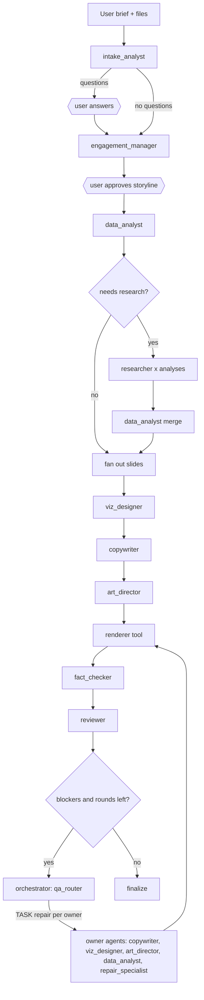
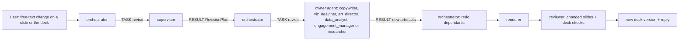
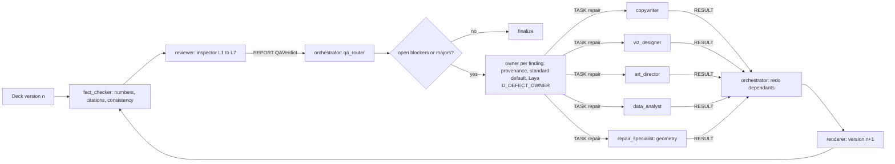
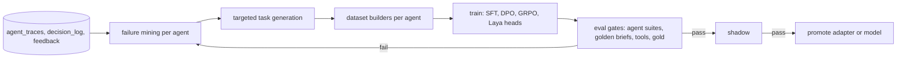

# 20. Agents, roles and workflows

## 1. Principles

1. An agent is a **role on a consulting team** with a typed input, a typed output, a fixed set of tools, a model adapter, limits and success metrics. Roles mirror how a top-firm team works: engagement manager, analysts, researcher, designer, editor, partner review.
2. A workflow is a **LangGraph graph** that hands typed artifacts from one agent to the next. Handoffs are explicit edges with Pydantic contracts, never free-form chat between agents. Agents never call or message each other directly. Every message goes through the orchestrator (hub and spoke) using the DeckForge Agent Protocol in `27`: the orchestrator sends `TASK`, the agent answers `RESULT`, `REJECT`, `NEED` or `ESCALATE`, QA agents answer `REPORT`.
3. Two kinds of agent:
   - **Workflow agents**: fixed steps inside a LangGraph subgraph (most agents). Predictable, testable, cheap.
   - **ReAct agents**: open-ended tool use with LangChain `create_agent` plus middleware (Researcher, Supervisor in revision mode). Used only where the steps cannot be fixed in advance.
4. All agents run on **DeckForge-LM** (`19`) through role adapters, and use **Laya** (`09`) for fast typed decisions and **CLM** (`09`, section 10) for ranking many candidates.
5. Every agent invocation writes an `AgentTrace` (section 9). Traces are the audit trail and the training data.
6. Domain knowledge (frameworks, chart rules, design standards, storyline patterns) comes from the knowledge base through context injection, CLM ranking, Laya picks and the `kb_search` and `kb_get` tools (`28`, section 6). Agents do not rely on what the base model remembers.

## 2. Agent roster

| Id | Role (consulting analogy) | Kind | Model role and adapter | Tools (groups from `08`) | Laya decisions | Input contract | Output contract | Limits |
|---|---|---|---|---|---|---|---|---|
| `supervisor` | Engagement lead: interprets free-text revision requests and decides who changes what | ReAct (revision only) | `extractor`, adapter `df-supervisor` (multitask base at first) | `knowledge` (read), `qa` (read-only: `get_findings`, `slide_summary`) | `D_REVISION_ROUTE`, `D_REVISION_SCOPE` | `TaskOrder(kind=revise)` | `RevisionPlan` returned to the orchestrator (`27`, section 6.4) | 6 model calls, 6 tool calls |
| `intake_analyst` | Analyst who reads the brief and asks the right questions | Workflow | `extractor`, `df-intake` | `documents`, `data` (read), `knowledge` (`org_terms`) | `D_DECK_TYPE`, `D_BRIEF_GAPS`, `D_GUARD_INJECTION` | `Brief` + table profiles | `IntakeResult` (normalised brief, questions, assumptions) | 3 model calls |
| `data_analyst` | Analyst who owns the numbers | Workflow (with one ReAct step for ambiguous mappings) | `extractor`, `df-analyst` | `data`, `calc` | `D_COLUMN_ROLE`, `D_TABLE_ROLE` | `Plan.analyses` + tables | `GroundingResult` (exhibit data, facts, dummy flags) | 4 model calls, 20 tool calls |
| `engagement_manager` | Problem solver: framing, issue tree, frameworks, storyline | Workflow with revision loops | `planner`, `df-planner` | `knowledge`, `documents` | `D_FRAMEWORK_PICK`, `J_MECE_PAIR` | `IntakeResult` + table summaries | `Plan` | 8 model calls |
| `researcher` | Research specialist: external facts with sources | ReAct | `extractor`, `df-researcher` | `research`, `documents`, `data` (read), `calc` | `D_TOOL_NEED`, `D_TOOL_GROUP`, `D_GUARD_INJECTION` | `ResearchTask` (one analysis) | `ResearchResult` (findings, citations, gaps) | 10 model calls, 12 tool calls, 6 fetches |
| `viz_designer` | Visualisation designer | Workflow | `writer`, `df-viz` | `viz` | `D_EXHIBIT_TIEBREAK` | `SlideTask` | `ExhibitDecision` (exhibit id, shaped data, emphasis, layout variant) | 2 model calls |
| `copywriter` | Editor who writes action titles and commentary | Workflow | `writer`, `df-writer` | `viz` (`fit_text`), `knowledge` (`org_terms`) | `J_ACTION_TITLE`, `J_TITLE_SUPPORTED`, `J_SO_WHAT` | `SlideTask` + `ExhibitDecision` | `SlideCopy` | 3 model calls |
| `art_director` | Designer for imagery, icons, focal elements | Workflow | `writer`, `df-art` | `assets` | `D_ICON_PICK` | `SlideTask` + `ExhibitDecision` + `SlideCopy` | `AssetPlan` (icons, band or panel image, illustration, map) | 2 model calls, 8 tool calls |
| `fact_checker` | Analyst who checks every number and claim | Workflow (mostly deterministic) | `judge`, `df-reviewer` | `qa`, `data` (read), `research` (`cite` verify only) | `J_COMMENTARY_GROUNDED` | `TaskOrder` for a deck version | `REPORT(QAVerdict)` | 2 model calls |
| `reviewer` | Partner review: storyline, charts, visuals | Workflow | `judge` and `vision_judge`, `df-reviewer`, `df-vlm` | `qa`, `render` (`preview`), inspector (`25`) | `J_*` judges | `TaskOrder` for a deck version | `REPORT(QAVerdict)` | 1 model call per escalated judge |
| `repair_specialist` | Production designer who owns slide geometry: spacing, alignment, overlaps, contrast, text fit, label nudges | Workflow | `writer`, `df-repair` | layout tools (`relayout`, `nudge_labels`, `fix_contrast`, `fit_text`, `snap_grid`), `render` (`preview`) | `D_REPAIR_STRATEGY` | `TaskOrder(kind=repair)` with geometry findings for one slide | `layout_patch` artefact (`27`, section 4) | 4 model calls, 10 tool calls |
| `template_designer` | Brand designer who adopts the customer template | Workflow (mostly deterministic) | `extractor`, multitask base | template and palette tools | none | template file | `DesignSystem` | 1 model call |

The **renderer** is not an agent. It is a deterministic tool (`render.compile_pptx`, `render.preview`) that the orchestrator invokes.

The **orchestrator** is not an agent either. It is the LangGraph deck graph (`06`) plus the `qa_router` and the dependency graph (`27`, sections 5 and 8). It owns no artefact, sends every task and receives every reply. Fixes found by QA go to the agent that owns the faulty artefact (copy to `copywriter`, exhibit to `viz_designer`, imagery to `art_director`, numbers to `data_analyst`, storyline to `engagement_manager`, geometry to `repair_specialist`), never to a generic fixer.

## 3. Agent card

Each agent has `deckforge/agents/<id>/card.yaml`, loaded into `AgentCard` (Pydantic) at startup:

```yaml
id: copywriter
version: 3
role: Editor who writes action titles and commentary for one slide
goal: A title a partner would sign off, proven by the exhibit, with every number as a fact token
kind: workflow
model_role: writer
adapter: df-writer                 # LoRA adapter name in the model pool, null = multitask model
input_model: deckforge.agents.contracts.CopyTask
output_model: deckforge.llm.schemas.SlideCopy
prompts: [compose.write_copy, compose.exec_summary, compose.decisions, compose.agenda]
tools: [fit_text, org_terms]
laya_decisions: [J_ACTION_TITLE, J_TITLE_SUPPORTED, J_SO_WHAT]
limits: {max_model_calls: 3, max_tool_calls: 4, timeout_s: 120, max_output_tokens: 800}
success_metrics:
  - schema_valid_rate >= 0.995
  - typed_number_rate == 0
  - action_title_rate >= 0.95
  - title_supported_rate >= 0.92
eval_suite: evals/agents/copywriter
training: {sft_share: 0.25, dpo: true, grpo_rewards: [schema, fact_tokens, fits_two_lines, action_title, title_supported, so_what, banned_phrases, length]}
```

`AgentCard` fields: `id`, `version`, `role`, `goal`, `kind`, `model_role`, `adapter`, `input_model`, `output_model`, `prompts`, `tools`, `laya_decisions`, `limits`, `success_metrics`, `eval_suite`, `training`. Startup validation: tools exist in the registry, decisions exist in the question registry, prompts exist, models import.

## 4. Code layout and factory

```text
deckforge/agents/
├── base.py              # AgentCard, AgentLimits, AgentContext, traced_step decorator, AgentTrace writer
├── factory.py           # build_workflow_agent(card), AgentFactory (ReAct agents cached per org model profile)
├── middleware.py        # TraceMiddleware, GuardMiddleware, LimitsMiddleware wiring, LayaToolSelectorMiddleware (from tools)
├── contracts.py         # handoff models (section 5)
├── registry.py          # loads every card.yaml
└── <agent_id>/
    ├── card.yaml
    ├── graph.py         # build(card) -> StateGraph   (workflow agents)
    ├── steps.py         # the step functions
    ├── rewards.py       # reward functions used in training (19, section 5.3)
    └── README.md        # one page: role, contract, failure modes seen, links to evals
```

Workflow agent pattern:

```python
# deckforge/agents/copywriter/graph.py
def build(card: AgentCard) -> StateGraph:
    g = StateGraph(CopyState, context_schema=GraphContext, input_schema=CopyTask, output_schema=CopyOutput)
    g.add_node("draft", steps.draft)          # LLM writer call through runtime.context.llm.structured(...)
    g.add_node("check", steps.check)          # resolve(), untracked_numbers(), fit_text, Laya judges
    g.add_node("rewrite", steps.rewrite)      # LLM call with judge evidence
    g.add_edge(START, "draft")
    g.add_edge("draft", "check")
    g.add_conditional_edges("check", steps.route, ["rewrite", END])   # rewrite at most card.limits.max_model_calls - 1 times
    g.add_edge("rewrite", "check")
    return g
```

Workflow agents are compiled once per process. They get the model at call time from `runtime.context.llm.chat_model(card.model_role, adapter=card.adapter, org=...)`, so one compiled graph serves every org.

ReAct agent pattern:

```python
# deckforge/agents/factory.py
class AgentFactory:
    """Builds and caches ReAct agents per (agent id, org model profile)."""
    def get(self, card: AgentCard, org: OrgSettings) -> CompiledStateGraph:
        key = (card.id, card.version, org.model_profile)
        if key not in self._cache:
            self._cache[key] = create_agent(
                model=self.llm.chat_model(card.model_role, adapter=card.adapter, org=org),
                tools=[self.tools.as_langchain_tool(name, ...) for name in card.tools],
                system_prompt=self.prompts.load(card.prompts[0]).system_text,
                response_format=import_model(card.output_model),
                middleware=[
                    GuardMiddleware(self.decisions),                       # quarantines injected instructions in tool results
                    LayaToolSelectorMiddleware(self.decisions, ...),       # 08, section 5
                    ToolRetryMiddleware(max_retries=2),
                    ToolCallLimitMiddleware(run_limit=card.limits.max_tool_calls),
                    ModelCallLimitMiddleware(run_limit=card.limits.max_model_calls, exit_behavior="end"),
                    ContextEditingMiddleware(),
                    SummarizationMiddleware(model=self.llm.chat_model("extractor", org=org), trigger=("tokens", 24000), keep=("messages", 12)),
                    TraceMiddleware(self.traces, card),                    # writes AgentTrace with every model and tool call
                ],
                name=card.id,
            )
        return self._cache[key]
```

No agent holds another agent as a tool. An earlier draft let `supervisor` and `repair_specialist` call `copywriter`, `viz_designer` and `art_director` as tools. That was dropped because nested calls bypass artefact ownership, budgets and the dependency graph, and they make traces hard to attribute for training. Cross-agent work is always a new `TASK` from the orchestrator (`27`).

## 5. Handoff contracts (`deckforge/agents/contracts.py`)

| Contract | From | To | Key fields |
|---|---|---|---|
| `IntakeResult` | intake_analyst | engagement_manager, data_analyst | `brief`, `questions`, `assumptions`, `warnings` |
| `Plan` (existing) | engagement_manager | data_analyst, researcher, slide team | problem, issue tree, analyses, storyline, slide plan |
| `GroundingResult` | data_analyst | slide team | `exhibit_data`, `facts`, `dummy_keys` |
| `ResearchTask` / `ResearchResult` | deck workflow / researcher | data_analyst (merge) | analysis, data needed / findings, citations, gaps |
| `SlideTask` | deck workflow | viz_designer, copywriter, art_director | slide plan item, facts subset, exhibit data, design limits, neighbour titles |
| `ExhibitDecision` | viz_designer | copywriter, art_director | exhibit id, `ExhibitData`, emphasis, layout variant, candidates with scores |
| `SlideCopy` | copywriter | art_director, renderer | title, exhibit title and unit, points, sticker, source |
| `AssetPlan` | art_director | renderer | icons per element, header band or panel image request, illustration spec, map spec |
| `QAVerdict` | fact_checker + reviewer | orchestrator (`qa_router`) | findings with owner hints, score, checked scope |
| `TaskOrder(kind=repair)` | orchestrator | owner agent of each finding | findings, strategy, constraints, acceptance checks |
| `LayoutPatch` | repair_specialist | renderer | per-shape geometry and colour changes on one slide |
| `RevisionRequest` / `RevisionPlan` | user / supervisor | orchestrator | free text, slide keys / agent, scope, targets, instruction, constraints |

The envelope, performatives and the full contract list are in `27`, sections 2 and 3.

Every contract model has `schema_version`. Agents reject inputs with an unknown major version.

## 6. Workflows

### W1. Deck generation (main workflow)

This is `deck_graph` in `06`. Its nodes are agents:



| Step | Agent | Runs | Output written to state |
|---|---|---|---|
| 1 | intake_analyst | once | `brief`, `clarifications`, `warnings` |
| 2 | user (interrupt) | if questions | answers |
| 3 | engagement_manager | once (plus revisions) | `plan` |
| 4 | user (interrupt) | unless auto-approve | approved or edited `plan` |
| 5 | data_analyst | once | `exhibit_data`, `facts` |
| 6 | researcher | per analysis needing external data, in parallel | `findings`, `citations` |
| 7 | data_analyst (merge) | once | updated `exhibit_data`, `facts` |
| 8 | slide team: viz_designer, copywriter, art_director | per slide, in parallel (`Send`) | `slides`, `asset_keys` |
| 9 | renderer (tool) | per deck version | deck, previews |
| 10 | fact_checker, reviewer | per deck version | `defects`, `qa` |
| 11 | owner agents, routed by `qa_router` (`27`, section 8.3) | up to 2 rounds | new artefact versions, then back to 9 |
| 12 | finalize | once | artifacts, status |

### W2. Revision (user asks for a change)



- The `supervisor` asks Laya `D_REVISION_ROUTE` (options: `copywriter`, `viz_designer`, `art_director`, `data_analyst`, `engagement_manager`, `researcher`, `repair_specialist`) and `D_REVISION_SCOPE` (`slide`, `section`, `deck`). When Laya abstains, the supervisor's LLM writes the `RevisionPlan` with the same fields. The supervisor never edits an artefact.
- The orchestrator validates the plan (agent exists, targets exist, the user may edit them) and dispatches with LangGraph `Command(goto="dispatch", update={"revision": plan})`.
- Dependants are redone through the dependency graph (`27`, section 5). Example: a new exhibit on S07 triggers a copy re-check and an asset re-check on S07 only.
- Scope `deck` with `engagement_manager` re-runs W1 from step 3 with the instruction attached and keeps unchanged slides (matched by slide key and spec hash).
- The reply event summarises what changed and links the new version.

### W3. Data onboarding

Upload, then `file.profile` job: code profiling, Laya `D_COLUMN_ROLE` and `D_TABLE_ROLE` for low-confidence columns, `data_analyst` writes a one-paragraph plain-language summary per table and flags problems (missing periods, totals that do not add up). The user confirms or corrects types in the UI. Corrections become outcome labels.

### W4. Template onboarding

`template_designer` runs `template_ingest_graph` (`12`, section 3): deterministic extraction and palette checks, one LLM call for naming and layout map confirmation, preview rendering, user review.

### W5. Research

One `researcher` ReAct run per analysis that needs external data (parallel through `Send`). Tools are shortlisted per step by Laya. Output findings must carry verified quotes (`08`, section 6).

### W6. QA and repair



Findings carry the design standard id from the knowledge base (`28`, DS cards), the owner hint, a strategy hint and acceptance checks. Loop control (attempts, reroutes, regression revert, round limit) is in `27`, section 8.4. Inspector layers are in `25`.

### W7. Learning loop (offline, nightly or monthly)



Runs as `train.*` and `eval.*` jobs on GPU workers (`19`, section 10 and `09`, section 8).

## 7. Agent memory

| Memory | Where | Lifetime | Used for |
|---|---|---|---|
| Working memory | the agent's subgraph state (`CopyState` and so on) | one invocation | drafts, judge evidence, retries |
| Run memory | `DeckState` (checkpointed) | one run | handoff artifacts between agents |
| Long-term memory | LangGraph Store namespaces (`10`, section 8) | until deleted | org terminology, house style, exhibit preferences |
| Experience | `agent_traces`, `decision_log` | retention policy | training data, failure mining |

Agents never write long-term memory directly. Code paths write it after explicit user actions or admin confirmation.

## 8. How to make a new agent (recipe)

1. Write the role, goal, and the input and output contracts in `contracts.py` (or reuse existing ones).
2. Decide the kind: workflow unless the steps truly depend on intermediate tool results.
3. Create `deckforge/agents/<id>/card.yaml` with tools, decisions, limits, metrics.
4. Write prompts in `prompts/<area>/` (`07`, section 6) and register them in `prompts/LOCK.json`.
5. Workflow: write `steps.py` (each step is a pure function of state plus `runtime.context`) and `graph.py`. ReAct: list tools in the card and use `AgentFactory`.
6. Add deterministic checks for the output (the same functions become reward functions in `rewards.py`).
7. Create `evals/agents/<id>/` with at least 100 cases (section 11) and a fixture-based unit test with FakeLLM.
8. Wire the agent into a workflow (edge or `Command` target) and add its trace to the events map.
9. Run the agent suite on the current multitask model to get a baseline. Record it in the agent README.
10. Add training data builders for the agent (`training/builders/<id>.py`) so the next training cycle includes it.

## 9. Agent traces

Table `app.agent_traces` (migration in T-13.3):

```sql
CREATE TABLE app.agent_traces (
  id uuid PRIMARY KEY, org_id uuid NOT NULL, run_id uuid, agent_id text NOT NULL, agent_version int NOT NULL,
  model text, adapter text, prompt_ids text[] NOT NULL DEFAULT '{}',
  input_ref text NOT NULL,               -- blob key of the input contract JSON
  messages_ref text,                     -- blob key of rendered messages and tool calls (redaction per org)
  output_ref text,                       -- blob key of the output contract JSON
  tool_calls int NOT NULL DEFAULT 0, model_calls int NOT NULL DEFAULT 0,
  decisions uuid[] NOT NULL DEFAULT '{}',
  checks jsonb NOT NULL DEFAULT '{}',    -- deterministic check results
  rewards jsonb NOT NULL DEFAULT '{}',   -- reward components computed after the fact
  outcome text,                          -- accepted, repaired, rejected_by_user, failed
  latency_ms int, input_tokens int, output_tokens int,
  created_at timestamptz NOT NULL DEFAULT now());
CREATE INDEX ON app.agent_traces (agent_id, created_at);
```

Provenance: `deck_versions` gains `provenance jsonb` mapping each slide key and element (`title`, `exhibit`, `commentary`, `assets`) to the producing agent, version and adapter. QA defects reference elements, so every defect is attributable to an agent.

## 10. How to train and refine an agent

### 10.1 Training signals per agent

| Agent | SFT data | Preference pairs | RL rewards (`19`, 5.3) | Laya heads trained from its logs |
|---|---|---|---|---|
| intake_analyst | C2 briefs with removed fields and the questions that recover them | questions that recovered vs did not | gaps found that the ground truth had removed | `D_BRIEF_GAPS`, `D_DECK_TYPE` |
| data_analyst | C2 tables with known mappings and facts | mapping that reconciles vs not | facts equal code truth | `D_COLUMN_ROLE`, `D_TABLE_ROLE` |
| engagement_manager | C1 storylines and issue trees, C3 accepted plans | plans approved vs edited at plan review, validator-passing vs failing | validators, MECE, framework agreement, storyline judge | `D_FRAMEWORK_PICK`, `J_MECE_PAIR` |
| researcher | C3 tool trajectories with verified findings | verified vs unverifiable trajectories | verified quotes, coverage, tool cost | `D_TOOL_NEED`, `D_TOOL_GROUP` |
| viz_designer | C1 message-to-exhibit pairs, C3 decisions | exhibit kept vs regenerated by users, look-and-feel pass vs fail | data validates, chart fit, look-and-feel | `D_EXHIBIT_TIEBREAK` |
| copywriter | C1 titles and commentary with fact tokens, C3 | corpus vs model, repaired vs original | `19` section 5.3 copywriter rewards | `J_ACTION_TITLE`, `J_TITLE_SUPPORTED`, `J_SO_WHAT`, `J_REGISTER` |
| art_director | C1 imagery and layout descriptions | Tier 3 higher vs lower | look-and-feel, Tier 3 | `D_ICON_PICK` |
| fact_checker, reviewer | C1 and C5 synthetic defects with exact labels | correct vs incorrect verdicts | agreement with exact labels | all `J_*` |
| repair_specialist | C5 geometry repair trajectories | clearing vs non-clearing layout patches | geometry findings cleared minus new findings | `D_REPAIR_STRATEGY` |
| supervisor | synthetic revision requests mapped to agents and scopes | correct vs wrong routes (from user re-requests) | correct route on synthetic set | `D_REVISION_ROUTE`, `D_REVISION_SCOPE` |

### 10.2 Refinement loop (per agent, weekly report)

1. **Attribute**: join defects and user corrections to `provenance` to get failures per agent.
2. **Cluster**: group by defect code, deck type, archetype and a short failure description (embedding clustering of evidence text).
3. **Diagnose** with this rule:

| Symptom | Fix type |
|---|---|
| Output ignores an instruction that the prompt states clearly, across cases | Prompt fix plus eval case, retrain later |
| Systematic skill gap (weak titles for one archetype, wrong exhibit for one message type) | Targeted data generation and a training round |
| Tool misuse (invalid args, wrong tool) | Tool lifecycle (`21`, section 7) |
| Wrong routing or decision | Laya head retraining (`09`, section 8) |
| Contract gap (agent lacks information it needs) | Contract change (ticket) |

4. **Fix and gate**: every fix adds failing cases to the agent's eval suite first, then must pass the suite and the golden briefs.

## 11. Agent evaluation suites

`evals/agents/<id>/cases.jsonl`, each case: input contract JSON, expectations (checks to run, optional reference output), tags (deck type, archetype, language).

| Agent | Cases (v1) | Metrics | Pass bar |
|---|---|---|---|
| intake_analyst | 150 | gap recall, question usefulness (judge), schema | recall at least 0.85 |
| data_analyst | 200 | mapping accuracy, facts exact match | facts exact at least 0.98 |
| engagement_manager | 150 | validator first-try pass, MECE overlap, storyline judge, framework top-3 | first-try pass at least 0.80 |
| researcher | 100 (sandbox web snapshot) | verified finding rate, coverage, tool calls | verified at least 0.95 |
| viz_designer | 300 | data validity, chart fit, agreement with corpus priors | validity 1.0, fit at least 0.90 |
| copywriter | 400 | `19` section 3 metrics | as in its card |
| art_director | 150 | look-and-feel rule pass, Tier 3 visual mean | rule pass at least 0.95 |
| fact_checker | 300 synthetic defects | recall, precision | recall at least 0.95 on blockers |
| reviewer | 400 synthetic defects + gold | recall, precision by severity | `09` section 9.2 judge bars |
| repair_specialist | 200 slides with geometry defects | cleared rate, new-defect rate | cleared at least 0.85, new at most 0.05 |
| supervisor | 300 revision requests | route and scope accuracy | at least 0.95 |

`deckforge eval --suite agents --agent <id>` runs a suite and writes `evals/reports/<date>/<id>.md`.

## 12. Observability per agent

Metrics: `deckforge_agent_invocations_total{agent, outcome}`, `deckforge_agent_latency_seconds{agent}`, `deckforge_agent_model_calls{agent}`, `deckforge_agent_tool_calls{agent}`, `deckforge_agent_defects_attributed_total{agent, code}`. A Grafana "Agents" dashboard shows these per agent and per adapter version.
