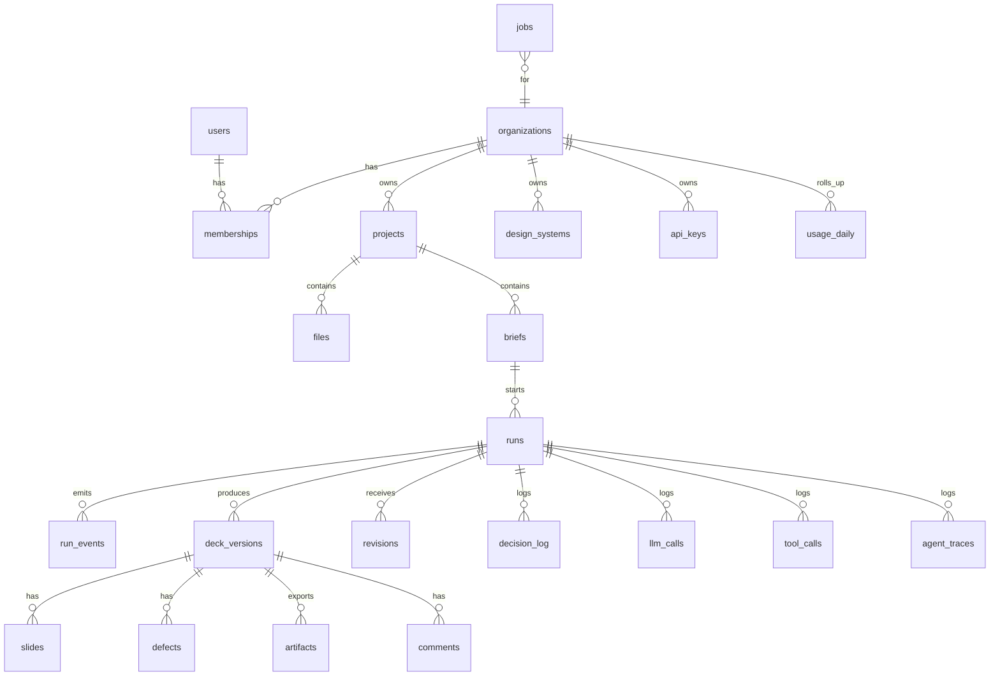

# 23. Database design, latency budgets and optimisation

`04` holds the base schema. This document adds the entity map, access patterns and indexes, partitioning, the tables later phases add, write-path and read-path optimisations, connection and timeout settings, and the latency budgets every layer must meet.

## 1. Entity map



Data classes:

| Class | Tables | Volume driver | Store |
|---|---|---|---|
| Core OLTP | organizations, users, memberships, projects, files, briefs, runs, deck_versions, slides, artifacts, defects, design_systems, api_keys, comments, revisions | users and runs | PostgreSQL, normal tables |
| Queue | jobs | runs and background work, high churn | PostgreSQL, tuned for updates |
| Event and telemetry streams | run_events, decision_log, llm_calls, tool_calls, agent_traces, audit_log, usage_ledger | about 50 to 500 rows per run each | PostgreSQL, partitioned by month |
| Orchestration state | LangGraph checkpoints and writes (schema `lg`) | about 100 checkpoints per run | PostgreSQL, pruned nightly |
| Knowledge | kb_items | framework cards, exemplars, icons, reference chunks | PostgreSQL with pgvector |
| Large payloads | decks, previews, tables, traces, page texts | per run | Blob store (never in rows) |

## 2. Access patterns and indexes

Every query a request path or graph node runs must be listed here with its index. Integration tests run `EXPLAIN (FORMAT JSON)` on each one and fail if a large table shows a sequential scan (T-12.10).

| # | Query | Where | Index | Target p95 |
|---|---|---|---|---|
| Q1 | user by email | login | `users(email)` unique (citext) | 2 ms |
| Q2 | API key by hash | every API-key request | `api_keys(key_hash)` unique | 2 ms |
| Q3 | refresh token by hash | refresh | `refresh_tokens(token_hash)` unique | 2 ms |
| Q4 | projects of an org, newest first, keyset page | projects list | `projects(org_id, created_at DESC, id DESC) WHERE archived_at IS NULL` | 5 ms |
| Q5 | runs of a project, newest first | project page | `runs(org_id, project_id, created_at DESC, id DESC)` | 5 ms |
| Q6 | active runs per org (admission) | run creation, job lease | `runs(org_id) WHERE status IN ('queued','running','waiting_input')` partial | 2 ms |
| Q7 | run by id with latest deck version | run page | PK + `deck_versions(run_id, version DESC)` | 3 ms |
| Q8 | run events after seq | SSE replay | `run_events` PK `(run_id, seq)` | 3 ms for 500 rows |
| Q9 | lease next job | worker loop | `jobs(priority, run_after) WHERE status='queued'` partial | 5 ms |
| Q10 | expired leases | reaper | `jobs(lease_expires_at) WHERE status='leased'` partial | 5 ms |
| Q11 | slides and defects of a deck version | deck studio | `slides(deck_version_id, position)`, `defects(deck_version_id)` | 5 ms |
| Q12 | decision log export by decision and month | training builders | partition by month + `decision_log(decision_id, created_at)` | batch, not latency-bound |
| Q13 | usage of an org for a month | admin, quota check | `usage_daily(org_id, day)` (rollup) | 3 ms |
| Q14 | framework or exemplar similarity search | planning | HNSW on `kb_items.embedding` per namespace (section 6) | 15 ms |
| Q15 | comments of a deck version | deck studio | `comments(deck_version_id, created_at)` | 3 ms |
| Q16 | org settings, design system, decision policies | almost every node | PK, cached (section 5) | under 1 ms (cache) |

Rules:
- Keyset pagination only (`WHERE (created_at, id) < (:c, :i) ORDER BY created_at DESC, id DESC LIMIT n`). No `OFFSET`.
- Every tenant query includes `org_id` as the leading index column.
- No query in a request path may touch a partitioned telemetry table except through its rollup.

## 3. Tables added by later phases

```sql
-- agent traces (20, section 9), partitioned
CREATE TABLE app.agent_traces (
  id uuid NOT NULL, created_at timestamptz NOT NULL DEFAULT now(),
  org_id uuid NOT NULL, run_id uuid, agent_id text NOT NULL, agent_version int NOT NULL,
  model text, adapter text, prompt_ids text[] NOT NULL DEFAULT '{}',
  input_ref text NOT NULL, messages_ref text, output_ref text,
  tool_calls int NOT NULL DEFAULT 0, model_calls int NOT NULL DEFAULT 0, decisions uuid[] NOT NULL DEFAULT '{}',
  checks jsonb NOT NULL DEFAULT '{}', rewards jsonb NOT NULL DEFAULT '{}', outcome text,
  latency_ms int, input_tokens int, output_tokens int,
  PRIMARY KEY (id, created_at)) PARTITION BY RANGE (created_at);
CREATE INDEX ON app.agent_traces (agent_id, created_at);

-- revisions (W2), one row per user change request
CREATE TABLE app.revisions (
  id uuid PRIMARY KEY, org_id uuid NOT NULL, run_id uuid NOT NULL REFERENCES app.runs ON DELETE CASCADE,
  base_version int NOT NULL, result_version int, user_id uuid, scope text NOT NULL, slide_keys text[] NOT NULL DEFAULT '{}',
  instruction text NOT NULL, routed_agent text, status text NOT NULL DEFAULT 'queued',
  created_at timestamptz NOT NULL DEFAULT now(), finished_at timestamptz);
CREATE INDEX ON app.revisions (run_id, created_at);

-- comments for collaboration (26)
CREATE TABLE app.comments (
  id uuid PRIMARY KEY, org_id uuid NOT NULL, deck_version_id uuid NOT NULL REFERENCES app.deck_versions ON DELETE CASCADE,
  slide_key text, anchor jsonb,                    -- {"element": "title"} or {"bbox": [x, y, w, h]} on the snapshot
  parent_id uuid REFERENCES app.comments ON DELETE CASCADE, author_id uuid NOT NULL,
  body text NOT NULL, resolved_at timestamptz, created_at timestamptz NOT NULL DEFAULT now());
CREATE INDEX ON app.comments (deck_version_id, created_at);

-- slide variants offered to the user (26, US-6.4)
CREATE TABLE app.slide_variants (
  id uuid PRIMARY KEY, org_id uuid NOT NULL, deck_version_id uuid NOT NULL REFERENCES app.deck_versions ON DELETE CASCADE,
  slide_key text NOT NULL, rank int NOT NULL, spec jsonb NOT NULL, preview_blob_key text,
  score real, chosen boolean NOT NULL DEFAULT false, created_at timestamptz NOT NULL DEFAULT now());

-- shares (26, E10)
CREATE TABLE app.shares (
  id uuid PRIMARY KEY, org_id uuid NOT NULL, project_id uuid NOT NULL REFERENCES app.projects ON DELETE CASCADE,
  user_id uuid NOT NULL, role text NOT NULL CHECK (role IN ('viewer','editor')), created_at timestamptz NOT NULL DEFAULT now(),
  UNIQUE (project_id, user_id));

-- daily usage rollup, written by a job from usage_ledger
CREATE TABLE app.usage_daily (
  org_id uuid NOT NULL, day date NOT NULL, metric text NOT NULL, quantity bigint NOT NULL,
  PRIMARY KEY (org_id, day, metric));

-- per-run event counter, replaces max(seq)+1 (removes conflicts under concurrent emits)
ALTER TABLE app.runs ADD COLUMN last_event_seq int NOT NULL DEFAULT 0;
-- emit: UPDATE app.runs SET last_event_seq = last_event_seq + 1 WHERE id = :run RETURNING last_event_seq
-- then INSERT INTO app.run_events (run_id, seq, ...) in the same transaction.

-- provenance for agent attribution (20, section 9)
ALTER TABLE app.deck_versions ADD COLUMN provenance jsonb NOT NULL DEFAULT '{}';
```

## 4. Partitioning and retention

| Table | Partition key | Granularity | Kept online | Retention action |
|---|---|---|---|---|
| run_events | `at` | month | 3 months | drop partition |
| decision_log | `created_at` | month | 6 months (state text redacted after `decision_log_retention_days`) | detach, export to parquet in blob store (training archive), drop |
| llm_calls | `created_at` | month | 13 months | drop |
| tool_calls | `created_at` | month | 6 months | drop |
| agent_traces | `created_at` | month | 6 months | export to parquet, drop |
| audit_log | `at` | month | 24 months | drop |
| usage_ledger | `created_at` | month | 13 months (rollup kept forever) | drop |

- Partitioned tables use `PRIMARY KEY (id, created_at)` (the key must include the partition column). `run_events` keeps `(run_id, seq)` plus the partition column: `PRIMARY KEY (run_id, seq, at)`.
- The `maintenance.partitions` job creates partitions three months ahead and applies retention on the first of each month. Dropping a partition deletes millions of rows instantly with no vacuum cost.
- Lite mode (SQLite) has no partitions. The same job deletes old rows in batches of 5,000.

## 5. Read path optimisation

| Technique | Applied to |
|---|---|
| Two-level cache with version keys (in-process LRU 30 s, then Valkey 10 min) | org settings, design systems, decision policies, agent cards, question specs |
| `selectinload` for collections, never lazy loading in async code | runs with deck versions, deck versions with slides and defects |
| Narrow selects (only needed columns) for lists | projects, runs, files lists |
| JSONB read whole, never filtered in hot paths. Filtered fields are real columns | plan, brief, spec, profile |
| Rollup tables | usage (`usage_daily`), dashboard counts |
| LZ4 TOAST compression for large JSONB (`ALTER TABLE ... ALTER COLUMN plan SET COMPRESSION lz4`) | deck_versions.plan, exhibit_data, facts, qa |
| Read replica for admin analytics and exports (optional) | usage, audit, telemetry queries |
| Signed blob URLs instead of streaming through the API (S3) | artifact downloads, previews |

## 6. Vector search

| Namespace | Rows (estimate) | Method |
|---|---|---|
| frameworks | about 80 | exact (no index needed, sequential scan on a tiny filtered set is allowed by an allow-list in the plan test) |
| icons | about 1,600 | exact |
| tool_cards | under 100 | exact |
| refs per project | hundreds | exact, filtered by `namespace` and `org_id` |
| exemplars (corpus slide descriptions) | 20k to 60k | HNSW (`m=16`, `ef_construction=64`), query with `SET LOCAL hnsw.ef_search = 40` and `SET LOCAL hnsw.iterative_scan = relaxed_order` so namespace filters do not starve results |

Lite mode uses numpy exact search for all namespaces.

## 7. Write path optimisation

| Technique | Applied to | Detail |
|---|---|---|
| Buffered async writer | decision_log, llm_calls, tool_calls, agent_traces, usage_ledger | in-process queue flushed every 200 ms or 500 rows with `COPY` (psycopg `cursor.copy`) in server mode, `executemany` in lite. Flushed on shutdown. Loss window on a hard crash is at most 200 ms of telemetry, never run state |
| Synchronous writes | run_events, runs, deck_versions, jobs, artifacts | correctness-critical, small |
| HOT updates | jobs, runs | `fillfactor=80`, no index on frequently updated columns other than the partial ones |
| Outbox | job enqueue with the state change | same transaction |
| `RETURNING` | inserts and updates that need ids or counters | avoids a second round trip |
| Batch inserts | slides and defects of a deck version | one `INSERT ... VALUES (...), (...)` |

## 8. Connections, timeouts, maintenance

| Setting | Value |
|---|---|
| API process pool | `pool_size=5`, `max_overflow=5`, `pool_pre_ping=True`, `pool_recycle=1800` |
| Worker process pool | `pool_size=5`, `max_overflow=5` |
| LangGraph checkpointer pool | psycopg `AsyncConnectionPool(min_size=2, max_size=5)` per worker process |
| Connection budget | `(api replicas x uvicorn workers x 10) + (worker replicas x 15) + 20 admin` must stay below 70% of `max_connections` (reference: 2 x 4 x 10 + 6 x 15 + 20 = 190 of 300) |
| Statement timeout | `SET LOCAL statement_timeout = '5s'` in API transactions, `60s` in workers, none in migrations |
| Lock timeout | `2s` in API transactions |
| Idle in transaction | `idle_in_transaction_session_timeout = 30s` |
| Autovacuum | `jobs`: `autovacuum_vacuum_scale_factor=0.01`, `autovacuum_analyze_scale_factor=0.02`. Default elsewhere |
| Job cleanup | `done` jobs deleted after 7 days, `dead` jobs after 30 days |
| Checkpoint pruning | `lg` checkpoints of runs finished more than 7 days ago deleted nightly. Expected growth before pruning: about 5 MB per run |
| Lite (SQLite) | WAL, `synchronous=NORMAL`, `busy_timeout=5000`, one write lock (asyncio) so writes never hit `SQLITE_BUSY`, `VACUUM` monthly |

## 9. Latency budgets

### 9.1 API (server mode, p95, excluding client network)

| Endpoint class | Budget | Notes |
|---|---|---|
| Auth (login, refresh) | 150 ms | argon2 verification dominates login (about 50 to 100 ms by design) |
| Reads (lists, run, deck version) | 100 ms | cache plus indexed queries |
| Writes (create brief, create run, resume, revision) | 150 ms | includes enqueue |
| Upload acknowledgement after body received | 300 ms | validation runs inline for size and type, profiling is async |
| SSE first event | 200 ms | replay from `run_events` |
| Signed download redirect | 50 ms | |

### 9.2 Run stages (reference server, 15-slide deck)

| Stage | p50 | p95 | Main levers |
|---|---|---|---|
| Intake and clarification decision | 10 s | 25 s | Laya decisions, one extractor call |
| Planning (to plan review) | 90 s | 180 s | prefix cache, non-thinking mode where possible, CLM framework shortlist |
| Data and facts | 5 s | 20 s | deterministic, process pool |
| Research (when enabled) | 60 s | 180 s | parallel per analysis, tool shortlist, fetch limits |
| Slide composition | 45 s | 100 s | parallel slides, per-slide budget 3 model calls |
| Render and previews | 15 s | 40 s | unoserver pool, PNG rasterisation in workers |
| QA cascade and inspection | 30 s | 70 s | Laya and Laya-Vision batched, LLM and VLM only on escalations |
| One repair round | 30 s | 70 s | targeted slides only |
| **Total to downloadable deck** | **under 5 min** | **under 10 min** | |

### 9.3 Per-call budgets

| Call | p50 | p95 |
|---|---|---|
| Laya decision (batched) | 30 ms | 100 ms |
| CLM ranking (cache hit / miss) | 2 ms / 30 ms | 10 ms / 80 ms |
| Laya-Vision judgement per slide | 45 ms | 120 ms |
| Writer call (DeckForge-LM, about 600 output tokens) | 4 s | 8 s |
| Planner call (about 2,500 output tokens) | 25 s | 50 s |
| Tool call (internal) | 20 ms | 200 ms |
| Tool call (fetch) | 1.5 s | 6 s |
| DB query in node paths | 3 ms | 10 ms |
| PPTX compile (15 slides) | 1.5 s | 4 s |
| LibreOffice conversion (15 slides) | 6 s | 15 s |

Every stage and call emits spans (`16`). A Grafana "Latency SLO" panel compares p95 with these budgets. Alert when any p95 exceeds 1.5x its budget for 30 minutes.

## 10. Optimisation checklist (review before each release)

- [ ] All Q1 to Q16 plans use their indexes (T-12.10 test green).
- [ ] No N+1 queries in API handlers (SQL count per request logged in debug mode, test asserts at most 5 queries for list and detail endpoints).
- [ ] Telemetry writes go through the buffered writer.
- [ ] Partitions exist three months ahead.
- [ ] Prefix cache hit rate above 50% on composition calls (`22`, section 10).
- [ ] p95 stage latencies within section 9.2 on the load test.
- [ ] Connection budget formula satisfied for the deployed replica counts.
