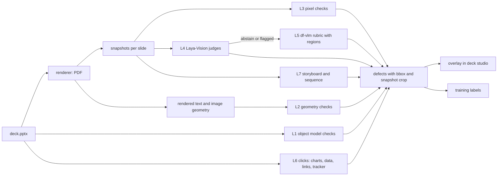

# 25. Visual QA inspector: snapshots, clicks and flows

Question this answers: does QA look at the deck the way a user sees it, interact with it, and verify design standards and the flow? Yes. The inspector renders every slide, checks what is actually drawn, "clicks" into charts and objects to verify they are editable and correct, reviews the deck as a sequence, and returns defects with regions marked on the snapshot.

It is part of the `reviewer` agent's QA cascade (`09` section 6, `20`).

## 1. Layers of inspection

| Layer | What it looks at | How | Runs on |
|---|---|---|---|
| L1 Object model | the PPTX structure | python-pptx and lxml (existing lint, look-and-feel, consistency) | every deck |
| L2 Rendered geometry | what LibreOffice actually drew | rendered PDF text positions (pdfplumber), font names, image placements | every deck |
| L3 Rendered pixels | the PNG snapshots | deterministic pixel checks | every deck |
| L4 Fast visual judges | the snapshot as a picture | DeckForge Laya-Vision heads (`df-laya-vision`) | every slide |
| L5 Rubric visual review | snapshot plus slide spec | `df-vlm` with region grounding | escalations and final round |
| L6 Interaction ("clicks") | charts, groups, links, tracker, notes as a user would open them | object-model clicks for every deck, LibreOffice UNO session (server), optional PowerPoint fidelity runner (Windows), optional GUI agent (research) | every deck (6a, 6b), optional (6c, 6d) |
| L7 Flow | the deck as a sequence | storyboard contact sheet, sequence rules, narrative judges | every deck |
| L8 Web app flows | the customer-facing UI | Playwright journeys with screenshots, visual regression, accessibility checks | CI and nightly |



## 2. L2 rendered geometry checks

The renderer returns the PDF. `deckforge/inspect/geometry.py` extracts, per slide, every word with its box (pdfplumber `extract_words` with `extra_attrs=["fontname", "size"]`) and every image box, then matches them to shapes by name order and text.

| Check | Rule | Defect code | Severity |
|---|---|---|---|
| Text overflow | a word's box extends beyond its shape box by more than 2 pt, or below the slide's content zone | `RENDER_TEXT_OVERFLOW` | blocker |
| Clipping | expected text missing from the rendered page (shape text tokens not found) | `RENDER_TEXT_MISSING` | blocker |
| Line count drift | rendered line count differs from the metrics model's prediction by more than 1 | `RENDER_LINE_DRIFT` | minor (signals font substitution) |
| Font substitution | rendered font name not in the design system's fonts or their metric-compatible aliases | `RENDER_FONT_SUBSTITUTED` | major |
| Minimum size as rendered | rendered size below 9.5 pt | `RENDER_SMALL_TEXT` | blocker |
| Off-grid alignment | left edges of title, exhibit header and commentary differ from zone edges by more than 3 pt | `RENDER_MISALIGNED` | minor |
| Title position consistency | title top and left vary more than 2 pt across content slides | `RENDER_TITLE_JUMP` | major |
| Safe area | any content outside 0.3 in margins | `RENDER_OUTSIDE_SAFE_AREA` | major |
| Image resolution | effective image DPI below 150 at placed size | `RENDER_LOW_DPI` | major |

## 3. L3 pixel checks

`deckforge/inspect/pixels.py` on the 144 dpi snapshot:

| Check | Method | Defect code |
|---|---|---|
| Rendered contrast | for each rendered word box, sample background pixels around glyph strokes and text colour, compute WCAG ratio, require 4.5:1 (3:1 for 18 pt+ or bold 14 pt+) | `RENDER_LOW_CONTRAST` |
| Palette adherence | k-means (k=8) on non-white pixels, every cluster within ΔE 6 (OKLab) of a design-system colour or an image region | `RENDER_OFF_PALETTE` |
| Visual density | ink coverage of the content zone between 18% and 55% | `RENDER_TOO_SPARSE`, `RENDER_TOO_DENSE` |
| Balance | ink centroid of the content zone within the middle 60% horizontally | `RENDER_UNBALANCED` (minor) |
| Collisions as drawn | overlap of rendered text boxes with other text or image boxes | `RENDER_COLLISION` |
| Near-duplicate slides | perceptual hash distance below 6 between two content slides | `RENDER_DUPLICATE` |

## 4. L4 fast visual judges: `df-laya-vision`

Laya-Vision (an independent Apache-2.0 fork of Laya that accepts an image plus text and answers typed questions in one forward pass, about 41 ms per image on an L4) provides the architecture and training code. **Its published weights are CC BY-NC-SA 4.0 (non-commercial), so DeckForge does not use them.** We train our own checkpoint `df-laya-vision` from Apache-2.0 backbones (SmolVLM-256M, or SigLIP with a ModernBERT text side) on our own data (section 8). The fork's Python package is also named `laya`, which clashes with the official Laya package, so it runs as its own service (`laya-vision`, image `deckforge-laya-vision`) with the same HTTP shape as `laya-serve`.

Questions (all binary questions are 2-option choices with neutral keys, `09` section 1):

| Id | Question | Options | Defect when |
|---|---|---|---|
| `V_FOCAL` | Is there one clear focal element on this slide? | `focused`, `scattered` | scattered |
| `V_CLUTTER` | How busy is the slide? | `clean`, `busy`, `cluttered` | cluttered (major), busy (minor) |
| `V_TEXT_ON_IMAGE` | Is any text placed over a busy part of an image? | `clear`, `busy_background` | busy_background |
| `V_CHART_READABLE` | Can the chart be read at presentation distance? | `readable`, `strained` | strained |
| `V_CONSISTENT` | Does this slide look like it belongs with the previous one (same visual system)? | `consistent`, `off_system` | off_system |
| `V_ICON_FIT` | Do the icons match the style of the slide (stroke, colour, size)? | `matching`, `mismatched` | mismatched |
| `V_PREMIUM` | Does the slide look like a top-firm deck or like generated slides? | `premium`, `generic` | generic (info, tracked as a quality metric) |

The state text includes the slide's archetype, title and design family, so the judge knows the context. Batched per deck. Calibrated thresholds per question (`09` section 5). Abstentions and flags escalate to L5.

## 5. L5 rubric review with regions: `df-vlm`

Prompt `prompts/judge/visual.md` gives the snapshot, the slide spec summary and the design rules. Output:

```python
class VisualIssue(BaseModel):
    code: str                         # from the visual defect catalogue
    severity: Literal["blocker", "major", "minor"]
    bbox: tuple[float, float, float, float]   # x, y, w, h normalised 0..1 on the snapshot
    evidence: str = Field(max_length=200)
    fix: str | None = Field(default=None, max_length=200)

class VisualVerdict(BaseModel):
    scores: dict[str, int]            # alignment, hierarchy, clutter, legibility, imagery_fit, premium, chart_readability (1..5)
    issues: list[VisualIssue]
```

Region check: an issue whose `bbox` does not overlap any rendered element by at least 30% is dropped as a likely hallucination and logged (training signal).

## 6. L6 interaction checks ("clicks")

### 6a. Object-model clicks (every deck, deterministic)

`deckforge/inspect/clicks.py` opens the saved PPTX the way PowerPoint would expose it:

| Click | Verification | Defect code |
|---|---|---|
| Open each native chart's embedded workbook (`chart.part.chart_workbook`, read with openpyxl) | series values equal the exhibit data and the facts used in the title (tolerance 0.5% of range) | `CLICK_CHART_DATA_MISMATCH` |
| Read each exhibit group's alt text JSON | parses, validates as `ExhibitData`, matches what is drawn | `CLICK_EXHIBIT_META_INVALID` |
| Select every text shape | real text frames, not pictures of text. Titles are in the title placeholder when the layout has one | `CLICK_TEXT_NOT_EDITABLE` |
| Walk shapes in z-order (reading order for screen readers) | title first, then exhibit, then commentary, then footer | `CLICK_READING_ORDER` (minor) |
| Section tracker | the highlighted section on each slide equals the slide's section | `CLICK_TRACKER_WRONG` |
| Agenda | agenda items equal the section names in order | `CLICK_AGENDA_MISMATCH` |
| Links | internal hyperlinks point to existing slides, external links are https and allowed | `CLICK_BROKEN_LINK` |
| Notes | every content slide has speaker notes with the facts and sources used | `CLICK_NOTES_MISSING` (minor) |
| Hidden and empty | no hidden slides, no empty placeholders, no off-slide shapes | `CLICK_HIDDEN_CONTENT` |
| Template use | slides use the mapped layouts and the master's footer and logo | `CLICK_LAYOUT_MISMATCH` |

### 6b. LibreOffice UNO session (server renderer, default on)

The renderer service exposes `POST /v1/inspect`: it loads the deck through UNO in a warm LibreOffice instance and, per slide:
1. Reads every text shape's autofit and overflow state as LibreOffice laid it out (the text frame's text height against the shape height).
2. Opens every chart's data table through the chart document's data provider and returns the values as LibreOffice sees them.
3. Exports the slide PNG (used when the PDF path is unavailable).
This is deterministic "clicking" through the application's API. It catches cases where the file is valid but the application interprets it differently.

### 6c. PowerPoint fidelity runner (optional, Windows host)

Customers open decks in PowerPoint, so this is the gold check when available:
- A small Windows service (`deckforge-pptcheck`, Python with pywin32) on a customer or vendor Windows machine with PowerPoint installed.
- For each deck: open through COM, export each slide to PNG, read each text frame's bound height against the frame height (overflow), list substituted fonts, and confirm each chart's data opens.
- Compare PowerPoint snapshots with LibreOffice snapshots (mean absolute difference per slide). A slide above the threshold is flagged `PPT_RENDER_DIFF` with both images for review.
- Used on the golden decks in release QA and, when the customer provides the host, on every deck.

### 6d. GUI agent (research track, nightly on golden decks only)

An open GUI-agent model drives LibreOffice Impress in a virtual display (Xvfb) to perform user tasks: open the deck, go to slide 5, double-click the chart, edit a value, check the chart updates, undo, check the title can be edited. Success rate per task is an editability benchmark. Not used per customer deck (slow and non-deterministic). CLM's roadmap includes vision for computer use, and Laya-Vision can choose actions from screenshots. Both are evaluated here before any production use.

## 7. L7 flow verification

| Check | Method | Defect code |
|---|---|---|
| Storyboard review | a contact sheet of all slides (4 columns) goes to `df-vlm` with a deck-level rubric: visual rhythm, layout variety, consistent system, imagery spread, where attention drops | `FLOW_VISUAL_MONOTONY`, `FLOW_INCONSISTENT_SYSTEM` |
| Sequence rules | no more than 2 identical layouts in a row, a section divider or tracker change at each section start, exec summary after agenda, decisions slide last for board audiences | existing look-and-feel codes |
| Narrative flow | `J_FLOW_PAIR` on consecutive titles, `J2_STORYLINE` on the whole storyline | `FLOW_JUMP`, `STORY_*` |
| Click-through continuity | consecutive snapshots compared for colour-histogram jumps above a threshold where the design system does not expect a change (for example a cover-to-content change is expected) | `FLOW_VISUAL_JUMP` (minor) |
| Exec summary coverage | every exec summary row maps to a body section and its numbers equal body facts | `FLOW_SUMMARY_MISMATCH` |

## 8. Training the visual judges

| Model | Data | Labels | Metrics and gate |
|---|---|---|---|
| `df-laya-vision` | V1: 20k snapshots generated by perturbing golden and generated decks in the compiler (move shapes off grid, shrink fonts, overlay text on busy images, add clutter, swap icon styles, break palettes, crowd charts), plus corpus snapshots (positives for focal, clean, premium) | exact labels from the perturbation, corpus as positive | per question: recall at least 0.90 on blocker and major classes, precision at least 0.75 on accepted items, ECE at most 0.05 |
| `df-vlm` critiques | same snapshots with the perturbation as ground truth, corpus critique descriptions from C1 | exact issue and region | issue recall at least 0.85 with region IoU at least 0.3, hallucinated region rate below 5% |
| Inspector as a whole | 500 held-out defective snapshots plus 500 clean corpus snapshots | exact | false positive rate on corpus snapshots below 5%, blocker recall at least 0.95 |

Backbones and data must have licences that permit commercial use. No non-commercial datasets (for example sets licensed CC BY-NC) enter `df-laya-vision` or `df-vlm` training.

## 9. L8 customer-facing UI flows

| Check | Tool | When |
|---|---|---|
| Journey tests for every user story in `26` with a screenshot at each step | Playwright | CI (fake models), nightly (real lite stack) |
| Visual regression | Playwright screenshot comparison with stored baselines, 0.2% pixel tolerance | CI |
| Accessibility | `@axe-core/playwright` on every page, zero serious or critical violations | CI |
| UX review | nightly `df-vlm` pass over the journey screenshots with a UI rubric (clarity, hierarchy, empty and error states) | nightly report, never blocks |

## 10. Outputs and UI

- Every defect carries `bbox` (when visual) and a crop of the snapshot. The deck studio overlays boxes on the slide preview with the evidence text (`26`, US-7.2).
- Inspector results are stored with the deck version and feed the repair loop (`09` section 7).
- Agreement and disagreement between L4 and L5, and user dismissals of defects, become training labels.

## 11. Performance budget

| Step | Budget per 15-slide deck (server) |
|---|---|
| L2 and L3 | 3 s (process pool) |
| L4 | under 1 s (batched) |
| L5 | escalations only, about 10 s |
| L6a | 1 s |
| L6b | 5 s (warm UNO instance) |
| L7 | 8 s (one storyboard call) |
| Total | under 30 s p95 |
