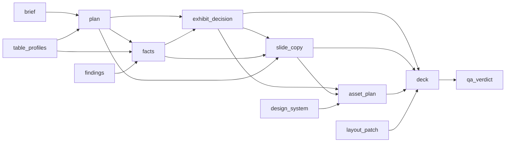
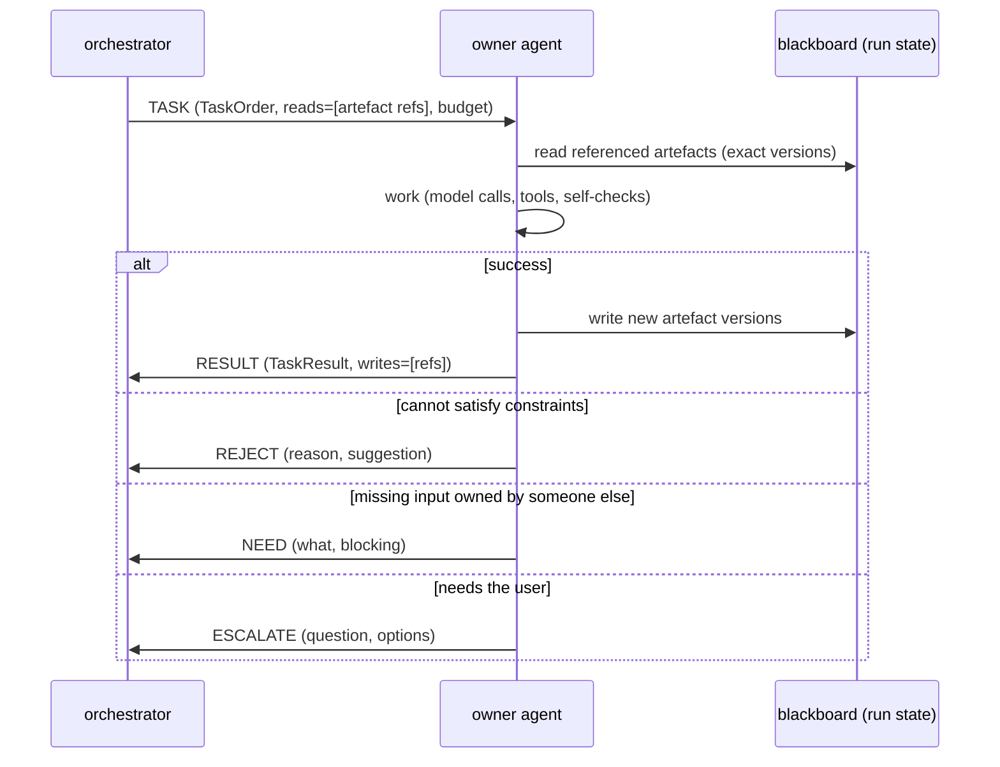
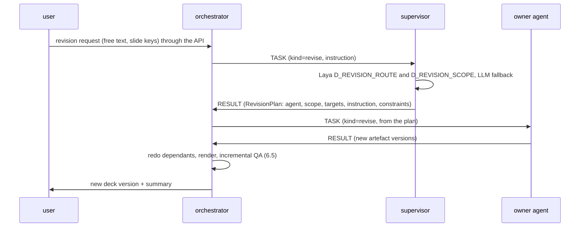

# 27. Agent communication protocol (DeckForge Agent Protocol, DAP)

Question this answers: how do the orchestrator and the agents talk to each other during generation, revision, verification and repair, inside one run, across workers, and with agents outside the install?

Short answer: **hub and spoke over typed messages.** The orchestrator assigns work with a `TASK` message. An agent answers with `RESULT`, `REJECT`, `NEED` (it needs something another agent owns) or `ESCALATE` (it needs the user). QA agents send `REPORT`. Agents never message each other directly. Shared artefacts live on a blackboard (the run state), messages carry references to them, and a dependency graph tells the orchestrator which agents must redo work when an artefact changes. One envelope, three transports (in process, job queue, A2A).

## 1. Decisions

| # | Decision | Why |
|---|---|---|
| P1 | **Hub and spoke.** Only the orchestrator sends work to agents. Agents send only to the orchestrator (or, through it, to the user) | Auditable flow, no loops between agents, one place enforces budgets, order and permissions |
| P2 | **Blackboard plus messages.** Artefacts (brief, plan, facts, exhibit data, slide copy, assets, verdicts) live in the run state (`DeckState`, checkpointed). Messages carry the task, constraints and references to artefacts, not copies of large data | Agents always see the latest artefact. Messages stay small. Crash recovery is free (checkpoints) |
| P3 | **Typed messages only.** Every message is a Pydantic contract inside one envelope. Free text is allowed only in declared fields (`instruction`, `evidence`, `reason`) | Validation, training data, no misreadings |
| P4 | **Single owner per artefact.** Each artefact type has exactly one owning agent (section 4). Only the owner writes it | No write conflicts. Defects and requests route by ownership |
| P5 | **Dependencies are explicit.** A directed graph of artefacts (section 5) drives invalidation: when an upstream artefact changes, the orchestrator re-tasks the owners of affected downstream artefacts | Consistency without agents watching each other |
| P6 | **The orchestrator is code with learned decisions.** Routing, ordering, retries and limits are deterministic graph logic. Ambiguous choices ask Laya or CLM (`D_DEFECT_OWNER`, `D_REPAIR_STRATEGY`, `D_REVISION_ROUTE`, `D_NEED_ROUTE`). Free-form user requests go through the `supervisor` agent, which returns a typed plan to the orchestrator | Predictable, testable, trainable (`24`, section 3) |
| P7 | **One envelope, three transports.** In-run (LangGraph state, in process), across workers (durable job queue), outside the install (A2A v1) | Same contracts everywhere, easy to move an agent to another worker or expose it externally |

## 2. Envelope

```python
# deckforge/agents/protocol.py
class Performative(StrEnum):
    TASK = "task"            # orchestrator -> agent: produce or change an artefact
    ACK = "ack"              # agent -> orchestrator: accepted (cross-process transports only)
    RESULT = "result"        # agent -> orchestrator: artefact produced or changed
    REJECT = "reject"        # agent -> orchestrator: cannot do it within constraints (reason, suggestion)
    NEED = "need"            # agent -> orchestrator: missing input owned by another agent (what, why)
    REPORT = "report"        # QA agents -> orchestrator: verdict with findings
    ESCALATE = "escalate"    # agent or orchestrator -> human: decision or input required
    CANCEL = "cancel"        # orchestrator -> agent: stop (run cancelled, task superseded)
    INFO = "info"            # progress for the UI, never acted on

class Budget(BaseModel):
    max_model_calls: int
    max_tool_calls: int
    max_output_tokens: int
    deadline_at: datetime

class ArtefactRef(BaseModel):
    kind: str                # "plan", "facts", "exhibit_decision", "slide_copy", "asset_plan", "qa_verdict", ...
    key: str                 # slide key, analysis id or "deck"
    version: int             # artefact version in the run state
    blob_key: str | None = None   # when the artefact is stored outside the state

class AgentMessage(BaseModel):
    id: str                               # uuid7
    run_id: str
    workflow: Literal["W1", "W2", "W3", "W4", "W5", "W6"]
    conversation_id: str                  # one task thread: a TASK and every reply, retry and follow-up
    causation_id: str | None              # the message this one responds to
    sender: str                           # "orchestrator", "copywriter@3+df-writer", "reviewer@4", "human:<user id>"
    recipient: str
    performative: Performative
    contract: str                         # payload model name, e.g. "TaskOrder"
    schema_version: str                   # "1.0"
    payload: dict                         # validated against `contract` on send and on receive
    reads: list[ArtefactRef] = []         # artefacts the recipient must read (exact versions)
    writes: list[ArtefactRef] = []        # artefacts produced or changed (on RESULT)
    priority: Literal["interactive", "generation", "qa", "background"] = "generation"
    budget: Budget | None = None          # required on TASK
    hop: int = 0                          # forwards so far (reroutes, NEED chains), max 3
    attempt: int = 1
    idempotency_key: str
    traceparent: str | None = None
    created_at: datetime
```

`protocol.send()` and `protocol.receive()` validate: payload against its contract and major version, `TASK` carries a budget with a future deadline, `hop <= 3`, every `reads` reference exists at that version in the run state, and the sender may send that performative to that recipient (section 10).

## 3. Message contracts

```python
class TaskOrder(BaseModel):                       # TASK
    task_id: str
    kind: Literal["generate", "repair", "revise", "redo"]   # redo = upstream changed, re-check or update
    agent: str
    scope: Literal["deck", "section", "slide", "analysis"]
    targets: list[str]                            # slide keys, analysis ids or ["deck"]
    instruction: str | None = None                # user instruction (revise) or orchestrator note, max 500 chars
    findings: list["Finding"] = []                # for repair: what to fix (section 8)
    constraints: list[str] = []                   # "keep_exhibit", "keep_facts", "keep_title_claim", "max_title_lines:2"
    acceptance: list[str] = []                    # check codes that must pass afterwards
    strategy: str | None = None                   # for repair: chosen R_... strategy
    previous_attempts: list[dict] = []            # what was tried and why it failed

class TaskResult(BaseModel):                      # RESULT
    task_id: str
    produced: list[ArtefactRef]                   # new artefact versions written to the blackboard
    addressed: list[str] = []                     # finding ids believed fixed (repair)
    self_check: dict[str, bool] = {}              # owner-side checks run before replying
    notes: str = ""

class TaskReject(BaseModel):                      # REJECT
    task_id: str
    reason: Literal["constraint_conflict", "missing_input", "out_of_scope", "budget_exhausted", "not_reproducible"]
    detail: str
    suggest_agent: str | None = None
    suggest_strategy: str | None = None
    conflicting_constraint: str | None = None

class InputNeed(BaseModel):                       # NEED
    task_id: str
    need: Literal["fact", "data_series", "citation", "exhibit_change", "storyline_change", "asset", "clarification"]
    description: str                              # "CAGR of revenue FY22-FY25 for machined components"
    blocking: bool                                # true: cannot finish without it. false: will finish with a placeholder
    suggested_owner: str | None = None

class Escalation(BaseModel):                      # ESCALATE
    task_id: str | None
    question: str
    options: list[str] = []
    blocking: bool

class QAVerdict(BaseModel):                       # REPORT (section 8)
    deck_version: int
    passed: bool
    score: float
    findings: list["Finding"]
    checked_scope: Literal["full", "incremental"]
    checked_slides: list[str]

class RevisionPlan(BaseModel):                    # supervisor RESULT in W2
    request_id: str
    agent: str
    scope: Literal["deck", "section", "slide"]
    targets: list[str]
    instruction: str
    constraints: list[str] = []
```

## 4. Artefact ownership

| Artefact (`ArtefactRef.kind`) | Owner | Key | Readers |
|---|---|---|---|
| `brief` (normalised), `clarifications` | intake_analyst | deck | everyone |
| `table_profiles` | data_analyst (with W3 user confirmation) | file | intake, engagement_manager |
| `plan` (problem, issue tree, analyses, storyline, slide plan) | engagement_manager | deck | everyone |
| `facts`, `exhibit_data` | data_analyst | analysis | viz_designer, copywriter, fact_checker |
| `findings`, `citations` | researcher | analysis | data_analyst (merge), copywriter, fact_checker |
| `exhibit_decision` (exhibit, shaped data, emphasis, layout variant) | viz_designer | slide | copywriter, art_director, renderer |
| `slide_copy` (title, commentary, sticker, source) | copywriter | slide | art_director, renderer, reviewer |
| `asset_plan` (icons, imagery, illustration, map, focal emphasis) | art_director | slide | renderer |
| `layout_patch` (geometry, contrast, nudges) | repair_specialist | slide | renderer |
| `design_system` | template_designer | deck | everyone |
| `deck` (rendered version) | renderer (tool, invoked by the orchestrator) | deck | QA agents |
| `qa_verdict` | reviewer and fact_checker | deck version | orchestrator |
| `revision_plan` | supervisor | request | orchestrator |

Writes are enforced: the blackboard writer checks that the sender of a `RESULT` owns every artefact in `writes`.

## 5. Dependency graph (drives "redo")



Rule: when an artefact version changes, the orchestrator walks the graph and sends `TASK(kind="redo")` to the owners of directly dependent artefacts for the affected keys only (for example a changed fact on analysis A5 re-tasks the exhibit decisions and copy of slides that read A5). A `redo` may return `RESULT` with `produced=[]` when nothing needs to change ("still valid"), which costs one cheap check instead of a regeneration. Cycles are impossible by construction (the graph is a DAG, checked at startup).

## 6. Interaction patterns

### 6.1 Assignment (every workflow)



### 6.2 Input request between agents (NEED)

An agent never asks another agent directly. Example: the copywriter wants to say "machined components grew 14% a year" but no such fact exists.

1. Copywriter sends `NEED(need="fact", description="CAGR of machined components revenue FY22-FY25", blocking=false)`. Non-blocking: it also returns a `RESULT` with a title that avoids the number, so the run never stalls.
2. Orchestrator routes the need to the owner (`fact` to data_analyst, `citation` to researcher, `exhibit_change` to viz_designer, `storyline_change` to engagement_manager, `clarification` to the user). When unclear, Laya `D_NEED_ROUTE` decides.
3. Data analyst receives `TASK(kind="generate", targets=["A6"], instruction=<need>)` and returns `RESULT(writes=[facts:A6 v2])` or `REJECT(missing_input)` if the data does not exist.
4. The new fact version triggers `redo` for dependants (section 5). The copywriter gets `TASK(kind="redo")` and may now use the fact.
Limits: at most 3 `NEED` messages per task thread and 20 per run. A blocking need that cannot be met becomes an `ESCALATE` to the user ("No data for machined components growth. Provide it, or allow dummy data?").

### 6.3 Change propagation (redo)

Triggered by any new artefact version: a user plan edit, a researcher finding merged into facts, a repair that changes an exhibit. The orchestrator computes affected keys from the dependency graph and fans out `redo` tasks in dependency order (section 7). This replaces any agent-to-agent "please update" messages.

### 6.4 Revision (W2)



### 6.5 Verification and repair (W6)

QA agents (`reviewer`, `fact_checker`) receive `TASK(kind="generate", targets=[deck version])`, read the rendered deck and artefacts, and reply with `REPORT(QAVerdict)`. The orchestrator turns findings into repair tasks (section 8), then re-verifies only what changed.

### 6.6 Conflict and arbitration

Conflicts arrive as `REJECT(reason="constraint_conflict")`. Example: the art_director cannot place an image panel because the exhibit needs full width. Arbitration order (highest wins):

1. Truth: data and facts (data_analyst, fact_checker).
2. Storyline (engagement_manager).
3. Exhibit choice (viz_designer).
4. Copy (copywriter).
5. Visual treatment (art_director, repair_specialist).

The orchestrator keeps the higher-ranked artefact, relaxes the lower-ranked constraint if the standard allows it, and re-tasks the lower-ranked owner with the conflict in `previous_attempts`. If the lower-ranked owner rejects again, the orchestrator asks Laya `D_REPAIR_STRATEGY` for an alternative or escalates (for blockers only).

### 6.7 Escalation to the user

`ESCALATE` from any agent goes to the orchestrator, which pauses the run with a LangGraph `interrupt` carrying the question. The user's answer returns as a resume payload, is written to the blackboard (`clarifications` or a constraint), and the waiting task is re-sent with the answer in `reads`. Non-blocking escalations are batched into the next natural pause (plan review or final review) instead of stopping the run.

### 6.8 Cancellation and preemption

`CANCEL` stops a task when the run is cancelled or the task is superseded (for example a newer revision targets the same slide). In-process agents check a cancellation flag between model and tool calls. Cross-process agents receive the cancel through the job system and stop at the next step. Partial results are discarded unless already returned.

### 6.9 Progress

Agents emit `INFO` messages (`{"step": "drafting title", "done": 1, "total": 3}`) through `get_stream_writer()`. The orchestrator maps them to `node.progress` events for the UI (`06`, section 10). `INFO` is never routed to another agent.

## 7. Ordering, parallelism and budgets

| Rule | Detail |
|---|---|
| Per slide, dependency order | data_analyst, then viz_designer, then copywriter, then art_director, then repair_specialist |
| Across slides, parallel | per-slide subgraphs through `Send`, limited by `max_concurrency` and the token budget semaphore (`22`, section 6) |
| Deck-scope tasks after slide-scope tasks | deck tasks read the latest slide artefacts |
| Budgets | every `TASK` carries the owner card's limits. An agent that runs out replies `REJECT(budget_exhausted)` with its best partial artefact |
| Deadlines | from the stage budgets (`23`, section 9.2). A missed deadline counts as a failed attempt |
| Idempotency | the orchestrator assigns the key. A re-delivered task with the same key returns the stored result |

## 8. Verification and repair in detail

### 8.1 Design standards registry

The design standard cards (`DS-*`) in `knowledge/design/` (doc `28`) are the standards registry. Their `extra` fields tie each standard to detectors, severity, owner and repair strategies. The compact form below shows those fields:

```yaml
- id: DS-TITLE-02
  text: Title is supported by the exhibit and facts
  detectors: [J_TITLE_SUPPORTED, J2_FACTUALITY]
  severity: blocker
  owner: {element: title, default: copywriter}
  strategies: [R_REWRITE_TITLE]
  acceptance: [J_TITLE_SUPPORTED, NUMBER_UNTRACKED, FACT_UNRESOLVED]
- id: DS-CHART-03
  text: Chart is readable at presentation distance
  detectors: [V_CHART_READABLE, LOOKFEEL_CHART_FAMILIARITY]
  severity: major
  owner: {element: exhibit, default: viz_designer}
  strategies: [R_SIMPLIFY_EXHIBIT, R_SWITCH_EXHIBIT]
  acceptance: [V_CHART_READABLE]
- id: DS-CONTRAST-01
  text: Text contrast at least 4.5:1 (3:1 for large text) as rendered
  detectors: [LINT_CONTRAST, RENDER_LOW_CONTRAST]
  severity: major
  owner: {element: by_shape, default: repair_specialist}
  strategies: [R_LINT_AUTOFIX, R_RELAYOUT]
  acceptance: [RENDER_LOW_CONTRAST]
- id: DS-FLOW-02
  text: No visual monotony (no more than 2 identical layouts in a row)
  detectors: [LOOKFEEL_LAYOUT_REPEAT, FLOW_VISUAL_MONOTONY]
  severity: major
  owner: {element: deck_layouts, default: art_director}
  strategies: [R_RELAYOUT, R_ADD_IMAGERY]
  acceptance: [LOOKFEEL_LAYOUT_REPEAT, FLOW_VISUAL_MONOTONY]
# about 60 standards in v1, validated by `deckforge kb validate` against detectors, strategies and agents
```

### 8.2 Finding

```python
class ElementRef(BaseModel):
    slide_key: str | None
    element: Literal["title", "exhibit", "commentary", "kpis", "assets", "layout", "notes", "deck_layouts",
                     "storyline", "data", "sources"]
    shape_name: str | None = None
    bbox: tuple[float, float, float, float] | None = None

class Finding(BaseModel):
    id: str
    fingerprint: str                      # stable across rounds: sha256(standard_id + element ref + normalised evidence)
    standard_id: str
    detector: str
    tier: Literal[0, 1, 2, 3]
    severity: Literal["blocker", "major", "minor", "info"]
    element: ElementRef
    owner: str | None                     # from provenance (deck_versions.provenance)
    evidence: str
    snapshot_crop_key: str | None = None
    measured: dict = {}
    confidence: float
    suggested_strategies: list[str] = []
```

### 8.3 Orchestrator steps on a REPORT (`qa_router`)

1. Filter: blockers and majors (minors when `fix_minor` is on).
2. Dedupe by fingerprint, merge evidence across detectors.
3. Owner: provenance, else the standard's default, else Laya `D_DEFECT_OWNER`.
4. Strategy: the standard's first strategy, else Laya `D_REPAIR_STRATEGY`.
5. Group into one `TASK(kind="repair")` per (owner, slide), deck-scope tasks per owner.
6. Dispatch in dependency order per slide (section 7), slides in parallel.
7. Apply results, run `redo` for dependants, re-render, re-verify incrementally (changed slides plus affected deck-level checks).
8. Classify findings by fingerprint: fixed, persisting, new.

### 8.4 Loop control

| Situation | Action |
|---|---|
| Fixed | close, record `fixed_by` |
| Persisting after attempt 1 | re-task the same owner with `previous_attempts` |
| Persisting after attempt 2 | reroute to `suggest_agent` or next strategy, once |
| Still persisting | blocker: `ESCALATE` to the user at final review. Major or minor: `accepted_residual` in the report |
| Regression (a fix created a new finding) | revert that artefact version, mark the original `needs_human`, do not retry the same strategy |
| Round limit | `max_repair_rounds` (default 2) per deck version chain |

### 8.5 Worked example (slide S07, site map)

1. Reviewer `REPORT`: `f1` DS-CONTRAST-01 on label "Sanand" (owner viz_designer by provenance, contrast 2.9:1), `f2` DS-CHART-03 map crowded (owner viz_designer), `f3` DS-TYPE-03 title on 3 lines (owner copywriter).
2. Orchestrator groups `f1` and `f2` into one task for viz_designer, `f3` for copywriter, orders viz_designer first.
3. `TASK(kind="repair", agent="viz_designer", targets=["S07"], findings=[f1, f2], constraints=["keep_facts", "keep_title_claim"], strategy="R_SIMPLIFY_EXHIBIT", acceptance=["RENDER_LOW_CONTRAST", "V_CHART_READABLE"])`.
4. Viz designer `RESULT(writes=[exhibit_decision:S07 v2])`: labels only for highlighted plants and the best performer, ink labels on a halo.
5. Exhibit changed, so the dependency graph adds a `redo` for `slide_copy:S07`. It merges with `f3` into one task for the copywriter: `TASK(kind="repair", findings=[f3], reads=[exhibit_decision:S07 v2, facts:A5 v1])`.
6. Copywriter `RESULT(writes=[slide_copy:S07 v2])`, self-check: fits 2 lines, fact tokens only, `J_TITLE_SUPPORTED` 0.94.
7. Renderer builds deck version 2. Incremental QA on S07 plus deck checks: all three fixed, nothing new.

## 9. Transports

| Layer | When | Mechanics | Durability |
|---|---|---|---|
| L-A In-run | all agents in v1 (they run in the run's worker process) | messages and artefacts are values in `DeckState` (`messages` reducer key for the current cycle, artefact keys for the blackboard). Each agent is a LangGraph node or subgraph. `Send` delivers parallel tasks, `Command(goto=...)` delivers routed tasks (W2) | checkpoints after every step (`durability="sync"`) |
| L-B Across workers | an agent moved to a specialised worker (researcher on a network-enabled worker, inspector on the renderer host, GPU-heavy agents) | the envelope goes into a `jobs` row (`kind="agent.task"`, recipient as `DF_WORKER_KINDS` filter). The reply is written to `app.agent_messages` and published on `agent:{conversation_id}`. The waiting orchestrator node awaits the reply up to the task deadline, then counts a failed attempt | job leases, retries with the same idempotency key |
| L-C Outside the install | customer agents call DeckForge, or DeckForge calls a customer agent (for example a data agent) | **A2A v1** with `a2a-sdk`. Agent Card at `/.well-known/agent-card.json` with skills `generate_deck`, `revise_deck`, `review_deck`. Contracts travel as structured data parts (`mediaType: application/json`, schema in part metadata) | A2A tasks map to runs |

A2A mapping: `TASK` to `SendMessage` (or `SendStreamingMessage`), `RESULT` to task artifacts with `TASK_STATE_COMPLETED`, `REJECT` to `TASK_STATE_REJECTED`, `ESCALATE` and blocking `NEED` to `TASK_STATE_INPUT_REQUIRED`, `CANCEL` to `CancelTask`, `INFO` to streaming status updates. Tools are not agents: agent-to-tool calls use the ToolExecutor (`08`) and MCP for external tools.

Audit and training table (partitioned like other telemetry, `23` section 4):

```sql
CREATE TABLE app.agent_messages (
  id uuid NOT NULL, created_at timestamptz NOT NULL DEFAULT now(),
  org_id uuid NOT NULL, run_id uuid NOT NULL, workflow text NOT NULL,
  conversation_id uuid NOT NULL, causation_id uuid,
  sender text NOT NULL, recipient text NOT NULL, performative text NOT NULL, contract text NOT NULL,
  schema_version text NOT NULL, payload jsonb, payload_ref text,        -- blob key when payload is above 8 KB
  reads jsonb NOT NULL DEFAULT '[]', writes jsonb NOT NULL DEFAULT '[]',
  hop smallint NOT NULL, attempt smallint NOT NULL, idempotency_key text NOT NULL,
  PRIMARY KEY (id, created_at)) PARTITION BY RANGE (created_at);
CREATE INDEX ON app.agent_messages (run_id, conversation_id, created_at);
```

## 10. Permission matrix

| Sender | TASK | RESULT | REJECT | NEED | REPORT | ESCALATE | CANCEL | INFO |
|---|---|---|---|---|---|---|---|---|
| orchestrator | to any agent | no | no | no | no | to human | to any agent | yes |
| working agents (intake_analyst, data_analyst, engagement_manager, researcher, viz_designer, copywriter, art_director, repair_specialist, template_designer) | no | to orchestrator | to orchestrator | to orchestrator | no | to orchestrator | no | yes |
| QA agents (reviewer, fact_checker) | no | no | to orchestrator | to orchestrator | to orchestrator | to orchestrator | no | yes |
| supervisor | no | `RevisionPlan` to orchestrator | to orchestrator | to orchestrator | no | to orchestrator | no | yes |
| human (API) | revision requests and escalation answers enter as orchestrator inputs | | | | | | cancel run | |

Anything else is refused by `protocol.send()` and logged as an error.

## 11. Workflow message maps

| Workflow | Message sequence (orchestrator = OR) |
|---|---|
| W1 generation | OR→intake TASK → RESULT(brief) [→ ESCALATE questions] → OR→engagement_manager TASK → RESULT(plan) → ESCALATE plan review → OR→data_analyst TASK → RESULT(facts, exhibit_data) [→ OR→researcher TASK per analysis → RESULT(findings) → OR→data_analyst redo] → per slide: OR→viz TASK → RESULT → OR→copywriter TASK → RESULT [→ NEED fact → OR→data_analyst → redo] → OR→art TASK → RESULT → OR renders → OR→reviewer, fact_checker TASK → REPORT → repair tasks (8.3) → final REPORT → finalize |
| W2 revision | OR→supervisor TASK(revise) → RESULT(RevisionPlan) → OR→owner TASK(revise) → RESULT → redo dependants → render → incremental REPORT |
| W3 data onboarding | OR→data_analyst TASK(generate profiles) → RESULT → ESCALATE confirm types → answers → done |
| W4 template | OR→template_designer TASK → RESULT(design_system) → ESCALATE review → answers |
| W5 research | OR→researcher TASK per analysis (parallel) → RESULT or REJECT(missing_input) |
| W6 QA and repair | section 8 |

## 12. Tests and training

| Test | File |
|---|---|
| Envelope and contract validation, permission matrix, ownership enforcement on writes | `tests/unit/agents/test_protocol.py` |
| Dependency graph is a DAG, redo fan-out computes the right keys | `tests/unit/agents/test_dependencies.py` |
| NEED routing and limits, non-blocking placeholder behaviour | `tests/unit/graphs/test_need_flow.py` |
| QA router: dedupe, owner resolution, ordering, invalidation | `tests/unit/graphs/test_qa_router.py` |
| Loop control: retry, reroute, revert on regression, escalation interrupt | `tests/unit/graphs/test_repair_loop.py` |
| Conflict arbitration | `tests/unit/graphs/test_arbitration.py` |
| Durability: crash between TASK and RESULT resumes without double-applying | `tests/integration/test_protocol_durability.py` |
| Cross-worker transport | `tests/integration/test_agent_jobs.py` |
| A2A bridge (Agent Card, SendMessage round trip, state mapping) | `tests/integration/test_a2a_bridge.py` |

Training signals from the message trail: `D_DEFECT_OWNER`, `D_REPAIR_STRATEGY`, `D_NEED_ROUTE` and `D_REVISION_ROUTE` heads learn which routes resolved tasks (`24`, section 3). Owner agents learn from accepted results (SFT) and from failed attempts paired with later successes (DPO).
