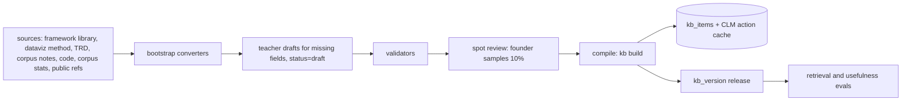

# 28. Knowledge base: frameworks, data visualisation, design and storyline practice

Question this answers: what does the system know about consulting frameworks, data visualisation, slide design and storyline writing, how is that knowledge built and kept correct, and how do agents look it up and use it?

## 1. Principles

1. **Knowledge is typed cards in the repository.** Every piece of knowledge is a YAML card with an id, a type, a version, its sources and licence, when it applies, guidance, good and bad examples, and links to the code and checks that enforce it. `knowledge/` in the repo is the source of truth.
2. **Rules that code can check are enforced by code.** A card that states a rule ("one axis only", "text at least 9.5 pt") links to the code and test that enforce it. Prompts carry only guidance that code cannot check (judgement about what makes a good title). This avoids "the model forgot the rule".
3. **One source for QA standards.** Design-standard cards (`DS-*`) are the QA standards registry (`27`, section 8.1). There is no second list.
4. **Agents retrieve, rank and cite.** Agents find cards by id, by search (embeddings), by ranking (CLM) or by a typed pick (Laya). Every output records the card ids it used (`kb_refs`), so the plan report can explain choices and the learning loop can measure which cards help.
5. **Versioned releases.** The KB is compiled into a release (`kb_version`) stored on every run for reproducibility.
6. **Global plus per-org.** Global cards ship with DeckForge. Orgs add house rules, terminology and preferred frameworks as their own cards, visible only to them.

## 2. Card types

| Prefix | Type | Count (v1) | Content | Built from | Main users |
|---|---|---|---|---|---|
| `F` | Framework | about 75 | question types, triggers, data needs, steps, calc recipe, visuals, archetypes, title patterns, pitfalls, related | `docs/FRAMEWORK_LIBRARY.md` (schema already defined there), corpus usage statistics | engagement_manager, data_analyst, viz_designer |
| `AN` | Analysis recipe | about 40 | executable calc recipe id (`deckforge/data/calcs.py`), inputs, outputs as facts, reconciliation checks | calc code docstrings | data_analyst |
| `VZ` | Data visualisation practice | about 60 | form choice by job, colour by job, axes, labelling, emphasis, familiarity by audience, anti-patterns | dataviz method (form heuristic, colour formula, mark specs, anti-patterns), TRD 7.3 chart tiers, Zelazny message types | viz_designer, reviewer, copywriter |
| `EXH` | Exhibit | one per exhibit (about 15) | when to use, data shape (`ExhibitData` model), emphasis options, layout variants, pitfalls, thumbnail | `deckforge/viz/exhibits/`, selector rules, golden decks | viz_designer, art_director |
| `DS` | Design standard | about 60 | the rule, detectors, severity, owner, repair strategies, acceptance checks | look-and-feel rules, lint, inspector checks, corpus style notes (`docs/corpus_notes/`) | reviewer, all owners, orchestrator |
| `ST` | Storyline and writing practice | about 40 | pyramid principle, SCR, MECE, action titles, so-what, commentary rules, stickers, sourcing, register, banned phrases | TRD storyline sections, corpus inversion (title patterns, register) | engagement_manager, copywriter |
| `AR` | Slide archetype | about 12 | purpose, layout zones, when to use, content limits, examples | `deckforge/story/render.py` archetypes, design systems | engagement_manager, art_director |
| `IND` | Industry primer | 10 in v1 | value drivers, standard KPIs and their definitions, typical benchmarks with sources and dates, common frameworks | public sources with permissive terms, written by the open teacher with citations | intake_analyst, engagement_manager, researcher |
| `EX` | Exemplar | 20k to 60k | corpus slide descriptions (from corpus inversion), framework and exhibit tags, quality signals. Snapshot thumbnails stay internal | `19` section 4.3 | few-shot retrieval for planner, copywriter, viz_designer, art_director |
| `TL` | Tool card | per tool | already defined (`08`, section 5.4) | tool specs | Laya and CLM tool routing |
| `ORG` | Org card | per org | house rules, terminology, preferred frameworks and exhibits, banned phrases | admin UI, accepted memory proposals (`10`, section 8) | all agents of that org |

## 3. Card schema

```python
# deckforge/knowledge/schema.py
class Source(BaseModel):
    kind: Literal["internal_doc", "code", "corpus_stats", "public", "teacher_draft", "org_admin"]
    ref: str                                   # doc path, code symbol, URL, corpus stats id
    licence: str                               # "internal", "Apache-2.0", "CC-BY-4.0", "public-domain", ...
    retrieved: date | None = None

class Enforcement(BaseModel):
    code: list[str] = []                       # "deckforge.viz.select:REJECT_DUAL_AXIS"
    standards: list[str] = []                  # DS ids
    judges: list[str] = []                     # J_*, V_* ids
    tests: list[str] = []                      # pytest node ids that prove the code enforces it

class Example(BaseModel):
    kind: Literal["good", "bad"]
    text: str                                  # a title, a commentary line, a description of a chart
    why: str
    image_ref: str | None = None               # thumbnail blob key (internal)

class Card(BaseModel):
    id: str                                    # "VZ-AXIS-01", "F050", "DS-FOCAL-01"
    type: Literal["F", "AN", "VZ", "EXH", "DS", "ST", "AR", "IND", "EX", "TL", "ORG"]
    version: int
    status: Literal["draft", "validated", "deprecated"]
    title: str                                 # short name
    applies_when: str                          # conditions in plain words, used for retrieval
    guidance: str                              # what to do, at most 600 tokens
    digest: str                                # at most 80 tokens, injected into prompts
    examples: list[Example] = []
    enforced_by: Enforcement = Enforcement()   # empty = advisory card
    related: list[str] = []
    tags: list[str] = []                       # audience, deck type, industry, message type
    used_by: list[str]                         # agent ids
    sources: list[Source]
    org_id: str | None = None                  # ORG cards only
    extra: dict = {}                           # type-specific fields (F: inputs, steps, calc_engine ...; DS: detectors, severity ...)
```

Type-specific `extra` fields are validated by sub-models (`FrameworkExtra`, `StandardExtra`, `ExhibitExtra`, `IndustryExtra`). The framework fields follow `docs/FRAMEWORK_LIBRARY.md` section 3 exactly.

### 3.1 Examples

```yaml
# knowledge/viz/VZ-AXIS-01.yaml
id: VZ-AXIS-01
type: VZ
version: 1
status: validated
title: One value axis per chart
applies_when: A chart shows two measures of different scale or unit, such as revenue and margin over time
guidance: >
  Never use two y-axes. Show the measures as two aligned charts sharing the time axis (columns above,
  line below), as small multiples, or indexed to a common base. Label the unit of each panel.
digest: No dual axes. Two measures of different scale go into two aligned panels sharing the x-axis.
examples:
  - {kind: good, text: "Revenue columns above, EBITDA margin line below, same FY22 to FY25 axis", why: "each scale readable"}
  - {kind: bad, text: "Revenue bars and margin line on left and right axes", why: "readers compare scales that are not comparable"}
enforced_by:
  code: ["deckforge.viz.select:REJECT_DUAL_AXIS"]
  standards: ["DS-CHART-01"]
  tests: ["tests/unit/test_story.py::test_selector_never_returns_dual_axis_or_radar"]
related: [EXH-COLUMNS-OVER-LINE, VZ-FORM-02]
tags: [time_series, mixed_units, all_audiences]
used_by: [viz_designer, reviewer]
sources:
  - {kind: internal_doc, ref: "dataviz method: non-negotiables", licence: internal}
  - {kind: internal_doc, ref: "docs/TRD_V2.md#7.3", licence: internal}
```

```yaml
# knowledge/storyline/ST-TITLE-01.yaml
id: ST-TITLE-01
type: ST
version: 2
status: validated
title: Action titles state the finding
applies_when: Writing the title of any content slide
guidance: >
  The title is one sentence that states what the exhibit proves and why it matters to the audience.
  Lead with the subject and the quantified finding, then the implication. Use fact tokens for numbers.
  At most two lines at the design system title size. No question titles, no topic labels.
digest: Title = one sentence, finding plus implication, numbers as {fact} tokens, max two lines.
examples:
  - {kind: good, text: "Raw-material lag and adverse mix explain {bridge_top2_bps} of the {margin_drop_bps} bps margin decline", why: "finding, magnitude, cause"}
  - {kind: bad, text: "EBITDA margin bridge FY22 to FY25", why: "topic label, no finding"}
enforced_by:
  judges: [J_ACTION_TITLE, J_TITLE_SUPPORTED]
  standards: [DS-TITLE-01, DS-TITLE-02, DS-TYPE-03]
  code: ["deckforge.story.plan:untracked_numbers"]
used_by: [copywriter, reviewer]
sources:
  - {kind: corpus_stats, ref: "corpus/title_patterns_v1", licence: internal}
```

```yaml
# knowledge/design/DS-FOCAL-01.yaml  (also the QA standard)
id: DS-FOCAL-01
type: DS
version: 1
status: validated
title: One focal element per content slide
applies_when: Any content slide
guidance: >
  The eye must land on one thing first: the highlighted bar, the big number, the callout.
  Use the accent colour once per slide for that element. Everything else stays neutral.
digest: One focal element per slide, accent colour used once for it.
enforced_by:
  standards: [DS-FOCAL-01]
  judges: [V_FOCAL]
  code: ["deckforge.qa.lookfeel:focal_element"]
used_by: [art_director, viz_designer, reviewer]
extra:
  detectors: [LOOKFEEL_FOCAL, V_FOCAL]
  severity: major
  owner: {element: layout, default: art_director}
  strategies: [R_ADD_EMPHASIS, R_RELAYOUT, R_ADD_IMAGERY]
  acceptance: [LOOKFEEL_FOCAL, V_FOCAL]
sources:
  - {kind: internal_doc, ref: "docs/corpus_notes/bain_bcg_mckinsey_styles.md", licence: internal}
```

## 4. Repository layout

```text
knowledge/
├── SCHEMA.md                 # human summary of section 3
├── frameworks/F001.yaml ...  # generated first from docs/FRAMEWORK_LIBRARY.md, then edited as YAML
├── recipes/AN-*.yaml
├── viz/VZ-*.yaml
├── exhibits/EXH-*.yaml
├── design/DS-*.yaml          # QA standards registry
├── storyline/ST-*.yaml
├── archetypes/AR-*.yaml
├── industries/IND-*.yaml
├── exemplars/MANIFEST.yaml   # pointers to corpus descriptions in the blob store (not in git)
└── RELEASES.md               # kb_version history
```

## 5. Build pipeline



| Step | Command or code | Detail |
|---|---|---|
| Bootstrap frameworks | `deckforge kb import-frameworks docs/FRAMEWORK_LIBRARY.md` | parses the catalogue tables and section 3 schema into `F*.yaml`, `status=draft` where fields are missing |
| Bootstrap viz and design | `deckforge kb import-rules` | converts the dataviz non-negotiables and anti-patterns, look-and-feel rules, lint checks and inspector checks into `VZ` and `DS` cards with `enforced_by` links |
| Corpus statistics | `training/sources/corpus.py --stats` | from corpus inversion: framework and exhibit frequencies by message type, audience and deck type, title patterns, words per slide, imagery share. Written into card `extra.corpus` fields and the CLM priors (`21`, section 5.4) |
| Teacher drafts | `deckforge kb draft --missing` | the open teacher fills missing guidance, digests and examples, citing the card's sources. Drafts stay `draft` |
| Validation | `deckforge kb validate` (also in CI) | schema, ids unique, links resolve (exhibits, recipes, standards, judges, tests), digest at most 80 tokens, guidance at most 600 tokens, near-duplicate cards (cosine above 0.92) flagged, every source has a licence, every `enforced_by.tests` node id exists |
| Spot review | `deckforge kb review --sample 0.1` | a simple admin page shows sampled cards, the founder marks accept or fix. Only accepted samples promote their batch from `draft` to `validated`. No hiring is needed: automated checks carry most of the load |
| Compile | `deckforge kb build --release` | writes `kb_items` rows per namespace (`frameworks`, `recipes`, `viz`, `exhibits`, `design`, `storyline`, `archetypes`, `industries`, `exemplars`, `tool_cards`) with the retrieval text (`title + applies_when + digest + tags`) embedded by fastembed, uploads CLM action embeddings for rankable namespaces, writes `kb_version` |
| Release | `knowledge/RELEASES.md` entry, git tag `kb-<version>` | every run stores `kb_version` (column on `runs`, migration in T-17.2) |

## 6. How agents use the knowledge base

### 6.1 Access modes

| Mode | When | Mechanism | Latency |
|---|---|---|---|
| By id | the id is known (a standard cited in a finding, a framework chosen in the plan, a recipe linked from a framework) | `KnowledgeBase.get(card_id, org)` from an in-process cache loaded at worker start | microseconds |
| Shortlist | find relevant cards for a situation | `KnowledgeBase.search(namespace, query, k, filters)` with embeddings (pgvector or numpy) | 5 to 15 ms |
| Rank | choose among many candidates (frameworks, exhibits, archetypes, icons) | CLM `rank` over the shortlist or the whole namespace with cached action embeddings | 2 to 30 ms |
| Typed pick | final choice among a few described options with calibrated confidence | Laya `choice` with card digests as option descriptions | about 30 ms |
| Context injection | give an agent the practices that apply to its task | `ContextBuilder` adds card digests (and full guidance when budget allows) to the prompt's stable sections | at prompt build |
| Tool call | ReAct agents that decide themselves when to look something up | tools `kb_search(namespace, query, k)` and `kb_get(card_id)` (group `knowledge`) | as above |
| Code enforcement | rules with `enforced_by.code` | the code runs regardless of what the model remembers | n/a |

### 6.2 Per-agent use

| Agent | Namespaces | How it uses them |
|---|---|---|
| intake_analyst | `IND`, `ST` (brief quality), `ORG` | industry primer for the brief's industry injected as context, so questions use the right KPIs |
| engagement_manager | `F`, `ST`, `AR`, `IND`, `EX`, `ORG` | per leaf issue: search `F` by issue text and tags, CLM ranks, Laya picks top 3, full guidance of the 3 cards injected. `ST` pyramid and MECE digests in the stable prefix. 2 exemplar storylines by similarity |
| data_analyst | `AN`, `F` | follows `F.extra.calc_engine` to the recipe card and runs the recipe code. Reconciliation checks from the recipe card |
| researcher | `IND`, `F` (data needs) | knows which data the framework needs and which sources the primer lists |
| viz_designer | `EXH`, `VZ`, `F.visuals`, `EX` | candidates from the selector plus the framework's visuals, CLM ranks with corpus priors, `VZ` digests for the chosen exhibit injected, 2 exemplar slides of the same exhibit |
| copywriter | `ST`, `VZ` (labelling), `DS` text standards, `ORG` terms, `EX` | title and commentary practice digests in the stable prefix, org terminology, 2 exemplar titles for the same framework and archetype |
| art_director | `DS`, `AR`, `EXH` layout variants, `EX` | design standards for imagery, focal and density, archetype layout zones |
| reviewer, fact_checker | `DS`, `VZ`, `ST` | standards are the checklist. Findings cite standard ids. Judge prompts include the cited card's guidance as the rubric |
| repair_specialist | `DS` | the finding's standard card states acceptance checks and allowed strategies |
| supervisor | `ST`, `DS` | maps a user request ("make it punchier") to the relevant practice cards for the routed agent |

### 6.3 Citing cards

Every agent output contract has `kb_refs: list[str]` (for example `AnalysisPick.framework_id` plus `kb_refs=["F050", "ST-PYRAMID-01"]`, `SlideCopy.kb_refs=["ST-TITLE-01", "ORG-TERM-ebitda"]`). They are stored in agent traces and in `deck_versions.provenance`. The plan report shows them ("Framework F050 Revenue bridge, chosen because ..."). The learning loop uses them to measure card usefulness (section 8).

### 6.4 Prompt placement

- Practice digests that apply to every call of an agent (for example `ST-TITLE-01`, `ST-SOWHAT-01`, `DS-TYPE-03`) go into the stable system section, so they are prefix-cached (`10`, section 9).
- Run-specific cards (the frameworks chosen for this brief, the industry primer) go into the run-stable section.
- Slide-specific cards (the exhibit's `VZ` cards, exemplars) go into the call-specific section, within the `ContextBuilder` budget (`10`, section 3). Exemplars are dropped first when space is short.

## 7. Keeping rules and code in sync

- A card with `enforced_by.code` or `enforced_by.tests` is a **rule card**. CI runs `deckforge kb validate --enforcement`, which checks that every referenced code symbol exists and every referenced test exists. The full test suite then proves the code still enforces the rule.
- Changing a rule's threshold (for example minimum font size) changes the card and the code in the same PR. A test asserts that the numeric thresholds in `DS` cards equal the constants in code (`deckforge/qa/lookfeel.py`, `deckforge/inspect/*`).
- A card without enforcement is **advisory**: it guides prompts and judges only. The weekly KB report lists advisory cards linked to frequent defects as candidates for code enforcement.

## 8. Evaluating the knowledge base

| Evaluation | Data | Metric | Bar |
|---|---|---|---|
| Framework retrieval | `evals/kb/frameworks.jsonl`: 300 issue statements with expected frameworks (from corpus inversion and C2 briefs) | recall at 5, MRR | recall at 5 at least 0.90 |
| Exhibit retrieval | 300 (message type, data shape, audience) cases with corpus exhibits | top-2 agreement | at least 0.85 |
| Standard lookup | every defect code maps to exactly one standard | coverage | 100% |
| Usefulness | eval briefs run with and without card injection for one agent at a time | golden-brief QA score and agent suite delta | injection must not lower any agent score. Cards with negative effect are revised |
| Card attribution | `kb_refs` joined with outcomes over the last month | defect rate and acceptance rate when the card was used | cards in the bottom decile flagged for review |
| Staleness | `IND` sources with dates | share of benchmarks older than 3 years | below 20% |

## 9. Maintenance loop (monthly, automated report)

1. Usage: calls per card, cards never retrieved, cards often retrieved but never cited.
2. Outcomes: cards correlated with defects or regenerations.
3. Gaps: failure clusters (`20`, section 10.2) with no matching card become card proposals drafted by the teacher (`status=draft`).
4. Corpus refresh: new corpus decks update statistics, priors and exemplars.
5. Review: founder spot review on drafts, then release a new `kb_version`, rerun the retrieval evals.

## 10. Per-org knowledge

- Org admins manage `ORG` cards in the UI (`26`, E11): house rules, terminology (preferred and avoided terms), preferred frameworks and exhibits, required disclaimers.
- Memory proposals from repeated user edits (`10`, section 8) become `ORG` card drafts that an admin approves.
- Retrieval for an org searches global and that org's cards together, and `ORG` cards win ties. `ORG` cards never leave the org (rows carry `org_id`, caches include it).
- Exporting and importing org cards as YAML lets a customer manage its house style in its own repository.

## 11. Size and memory

About 800 global cards plus 20k to 60k exemplars. Embeddings at 384 dimensions: about 90 MB in pgvector for 60k rows. The in-process card cache (all non-exemplar cards) is under 5 MB per worker. CLM action embeddings for rankable namespaces fit easily in the CLM server's default vector cache.
